# nhf-spatial-targets

### Aggregated source results & final calibration targets

#### Project: `gfv2-spatial-targets`

Companion to the earlier collaborator briefing — this deck assumes the
gridded-source QC story and zooms straight to the **HRU-aggregated** and
**final-target** outputs that downstream PRMS calibration consumes.

<span class="footnote">
USGS National Hydrologic Model · TM 6-B10 (Hay et al. 2022) · `docs/presentations/2026-collaborator-overview-...` for Stage 1 context
</span>

<!--
Session goal: review the two outputs the pipeline actually emits — the per-source
aggregated NCs and the combined target NCs — for each of the six variable
categories. We'll skip the Stage 1 (raw gridded) material entirely; that lives
in the prior collaborator deck if anyone wants to revisit it.
-->

---

## Today's plan

1. **Repo intro** — purpose, datastore vs project, CLI workflow, multi-source bounds (~5 min)
2. **Aggregated → target pipeline** in one diagram (~3 min)
3. **Calibration target walkthroughs** — sources → aggregated bounds → target output (~30 min, 6 × ~5 min)
   - Runoff · AET · Recharge · Soil moisture · Snow-covered area · SWE
4. **Open questions & next steps** (~5 min)
5. **Free discussion** (~2 min buffer + interleaved throughout)

<!--
Time budget: ~30 min of speaking with ~15 min for discussion (front-loaded between
categories, back-loaded after Section 4). SWE and SCA have placeholders for the
final-target step because the work isn't end-to-end yet — those become discussion
prompts rather than figure tours.
-->

---

# Part 1 — Repo intro

<!-- _class: compact -->

## Project purpose

Build the **six calibration targets** for the National Hydrologic Model by spatially aggregating gridded source datasets to an HRU fabric via [`gdptools`](https://github.com/rmcd-mscb/gdptools). TM 6-B10 (Hay et al. 2022) is the methodological reference; where the report's original sources are retired we use the modern replacement (`docs/references/known-gaps-resolved.md`).

| Target | Sources | Method | Step |
|---|---|---|---|
| Runoff | **ERA5-Land** · GLDAS-NOAH · MWBM ClimGrid | multi-source min/max | Monthly |
| AET | MOD16A2 v061 · SSEBop · MWBM ClimGrid | multi-source min/max | Monthly |
| Recharge | Reitz 2017 · WaterGAP 2.2d · **ERA5-Land** | 0–1 normalised min/max | Annual |
| Soil moisture | MERRA-2 · NCEP/NCAR · NLDAS-MOSAIC · NLDAS-NOAH | 0–1 normalised min/max | Monthly + annual |
| Snow-covered area | MOD10C1 v061 | MODIS CI > 70 % bound | Daily |
| **SWE** | Daymet · SNODAS · ERA5-Land · Margulis WUS-SR¹ | multi-source min/max | Daily |

<span class="footnote">
¹ Margulis WUS-SR fabric-scoped to Oregon via `catalog/sources.yml → fabric_scope`. Non-OR fabrics fall back to a 3-source bound.
</span>

<!--
Six targets. The runoff/AET/SWE targets are bounded in absolute units (cfs,
inches/day, inches); recharge and soil moisture are 0–1 normalised because we
care about year-to-year change, not absolute magnitude. SCA is its own animal:
single source, CI-driven, builder still pending.
-->

---

## Datastore vs project — one diagram

```text
═══════════════════  DATASTORE — shared, fabric-independent  ═════════════════
/caldera/.../nhf-datastore/
  ├── era5_land/   gldas/   merra2/      #   raw downloads + consolidated NCs
  ├── mod16a2/     mod10c1/   ...        #   reusable across any fabric
  ├── snodas/      daymet/               #   expensive to re-fetch
  └── margulis_wus_sr/                   #   (OR scope at catalog-level)

═══════════════════  PROJECT — fabric-specific (GFv2.0)  ═════════════════════
/caldera/.../gfv2-spatial-targets/
  ├── config.yml                         #   points to datastore + fabric
  ├── fabric.json   manifest.json        #   computed metadata + provenance
  ├── data/aggregated/<source>/          #   per-source HRU NCs, native units, NaN-honest
  ├── targets/                           #   final calibration target NCs (this deck's focus)
  ├── weights/                           #   gdptools weight caches (fabric × source grid)
  └── logs/

═══════════════════  ANOTHER PROJECT — same datastore, different fabric  ═════
/caldera/.../gfv11-spatial-targets/
  └── config.yml  → /caldera/.../nhf-datastore   # 100% raw-data reuse
```

**Why this split?** Raw downloads are expensive and fabric-independent; fabric-aligned
outputs are cheap and fabric-tied. One datastore can serve N fabrics — switching
GFv1.1 → GFv2.0 re-uses every fetched file and only rebuilds weights + aggregated NCs.

<!--
The audit trail story matters here: never delete a project directory. manifest.json
records every fetch with timestamp + sha256 + period covered; the target NCs embed
the same provenance in CF global attributes. If a calibration result is ever
questioned, the answer to "what data went into this?" lives in the project, not
in the operator's memory.
-->

---

## CLI workflow

`init` → *edit config* → `materialize-credentials` → `validate` → `fetch` → **`agg`** → **`run`**

| Step | Command | What this deck covers |
|---|---|---|
| 1 | `nhf-targets init --project-dir <dir>` | — |
| 2 | *(manual edit of `config.yml` + `.credentials.yml`)* | — |
| 3 | `nhf-targets materialize-credentials --project-dir <dir>` | — |
| 4 | `nhf-targets validate --project-dir <dir>` | — |
| 5 | `nhf-targets fetch <source> --project-dir <dir>` | — *(covered in prior deck)* |
| 6 | **`nhf-targets agg <source> --project-dir <dir>`** | **→ `data/aggregated/<source>/` (panel B in each walkthrough)** |
| 7 | **`nhf-targets run --project-dir <dir>`** | **→ `targets/*.nc` (panel C in each walkthrough)** |

**On HPC:** the same commands ship as SLURM scripts at the repo root
(`agg_all.slurm`, `agg_ssebop.slurm`, `agg_daymet.slurm`, `agg_snodas.slurm`,
`run_all.slurm`) — array dispatch + memory/CPU tuning per source.

<!--
The two stages this deck zooms into — agg and run — are the last two steps. The
fetch/consolidate side was the prior deck's main story; here it's a precondition.
The HPC note matters because on Caldera every figure in this deck came from the
SLURM-driven aggregation/target build, not from a workstation run.
-->

---

## Multi-source bounds — why a lower/upper, not a point estimate

The pipeline emits **bounds**, not a best estimate. The bound width is real inter-product disagreement.

- Different products use different physics, forcing, and algorithms → different answers.
- The **envelope** (per-HRU min/max) is the calibration uncertainty range.
- Targets are *constraints with width*, not absolute observations.
- PRMS calibration treats the bound as an **error-tolerance window** — simulated values inside the bound contribute **zero NRMSE**; only excursions are penalised (TM 6-B10 §Methods).

**Why not just pick the "best" product?** No product is best everywhere; picking one over-fits the optimiser to that product's systematic bias.

**Why not make bounds as wide as possible?** A bound that's too wide flattens the penalty surface and calibration won't converge. The goal is an *honest* bound — wide where products genuinely disagree, tight where they agree.

<div class="callout">
This is the conceptual hinge for every calibration target walkthrough that follows. The aggregated-bounds slide shows where sources agree and disagree; the target slide shows what falls out when we take the envelope.
</div>

<span class="footnote">
TM 6-B10 (Hay et al. 2022) is the methodological reference for the bound-as-error-window mechanic; see <code>docs/references/tm6b10-summary.md</code> for the per-target range rules + NRMSE-inside-the-bound objective-function detail.
</span>

<!--
Use this slide to set up the discussion frame for the rest of the deck. When a
collaborator asks "why are we keeping source X?", the right question is: does X
widen the bound in a direction that reflects real uncertainty, or in a direction
that reflects a product artifact? That's exactly the question PR #88 resolved
for MOD16A2 v061 — fill-value contamination was widening the AET bound for the
wrong reason.

**NRMSE primer (in case the room asks).** NRMSE = *Normalized* Root Mean Square
Error — the N is "normalized," not "Nash" (Nash–Sutcliffe Efficiency / NSE is
the other metric TM 6-B10 uses, e.g. Figure 14). RMSE in raw form has the
variable's units (cfs for runoff, in/day for AET, dimensionless for
normalised recharge), so you can't sum or compare it across variables.
Dividing by a normaliser (mean / range / σ of the observations) makes NRMSE
unitless — which is what lets TM 6-B10's six-step procedure weight-sum
errors across runoff, AET, recharge, soil moisture, and SCA in one
objective function (table 3 of the report). Equation 1 in TM 6-B10 carries
the exact form.
-->

---

# Part 2 — Aggregation workflow

---

## How an aggregated NC becomes a target NC

```text
  ┌──────────────────────────────────────────────────────────────────────┐
  │ Stage 1                                                              │
  │   source granules → fetch/<src>.py → datastore consolidated NC       │
  └─────────────────────────────────┬────────────────────────────────────┘
                                    │  native grid, native units
                                    ▼
  ┌──────────────────────────────────────────────────────────────────────┐
  │ Stage 2  AGGREGATE     (nhf-targets agg <src>)                       │
  │   1. mask pixels with fill values or failing quality gates           │
  │   2. area-weighted pixel → HRU mean  (via gdptools)                  │
  │   3. attach CF metadata; HRUs with no valid pixels stay NaN          │
  │   ⇒ <project>/data/aggregated/<src>/   (per-HRU, native units)       │
  └─────────────────────────────────┬────────────────────────────────────┘
                                    │  per-source HRU bound material
                                    ▼
  ┌──────────────────────────────────────────────────────────────────────┐
  │ Stage 3  TARGET BUILD  (nhf-targets run)                             │
  │   unit conversion (× 1000, ÷ 100, mm/month → cfs, ...)               │
  │   multi-source NaN-aware min/max  →  lower_bound, upper_bound        │
  │   optional NN-fill on the combined bound  →  parallel _nn_filled.nc  │
  │   ⇒ <project>/targets/<tgt>.nc   +   <tgt>_nn_filled.nc              │
  └──────────────────────────────────────────────────────────────────────┘
```
<!-- Pixel-defined ops run **pre-aggregation**; HRU-defined ops run **post-aggregation**; linear ops commute and live in `targets/` by convention. Deep dive: `docs/architecture/transformation-pipeline.md`. -->

<!--
Speaker notes:

- One direction, no loops. Stage 2 is per-source; Stage 3 is the only place
  multiple sources meet.
- Stage 2 ordering is load-bearing: a per-pixel quality gate AFTER averaging
  gives a different answer than the same gate BEFORE — once area-weighted
  mixing happens, you can't recover the high-confidence subset. MOD10C1
  (cloud-confidence filter) and MOD16A2 (fill-value mask) are the two sources
  where this would bite if we ran the gate in Stage 3.
- Three sources currently mask pixels and then weighted-average the
  survivors (gdptools `stat_method="masked_mean"`): **MOD16A2** (fill-value
  mask, PR #88), **MOD10C1** (CI > 70 confidence gate), **SNODAS** (CONUS
  mask, issue #151). Everything else uses the default `mean` where any NaN
  pixel touching an HRU makes the whole HRU NaN — appropriate when there's
  no deliberate per-pixel masking upstream.
- Honest NaNs at Stage 2 are what let Stage 3's NaN-aware min/max
  distinguish "no source data here" from "source said zero." Don't impute in
  Stage 2 — that's a Stage 3 (target-builder) choice, see `_nn_filled.nc`.
- Linear stuff (unit conversion, ×1000, mm/month → cfs) is parked in Stage 3
  on purpose: it commutes with averaging, and keeping native units in the
  aggregated NC makes a missed conversion factor easier to spot.
- Deep dive + worked example: `docs/architecture/transformation-pipeline.md`.
-->

---

# Part 3 — Calibration target walkthroughs

For each variable: **A** sources & method · **B** aggregated bounds · **C** target output.

---

<!-- _class: fig-over-text -->

## 3.1 Runoff — sources & method

<div class="fig-row">

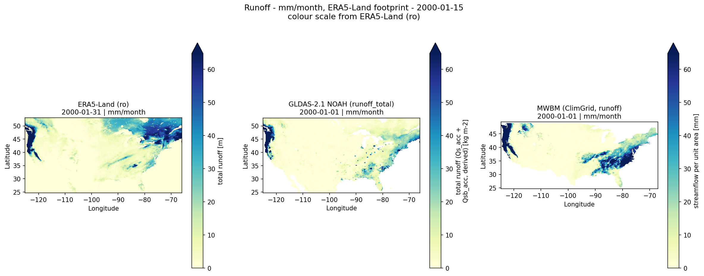

<span class="caption">Raw-grid scale before HRU aggregation — all three sources on a common mm/month scale, ERA5-Land footprint.</span>

</div>

<div class="text-cols">
<div>

**Sources** (all contribute to bound):
- **ERA5-Land** `ro` — 1979–present
- **GLDAS-2.1 NOAH** `Qs_acc + Qsb_acc` — 2000–present
- **MWBM ClimGrid** `runoff` — 1900–2020

</div>
<div>

**Method.** HRU aggregation → mm/month → **cfs** in `targets/run.py`. NaN-aware multi-source min/max. Intersection caps the bound at 2020 (MWBM ceiling).

GLDAS shows **urban impervious-surface runoff** via NOAH-LSM's MODIS-IGBP urban class; ERA5-Land H-TESSEL has no urban tile, so disagreement in urban HRUs is honest model-physics divergence.

</div>
</div>

<!--
The conversion to cfs is the only linear unit step that lives in the target
builder for runoff. It commutes with the area-weighted mean, so it doesn't matter
mathematically whether we convert pre- or post-aggregation — convention is post,
so the aggregated NCs stay in source-native mm/month, which makes a missed
conversion factor easier to spot if it ever creeps in.

**Why GLDAS picks up urban impervious surfaces (in case the room asks).**
GLDAS-2.1 runs NOAH LSM with MODIS IGBP land cover. IGBP class 13 ("Urban
and Built-up") gets explicit urban parameters in NOAH: near-zero
infiltration capacity, low green-vegetation fraction. The result is that
nearly all precipitation over an urban grid cell becomes surface runoff
(`Qs_acc`), which is physically correct for impervious pavement. At
GLDAS's 0.25° (~25 km) cells, major metro footprints (NYC, Chicago, LA,
Boston, Houston) cover several cells each and show as distinct
high-runoff blobs. ERA5-Land H-TESSEL has no urban tile — it treats urban
cells as generic low-vegetation with normal infiltration parameters — so
the urban signature is invisible to it. MWBM ClimGrid has no land-cover
physics at all.

**Calibration implication.** Urban HRUs end up with a *wider* multi-source
bound for the right reason — real inter-product disagreement about
impervious runoff. PRMS doesn't have populated `imperv_frac` for this
fabric either, so the optimiser can't reproduce the urban signal — it
just has more room in those HRUs. The bound is "honest" but not actively
guiding urban-aware calibration. Worth flagging if a collaborator points
at urban-HRU bound width.
-->

---

<!-- _class: two-col -->

## 3.1 Runoff — aggregated bounds

<div class="grid">
<div class="figs tall-second">

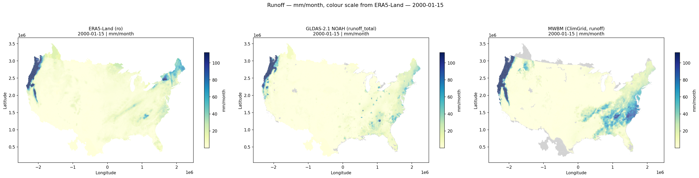
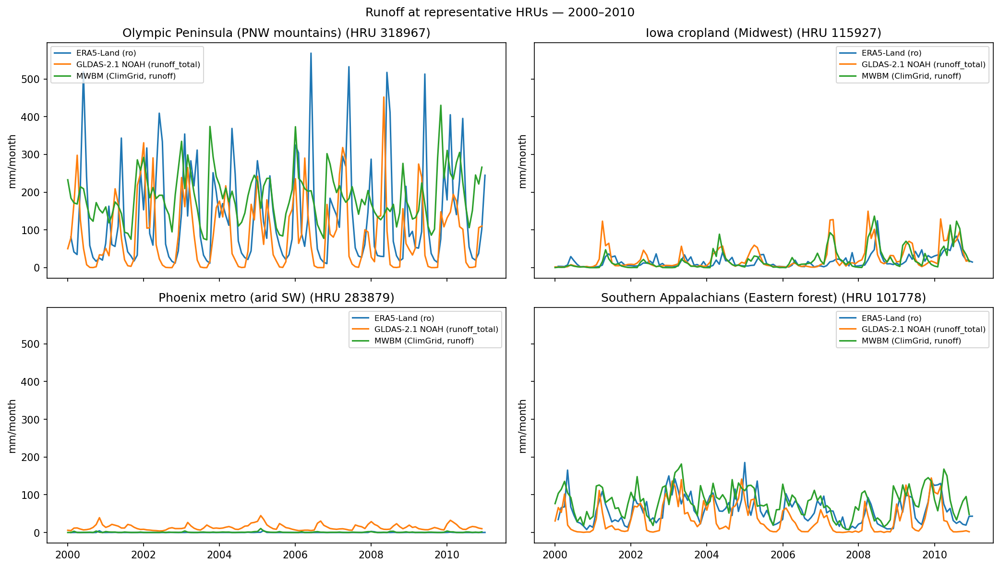

<span class="caption">Top: cross-source magnitude check (normalised). Bottom: representative HRU time series, per source.</span>

</div>
<div class="notes">

<div class="figs">

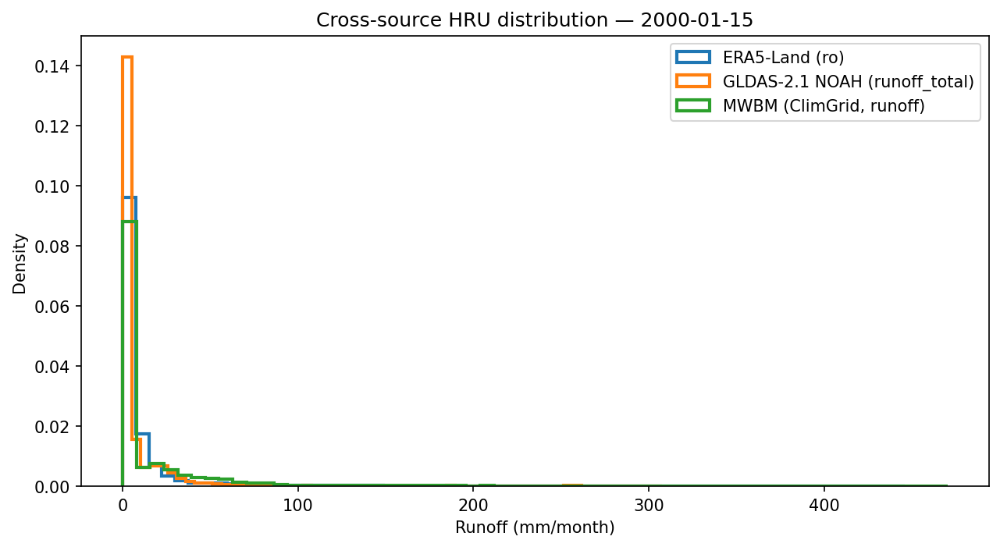

<span class="caption">HRU value distribution, per source.</span>

</div>

- All three sources show the expected east-wet / west-dry CONUS gradient at HRU resolution.
- ERA5-Land and GLDAS agree closely in the humid east; MWBM ClimGrid runs lower in arid HRUs.

</div>
</div>

<!--
Bring up runoff_coverage.png in discussion if anyone asks about completeness;
runoff is the cleanest of the six on that axis. The normalisation panel is
showing relative magnitude, not the final bound — it's a "do these sources
disagree in a way that suggests a unit bug?" check. They don't.
-->

---

<!-- _class: two-col -->

## 3.1 Runoff — target output

<div class="grid">
<div class="figs tall-second">

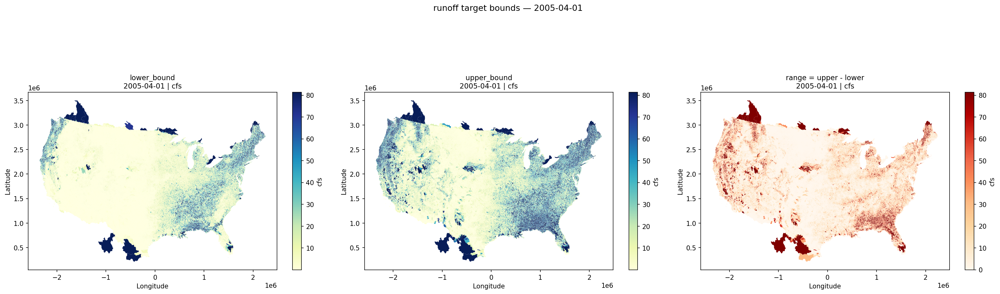
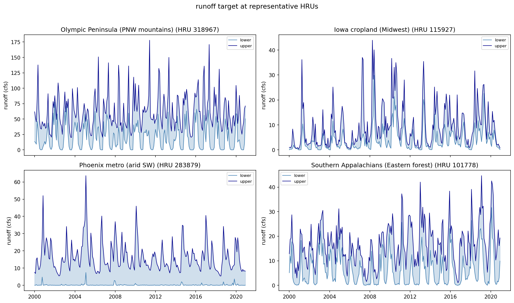

<span class="caption">Top: lower / upper bound maps (cfs). Bottom: representative HRU time series with bound envelope.</span>

</div>
<div class="notes">

<div class="figs">

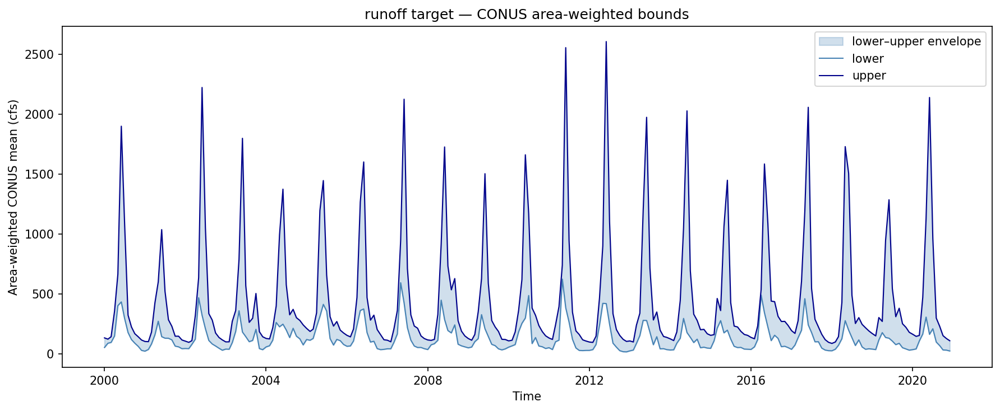

<span class="caption">CONUS-mean lower / upper envelope.</span>

</div>

<!-- - `runoff_target_nn_fill_{map,series}.png` shows where NN-fill closes the residual all-NaN cells in the `_nn_filled` companion file.

<div class="callout">
<strong>Discussion hook.</strong> MWBM ClimGrid coverage ends 2020-12 (verified on PR #127's full run; n_sources=3 covers 96.6 % through 2020). Do we extend the runoff target past 2020 with a 2-source bound, or hold the window at 2020 to keep all three sources in play?
</div> -->

</div>
</div>

<!--
The 2020 ceiling is the one decision the room actually needs to make for runoff.
Memory note project_mwbm_2020_ceiling has the underlying numbers if anyone asks
for them. Extending past 2020 with 2 sources is mechanically fine; the question
is whether the bound width is honest with one fewer voter.
-->

---

<!-- _class: fig-over-text -->

## 3.2 AET — sources & method

<div class="fig-row">

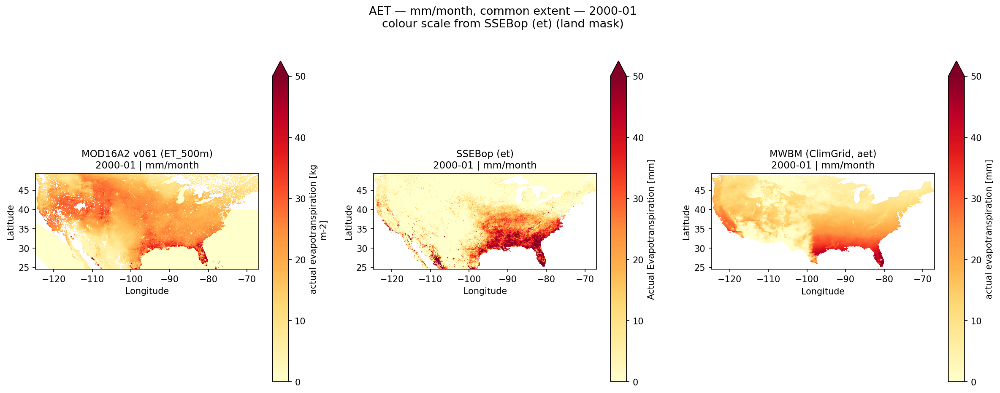

<span class="caption">Raw-grid scale before HRU aggregation — mm/month on a common scale.</span>

</div>

<div class="text-cols">
<div>

**Sources:**
- **MOD16A2 v061** `ET_500m` — 2000–present (`masked_mean`, PR #88)
- **SSEBop** `et` — 2000–2023
- **MWBM ClimGrid** `aet` — 1900–2020


</div>
<div>

**Method.** HRU aggregation → mm/month → **inches/day** in `targets/aet.py`. Multi-source min/max.

<!-- <div class="callout">
<strong>MOD16A2 fill-mask.</strong> Sinusoidal→WGS84 reprojection was averaging fill codes (32766/32767) into valid neighbours, widening the bound artefactually. PR #88 masks `ET_500m` fills <em>before</em> reprojection.
</div> -->

</div>
</div>

<!--
The MOD16A2 fill-mask fix is one of the cleaner case studies for why
pre-aggregate hooks exist. Pre-#88 the AET bound was wider than it should have
been, because the upper envelope was being pulled by reprojection-averaged
fill codes that looked like real high values. Worth noting if discussion drifts
into "why do we have a pre_aggregate_hook at all".
-->

---

<!-- _class: two-col -->

## 3.2 AET — aggregated bounds

<div class="grid">
<div class="figs tall-second">

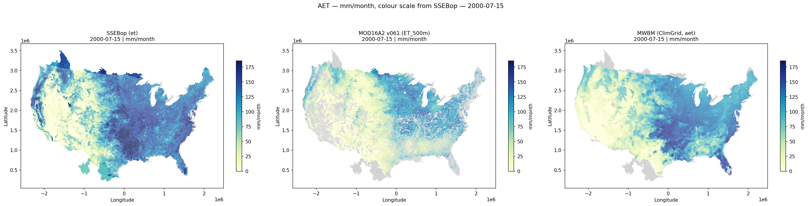
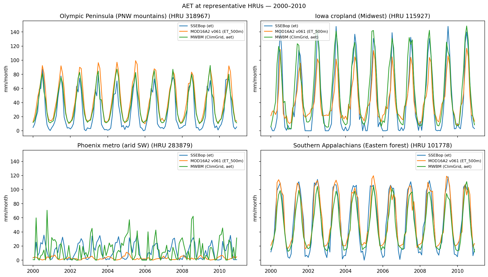

<span class="caption">Top: cross-source magnitude check (mm/month basis). Bottom: representative HRU time series, per source.</span>

</div>
<div class="notes">

<div class="figs">

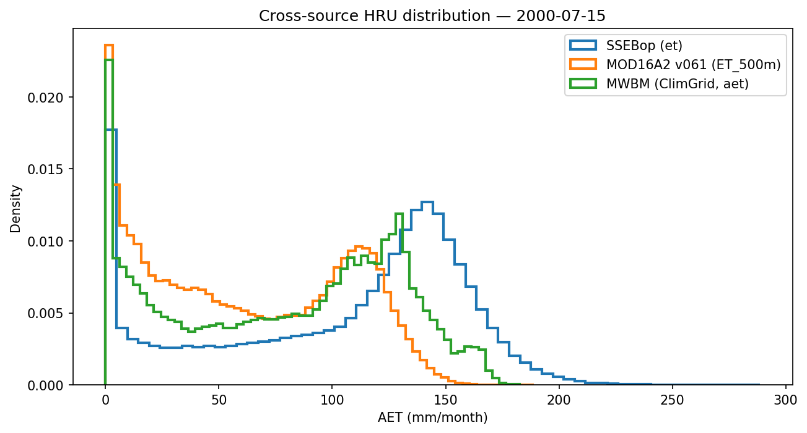

<span class="caption">HRU value distribution, per source.</span>

</div>

- SSEBop trends slightly higher than MOD16A2 in agricultural HRUs; MWBM ClimGrid sits between them.

</div>
</div>

<!--
The 5–8× summer/winter ratio for east-CONUS HRUs is the test that the PR #88
fix worked end-to-end. If anyone asks "are we sure the MOD16A2 fix is in
this aggregated output?", the answer is yes — the seasonal swing is the
smoking gun.
-->

---

<!-- _class: two-col -->

## 3.2 AET — target output

<div class="grid">
<div class="figs tall-second">

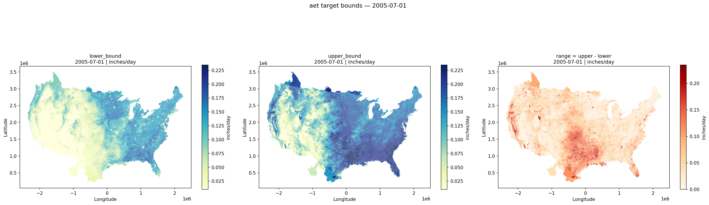
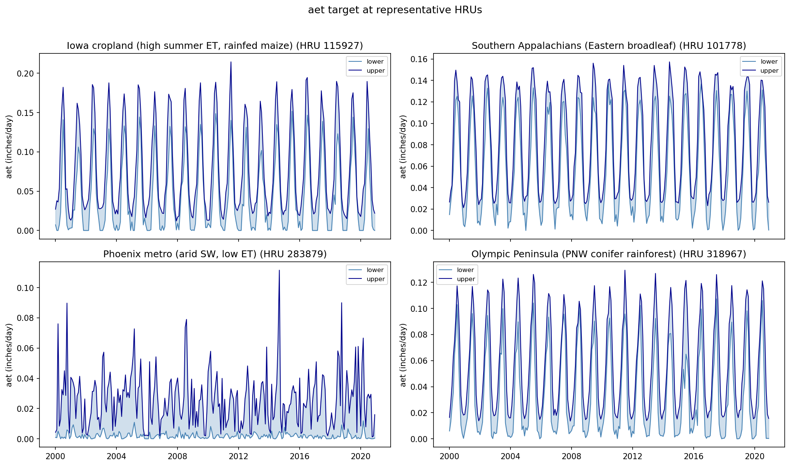

<span class="caption">Top: lower / upper bound maps (inches/day). Bottom: representative HRU time series.</span>

</div>
<div class="notes">

<div class="figs">

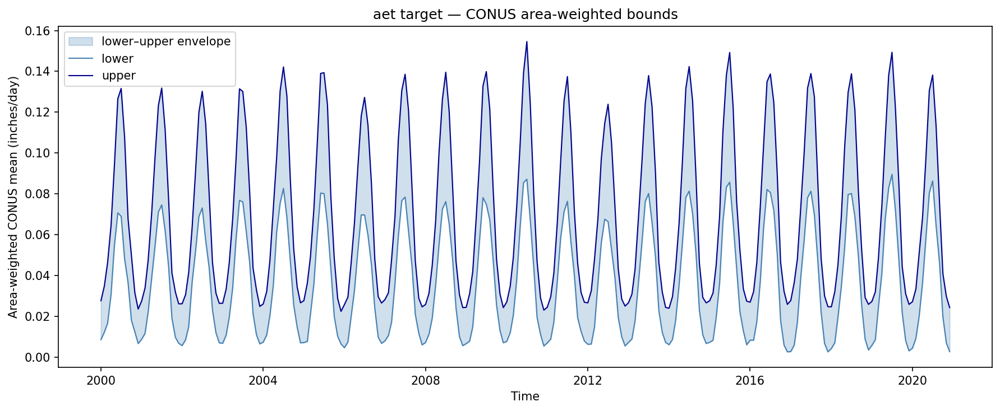

<span class="caption">CONUS-mean lower / upper envelope (PR #127 21-year run).</span>

</div>

- Bound shrinks in winter — all three sources agree on near-zero AET.
- Bound opens in summer where MOD16A2 and SSEBop diverge; that's the calibration-relevant disagreement.
- CONUS-mean envelope confirms the seasonal asymmetry at aggregate scale.

</div>
</div>

<!--
For discussion: the summer/winter bound asymmetry is the calibration-relevant
feature. The optimiser has plenty of room in summer to fit either a MOD16A2-like
or SSEBop-like response without leaving the envelope; in winter it's locked
to a narrow band. That's the kind of "honest bound" we want.
-->

---

<!-- _class: fig-over-text -->

## 3.3 Recharge — sources & method

<div class="fig-row">

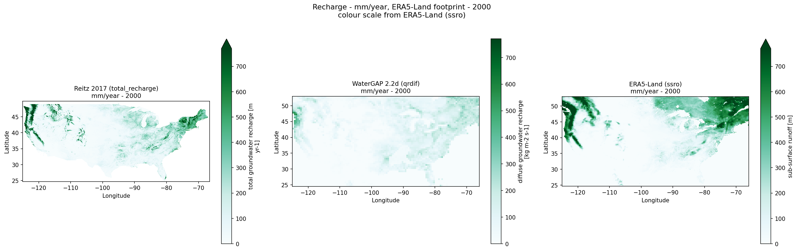

<span class="caption">Raw-grid scale before HRU aggregation — annual recharge on a common scale.</span>

</div>

<div class="text-cols">
<div>

**Sources** (annual):
- **Reitz 2017** `total_recharge` — 2000–2013
- **WaterGAP 2.2d** `groundwater_recharge` — 1901–2016
- **ERA5-Land** `ssro` — 1979–present (sub-surface runoff proxy)

</div>
<div>

**Method.** 0–1 normalised independently, then multi-source min/max in `targets/rch.py`. Target is year-to-year *relative* change, not absolute magnitude.

<div class="callout">
<strong>gfv2 note.</strong> WaterGAP 2.2d excluded — 0.5° cells average orographic gradients across mountain/valley pairs in the intermountain west, collapsing HRU detail. Per-fabric decision.
</div>

</div>
</div>

<!--
The fabric-coarse-grid exclusion is captured in memory note
project_gfv2_coarse_grid_exclusions. It's a per-fabric judgment call, not a
catalog-level decision — WaterGAP 2.2d still lives in catalog/sources.yml and
is fetched into the shared datastore, it's just dropped at the target-build
stage for gfv2.

**Why ERA5-Land `ssro` works as a recharge proxy (in case the room asks).**
`ssro` is the drainage flux out of the bottom of ERA5-Land's modeled soil
column (H-TESSEL, 4 layers to ~289 cm). It's not direct recharge — there's
no aquifer in the model — but the flux exiting the unsaturated zone is the
right *mechanistic* analog. Why this is acceptable here: the recharge
target normalises each source 0–1 over 2000–2009 and asks the optimiser to
match year-to-year *relative* change, not absolute magnitude. So `ssro`
only needs to be temporally informative (wet years → more drainage, dry
years → less), which it is. Caveats: `ssro` bundles deep drainage with
shallow interflow that returns to streams; no travel-time lag from soil
column to water table (matters in deep-unsaturated-zone arid HRUs); no
aquifer-property mediation. Adding `ssro` as a third source also extends
target coverage past 2016 (Reitz ends 2013, WaterGAP 2.2d ends 2016) — see
`docs/references/known-gaps-resolved.md` line 9 + catalog comment on the
`ssro` variable.
-->

---

<!-- _class: two-col -->

## 3.3 Recharge — aggregated bounds

<div class="grid">
<div class="figs tall-second">

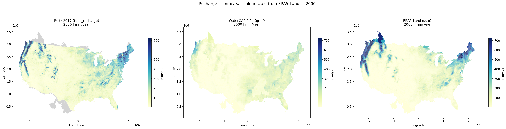
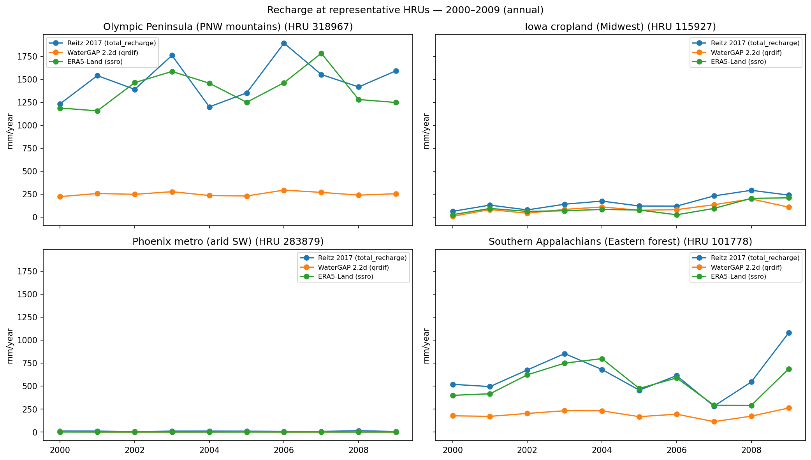

<span class="caption">Top: cross-source magnitude check, normalised over 2000–2009. Bottom: representative HRU annual series, per source.</span>

</div>
<div class="notes">

<div class="figs">

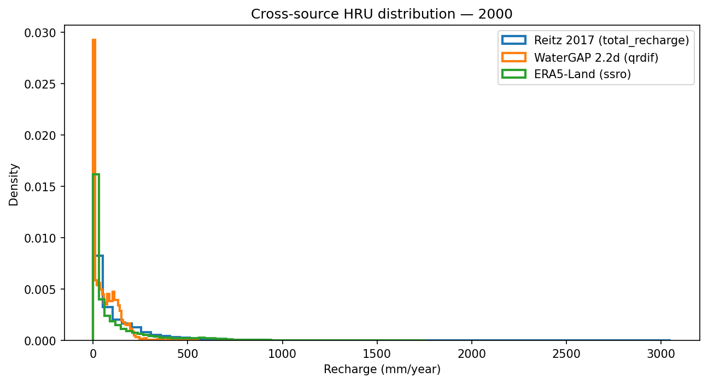

<span class="caption">HRU value distribution, per source.</span>

</div>

- Reitz 2017 carries the spatial detail (800 m → HRU); ERA5-Land `ssro` is smoother.
- WaterGAP 2.2d included in the aggregated NCs (for inspection) but excluded from the gfv2 target bound — see prior slide.

</div>
</div>

<!--
The Reitz 2017 2013 end-date is a sub-question to flag if anyone wonders why
the recharge target doesn't extend further. It's not the only reason — WaterGAP
ends 2016 — but Reitz is the spatial-detail anchor and losing it past 2013
materially changes what the bound captures.
-->

---

<!-- _class: two-col -->

## 3.3 Recharge — target output

<div class="grid">
<div class="figs tall-second">

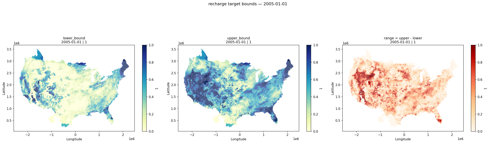
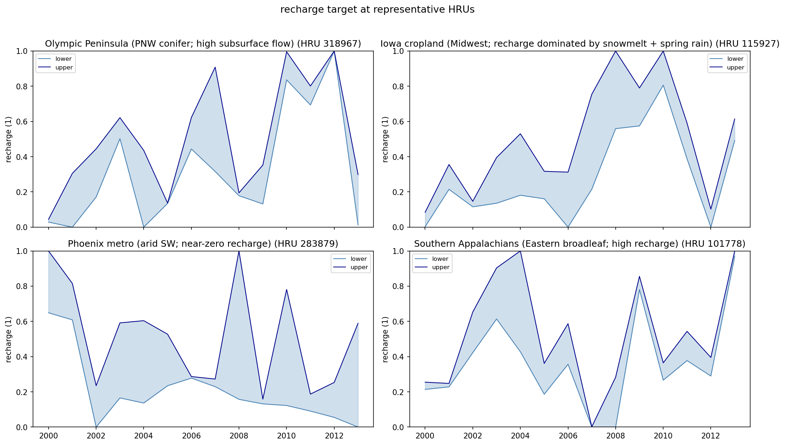

<span class="caption">Top: lower / upper bound maps (0–1 normalised). Bottom: representative HRU annual series.</span>

</div>
<div class="notes">

<div class="figs">

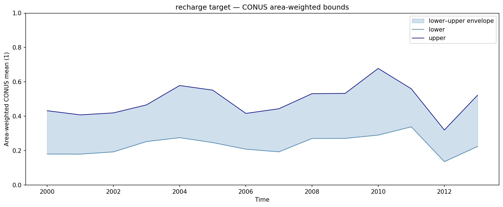

<span class="caption">CONUS-mean lower / upper envelope.</span>

</div>

<div class="callout">
<strong>Discussion hook.</strong> gfv2 ships a <strong>2-source</strong> bound — Reitz 2017 +
ERA5-Land <code>ssro</code>; WaterGAP 2.2d was dropped at this fabric for the
coarse-grid reason (slide 3.3A). Reitz 2017 is an <em>empirical baseflow-regression</em>
product, so in <strong>arid-west HRUs where baseflow is near zero, Reitz's
recharge estimate is also near zero</strong>. That collapses the bound there to
roughly <code>(≈0, ssro)</code> — effectively one-sided. <strong>Worse: in
deep-unsaturated-zone arid HRUs, real recharge lags soil-column drainage by
years to decades</strong>, so <code>ssro</code> at year N isn't even the right
temporal signal for recharge at year N. Is that bound informative enough to
guide calibration in arid HRUs?
</div>

</div>
</div>

<!--
The two-source bound width in the arid west is the question worth airing in
the room. There's a reasonable argument that adding WaterGAP back in for
non-mountainous arid HRUs would help, but it's a per-cell decision and we don't
have the per-cell logic wired up yet — currently it's an all-or-nothing
fabric-level exclusion.
-->

---

<!-- _class: fig-over-text -->

## 3.4 Soil moisture — sources & method

<div class="fig-row">

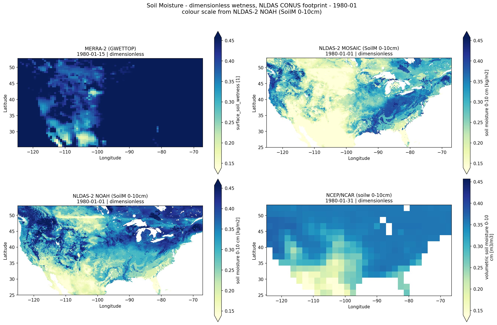

<span class="caption">Raw-grid scale before HRU aggregation — heterogeneous native units normalised to a common scale (note the coarse NCEP/NCAR cells vs the 0.125° NLDAS).</span>

</div>

<div class="text-cols">
<div>

**Sources** (monthly, upper-zone soil layer):
- **MERRA-2** `GWETTOP` — 1980–present
- **NCEP/NCAR** `soilw_0_10cm` — 1948–present *(gfv2-excluded)*
- **NLDAS-2 MOSAIC** `SoilM_0_10cm` — 1979–present
- **NLDAS-2 NOAH** `SoilM_0_10cm` — 1979–present

</div>
<div>

**Method.** 0–1 normalised independently per source — *monthly* per calendar month; *annual*. Multi-source min/max in `targets/som.py` (emits monthly + annual NCs).

<div class="callout">
<strong>gfv2 note.</strong> NCEP/NCAR (T62 ≈ 210 km) excluded — same intermountain-west coarse-grid reason as WaterGAP for recharge. gfv2 ships a 3-source bound.
</div>

</div>
</div>

<!--
Two sources (MERRA-2 + NLDAS-NOAH) report different physical layers (0–5 cm vs
0–10 cm), which is one reason we normalise per source before combining — the
normalised value is "where does this layer sit in its own historical range",
which is comparable across layers. Mention if anyone asks about depth heterogeneity.
-->

---

<!-- _class: two-col -->

## 3.4 Soil moisture — aggregated bounds

<div class="grid">
<div class="figs tall-second">

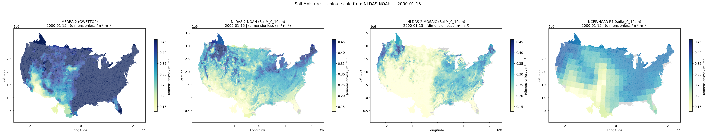
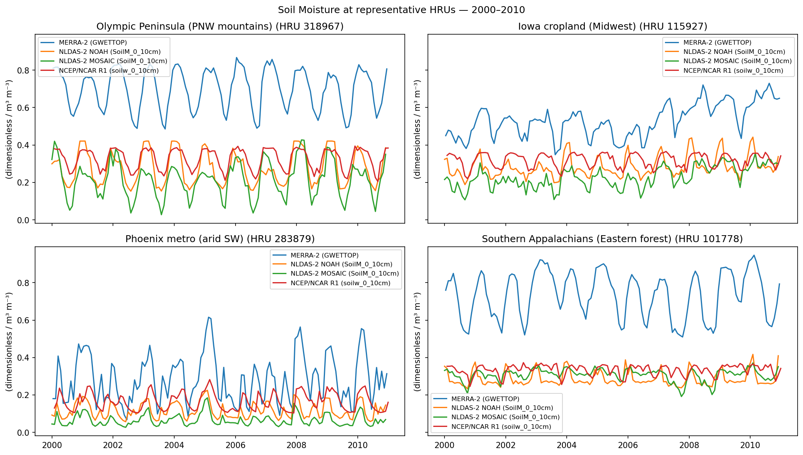

<span class="caption">Top: cross-source magnitude check (0–1 normalised — heterogeneous native units harmonised). Bottom: representative HRU time series, per source.</span>

</div>
<div class="notes">

<div class="figs">

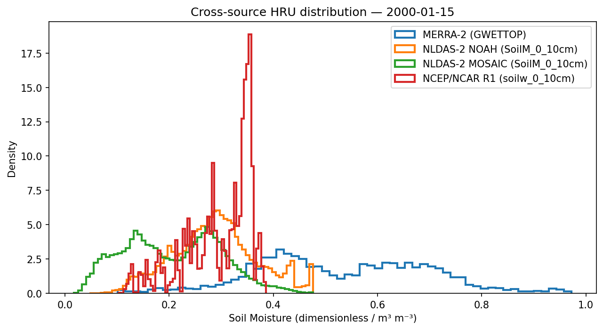

<span class="caption">HRU value distribution, per source.</span>

</div>

- Wet/dry geography agrees across all four sources at HRU resolution.
- NCEP/NCAR (T62) visibly washes out terrain detail in the intermountain west — motivation for the gfv2 exclusion.
- Annual cycle phase agreement is good across sources; amplitude varies, which the per-calendar-month normalisation absorbs.

</div>
</div>

<!--
The visible coarse-grid washout in NCEP/NCAR is the visual smoking gun for the
gfv2 exclusion. Worth flipping to that map briefly if discussion is lukewarm —
it's a quick "look, this is what we're excluding and why" moment.
-->

---

<!-- _class: two-col -->

## 3.4 Soil moisture — target output

<div class="grid">
<div class="figs tall-second">

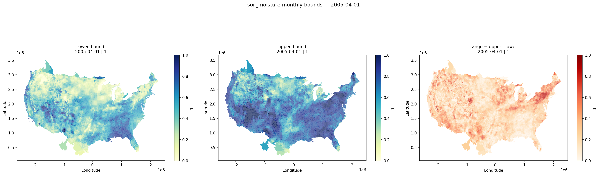
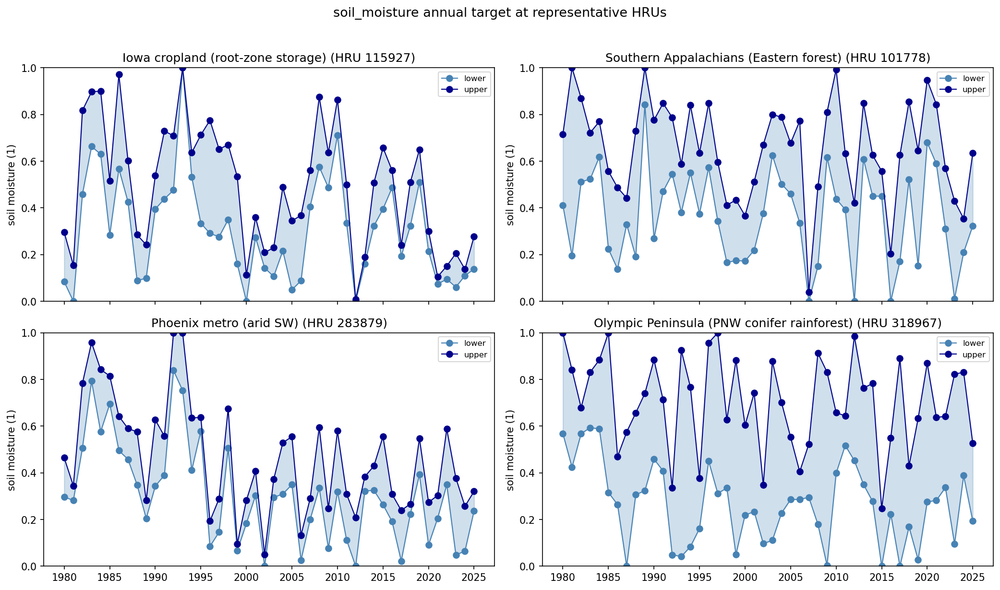

<span class="caption">Top: monthly bound maps (0–1 normalised). Bottom: annual representative HRU series.</span>

</div>
<div class="notes">

<div class="figs">

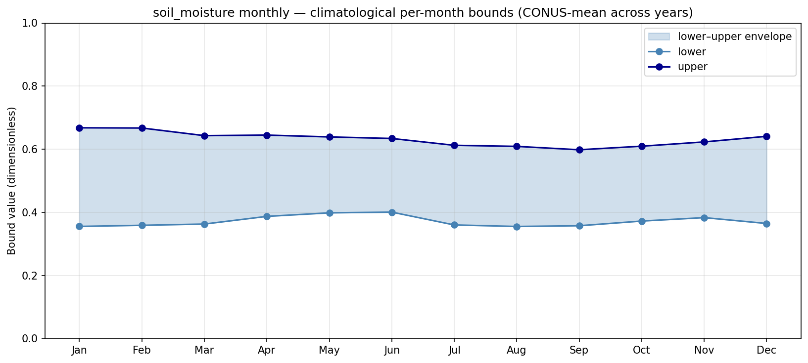

<span class="caption">Per-calendar-month CONUS-mean climatology — seasonal-cycle view of the bound.</span>

</div>

- NCs on disk: `soil_moisture_targets_monthly.nc`, `..._annual.nc`, plus `_nn_filled` variants.

<div class="callout">
<strong>Discussion hook.</strong> Monthly normalisation (per calendar month — Jans
together, Febs together, …) vs annual normalisation (single 1982–2010 window)
gives meaningfully different bound widths, especially in spring shoulder
seasons. Is the modelling team using monthly, annual, or both?
</div>

</div>
</div>

<!--
The bounds_map shows the per-HRU envelope at a snapshot month; the climatology
panel shows the seasonal cycle of the CONUS-mean bound after per-calendar-month
normalisation. The annual figures aren't shown inline to keep the slide tight,
but the file list above signals to the room that they exist if anyone wants to
dig into the annual cadence. The choice of monthly-vs-annual is genuinely a
modeller-side decision — we emit both NCs.
-->

---

<!-- _class: fig-over-text -->

## 3.5 Snow-covered area — sources & method

<div class="fig-row">

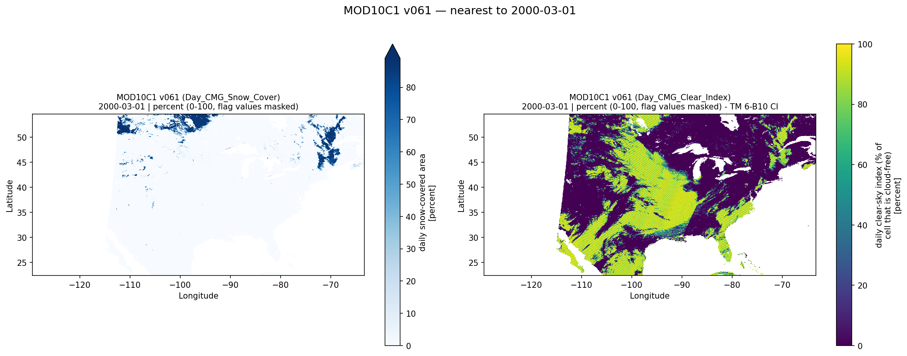

<span class="caption">Raw MOD10C1 v061 panels — CI-gated SCA fraction at 0.05° resolution before HRU aggregation.</span>

</div>

<div class="text-cols">
<div>

**Source** (single):
- **MOD10C1 v061** `Day_CMG_Snow_Cover` + `Day_CMG_Clear_Index` — 2000–present

**Method.** Per-pixel **CI > 0.70** filter (TM 6-B10). Aggregated NCs carry CI-gated SCA as a daily 0–1 fraction.

</div>
<div>

<div class="callout">
<strong>Open gap.</strong> Target builder (<code>targets/sca.py</code>) is a <span class="status-todo">STUB</span> — raises NotImplementedError. TM 6-B10 §3.5 calls for bounds from daily SCA + CI; <code>PRMSobjfun.f</code> not publicly available, so the exact bound formula has not been reconstructed.
</div>

</div>
</div>

<!--
The PRMSobjfun.f gap is genuinely unresolved. We have the aggregated NC ready
to feed a builder — the question is just what formula to feed it through.
The two natural candidates: (a) a binary CI > 70% pass/fail bound, where the
"bound" degenerates to single point estimate; (b) a CI-weighted bound width.
Worth airing for input.
-->

---

<!-- _class: two-col -->

## 3.5 Snow-covered area — aggregated bounds

<div class="grid">
<div class="figs tall-second">

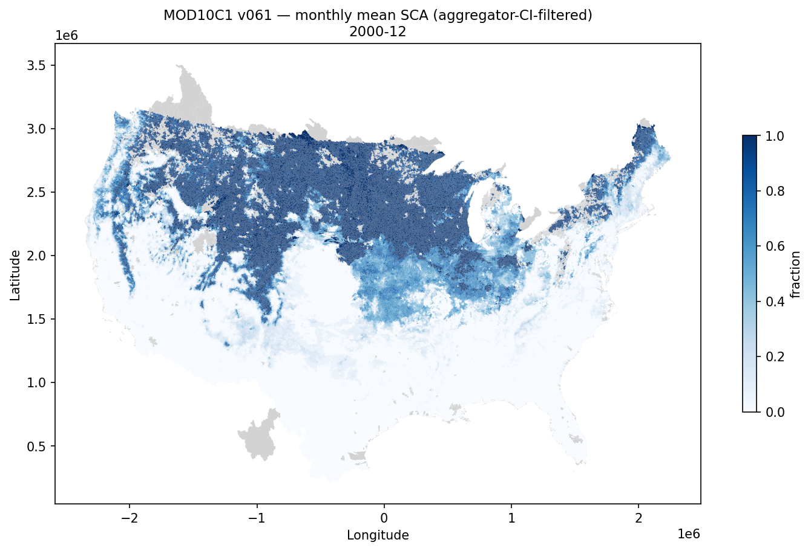
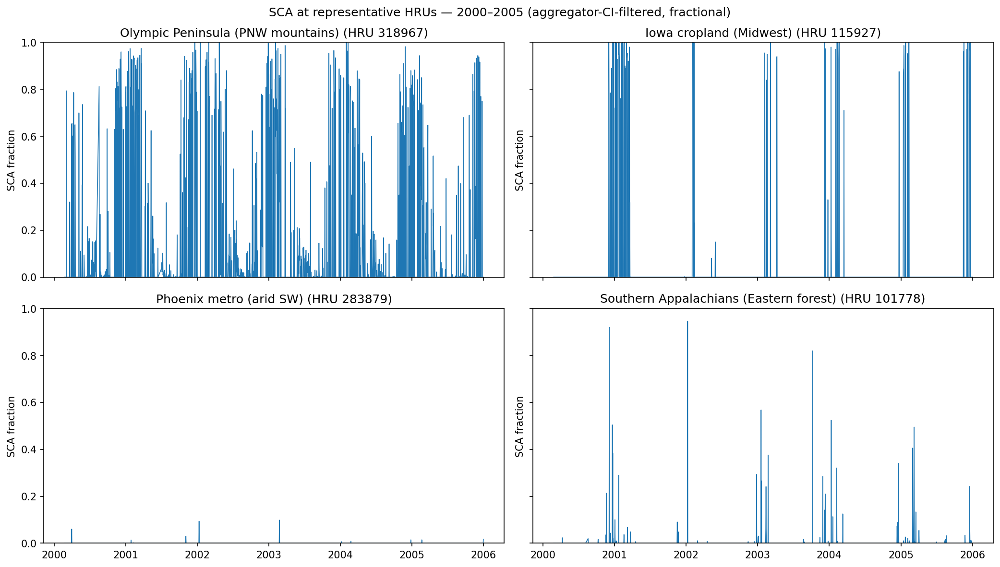

<span class="caption">Top: aggregated HRU SCA fraction, MOD10C1 v061 (CI > 70 % gate), 0–1 scale. Bottom: representative HRU time series.</span>

</div>
<div class="notes">

<div class="figs">

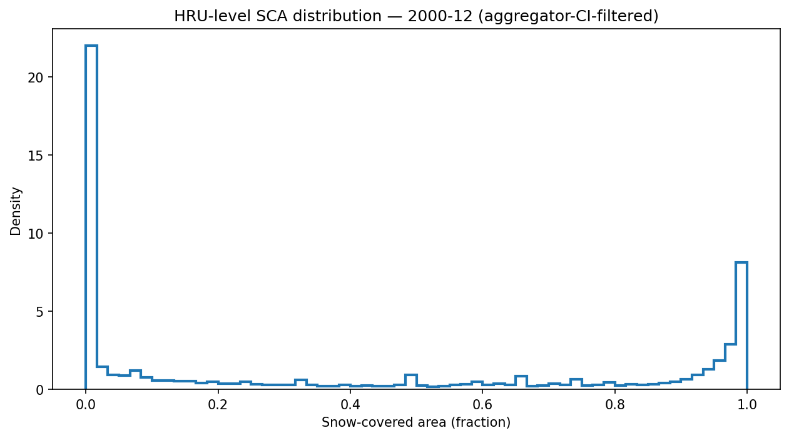

<span class="caption">HRU value distribution — bimodal as expected (snow / snow-free).</span>

</div>

- Single source (MOD10C1 v061) — figures are within-source diagnostics, not cross-source.
- Strong seasonal cycle in snowy HRUs; near-zero year-round in southern CONUS.

</div>
</div>

<!--
The polar-night coverage drop is worth knowing — it's not a pipeline bug, it's
MODIS having no signal in the dark. For CONUS specifically it's mostly a non-issue,
but if we ever extend the fabric to Alaska the CI-gate becomes a meaningful
coverage filter.
-->

---

## 3.5 Snow-covered area — target output *(placeholder — builder pending)*

<div class="callout">
<strong>Final target NC not yet produced.</strong> <code>targets/sca.py</code> is a
stub. Once the bound formula is selected, expected outputs:
<code>sca_targets.nc</code> (per-HRU per-day lower / upper bound, fraction 0–1)
plus optional <code>sca_targets_nn_filled.nc</code>.
</div>

**Decision the room can help with:**

1. **Binary CI > 70 % filter** — single point estimate per HRU per day; "bound" degenerates to (value, value). Implementable in a day.
2. **CI-weighted bound** — bound width scales with confidence; needs the reconstructed `PRMSobjfun.f` formula. Pending source-code recovery from collaborators.
3. **Something else?** — e.g. multi-day rolling CI weighting, or pairing MOD10C1 with a second source (Daymet snow fraction proxy?).

Reference: `catalog/variables.yml → snow_covered_area`, `docs/references/known-gaps-resolved.md`.

<!--
This is the most important Section-3 slide for getting decisions from the room.
We can implement (1) immediately and ship a target NC tomorrow; (2) needs the
PRMSobjfun.f recovery first and then a week of implementation; (3) is a research
question. Steer toward "what does the modelling team need by when?".
-->

---

<!-- _class: fig-over-text -->

## 3.6 SWE — sources & method

<div class="fig-row">

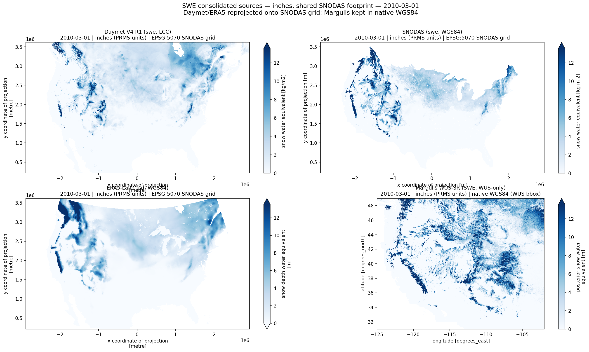

<span class="caption">Raw-grid scale before HRU aggregation — all four sources rescaled to inches on a common SNODAS-CONUS footprint (Margulis Western-US only by design).</span>

</div>

<div class="text-cols">
<div>

**Sources** (daily):
- **Daymet v4 R1** `swe` — 1980–2024
- **SNODAS** `swe` — 2003–present
- **ERA5-Land** `sd` — 1979–present
- **Margulis WUS-SR** `SWE` — 1985–2021 *(Oregon-only via `fabric_scope`)*

</div>
<div>

**Method.** HRU aggregation → harmonised to mm → **inches** in `targets/swe.py`. NaN-aware multi-source min/max. Margulis contributes only inside its OR scope; non-OR fabrics get a 3-source bound.

</div>
</div>

<!--
The year-chunked streaming was the implementation detail that made SWE tractable
on this hardware — without it the daily-cadence cross-source concat would blow
memory at fabric scale. Mention if anyone asks why SWE took longer than runoff.
-->

---

<!-- _class: two-col -->

## 3.6 SWE — aggregated bounds

<div class="grid">
<div class="figs tall-second">

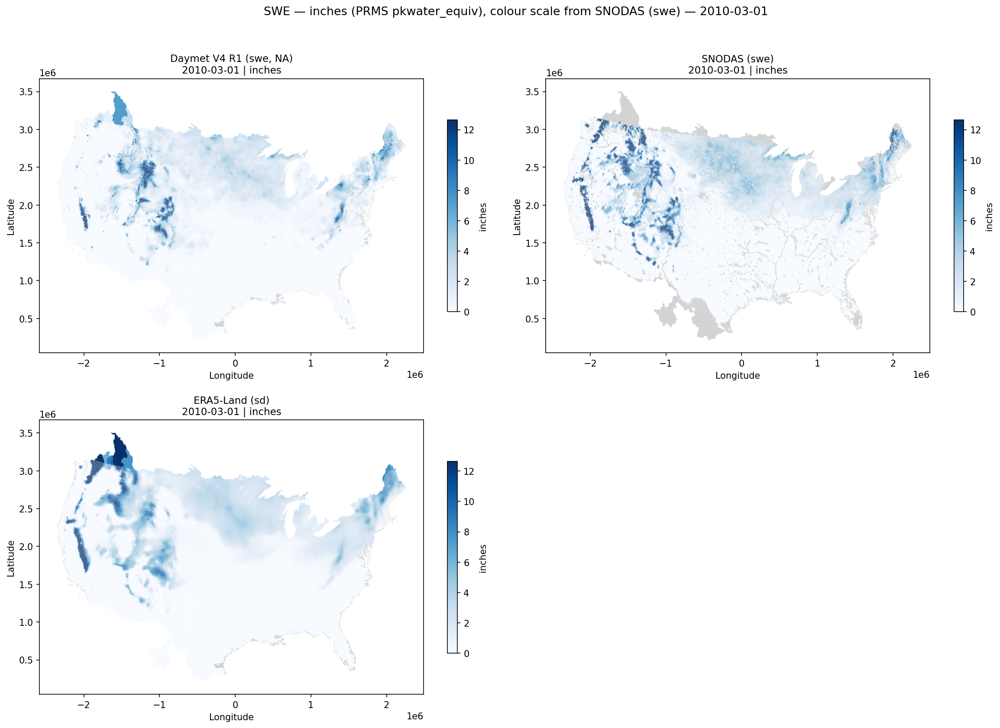
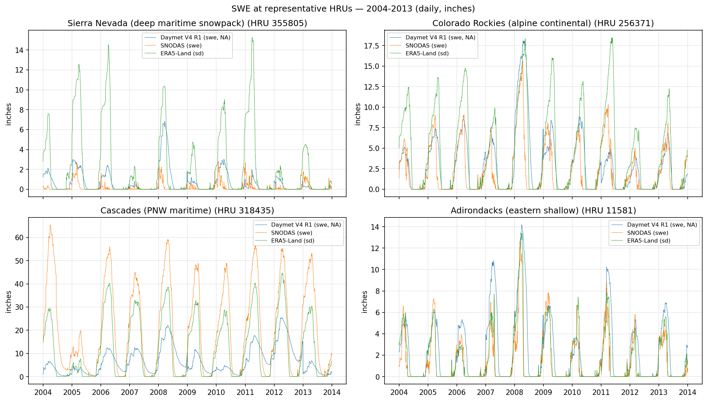

<span class="caption">Top: cross-source magnitude check (mm basis). Bottom: representative HRU time series, per source.</span>

</div>
<div class="notes">

<div class="figs">

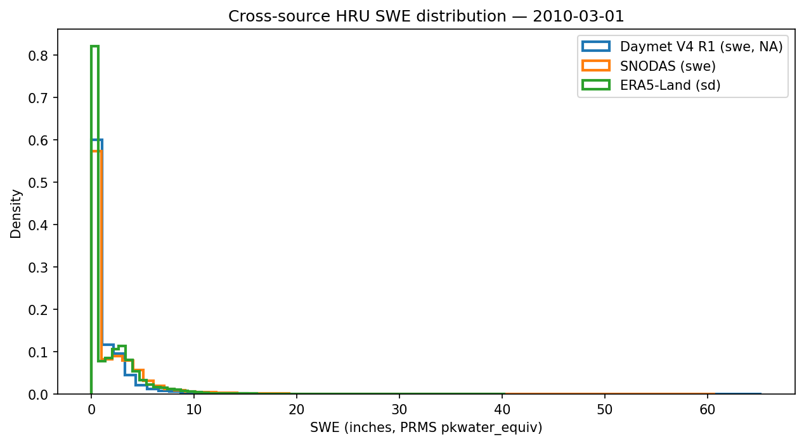

<span class="caption">HRU value distribution, per source.</span>

</div>

- **Daymet v4** `swe` — 1980–2024
- **SNODAS** `swe` — 2003–2024
- **ERA5-Land** `sd` — 1979–present
- **Margulis WUS-SR** `SWE` — 1985–2021 *(OR scope)*

</div>
</div>

<!--
WGS84-native cost: memory note project_crs_aggregation_cost has the receipt —
SNODAS and other WGS84-native sources cost ~5–8× more in weight generation
than projected sources (Daymet sinusoidal, etc.) at comparable resolution.
That's why SNODAS is the trailing item on the SWE list.
-->

---

<!-- _class: two-col -->

## 3.6 SWE — target output

<div class="grid">
<div class="figs tall-second">

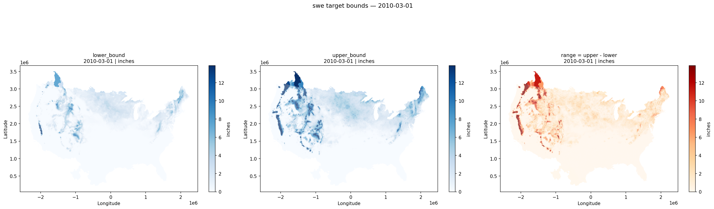
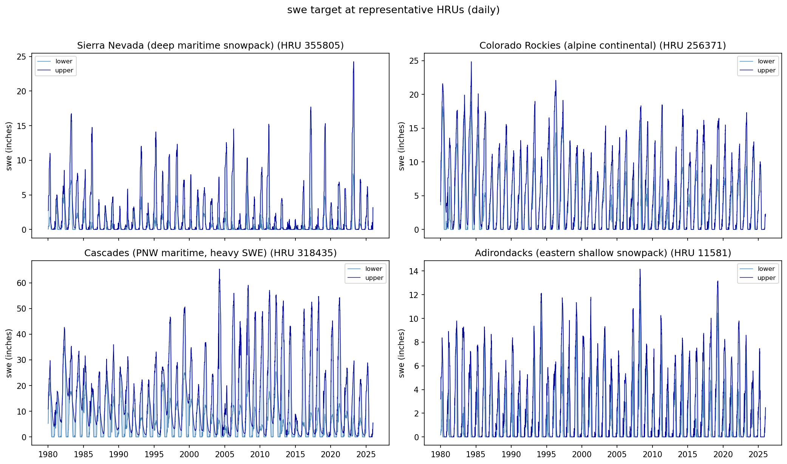

<span class="caption">Top: lower / upper bound maps (inches). Bottom: representative HRU time series with bound envelope.</span>

</div>
<div class="notes">

<div class="figs">

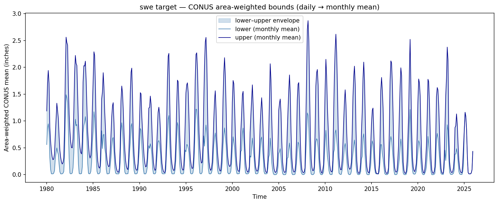

<span class="caption">CONUS-mean lower / upper envelope.</span>

</div>

- 4-source bound where Margulis is inside its OR scope; 3-source elsewhere on gfv2.
- Margulis (500 m) dominates the bound inside its OR scope.


</div>
</div>

<!--
Source weighting and NN-fill policy are both legitimate "the room can decide" items.
The period-of-record question is a harder one — it's tangled up with what the
calibration team treats as the modelling era. Defer to whatever they've said
elsewhere if known; otherwise air the trade-off.
-->

---

# Part 4 — What this unlocks · open questions

---

## How PRMS consumes a target NC

Each target NC is a **soft constraint** for PRMS calibration:

- Per-HRU per-timestep `(lower_bound, upper_bound)` in the variable's PRMS units.
- Simulated values inside the envelope incur zero cost; outside the envelope incur a penalty.
- `_nn_filled` companion is the consumer-default for builders that produce one — it closes the residual all-NaN HRUs so the optimiser sees no missing data; the honest-NaN `.nc` is the audit-trail record.

**Reusable across fabrics, not across projects** — the target NC is fabric-specific,
but the same builder + same datastore on a different fabric reproduces the equivalent
targets without re-fetching any raw data.

<!--
The "soft constraint" framing matters for the calibration audience: targets aren't
ground truth, they're the bound the optimiser is allowed to live inside.
A bound width of zero would be a point-estimate constraint (hardest); the bounds
we ship are intentionally wider where products disagree.
-->

---

## Open questions to bring to the room

1. **SCA bound formula** — binary CI > 70 % filter, CI-weighted bound, or wait on `PRMSobjfun.f` recovery? (SCA walkthrough)
2. **Period-of-record locks** per category
3. **NN-fill default** — which targets ship `_nn_filled` as the consumer default vs the honest-NaN file? Currently we emit both for runoff / AET / recharge / soil moisture; choice belongs to the modelling team.
45. **Fabric-coarse-grid exclusions** for the next fabric — WaterGAP (recharge) and NCEP/NCAR (soil moisture) are gfv2-specific; are we ready to codify a per-fabric exclusion mechanism?

<!--
These five are the discussion seeds. Order them by where the room has the most
energy — usually #1 (SCA) and #2 (SWE) draw the most response because they're
the visible "this is not done yet" items. #3-5 are the implicit decisions
that have been quietly accumulating; airing them is the point of this slide.
-->

---

# Part 5 — References & next steps

---

## References

**Architecture & methodology:**

- `docs/architecture/transformation-pipeline.md` — pre/post-aggregation policy, `mean` vs `masked_mean`, canonical row order.
- `docs/references/tm6b10-summary.md` — TM 6-B10 crib sheet keyed to this repo.
- `docs/references/calibration-target-recipes.md` — per-target unit-conversion + multi-source-combination recipes.
- `docs/references/known-gaps-resolved.md` — dataset substitutions (v006→v061, MERRA-Land→MERRA-2, NHM-MWBM→ERA5-Land+GLDAS+ClimGrid, …).
- `docs/references/target-period-coverage.md` — per-source on-disk ranges.

**Catalogue & code:**

- `catalog/sources.yml`, `catalog/variables.yml` — single source of truth for sources, variables, units, periods.
- `src/nhf_spatial_targets/targets/{run,aet,rch,som,sca,swe}.py` — per-target builders.

**Prior deck (Stage 1 / consolidated context):**

- `docs/presentations/2026-collaborator-overview-gfv2-spatial-targets.slides.md`

**GitHub:** SWE umbrella **#101** · runoff target **#92 / #95** · MOD16A2 fill-mask fix **#88**.
