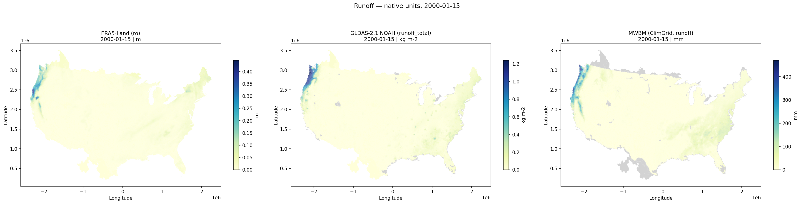
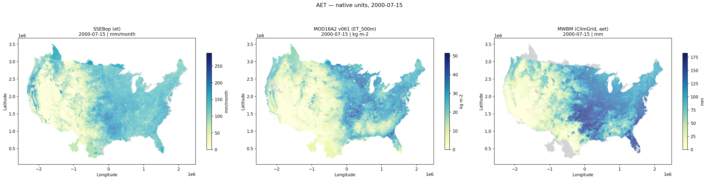
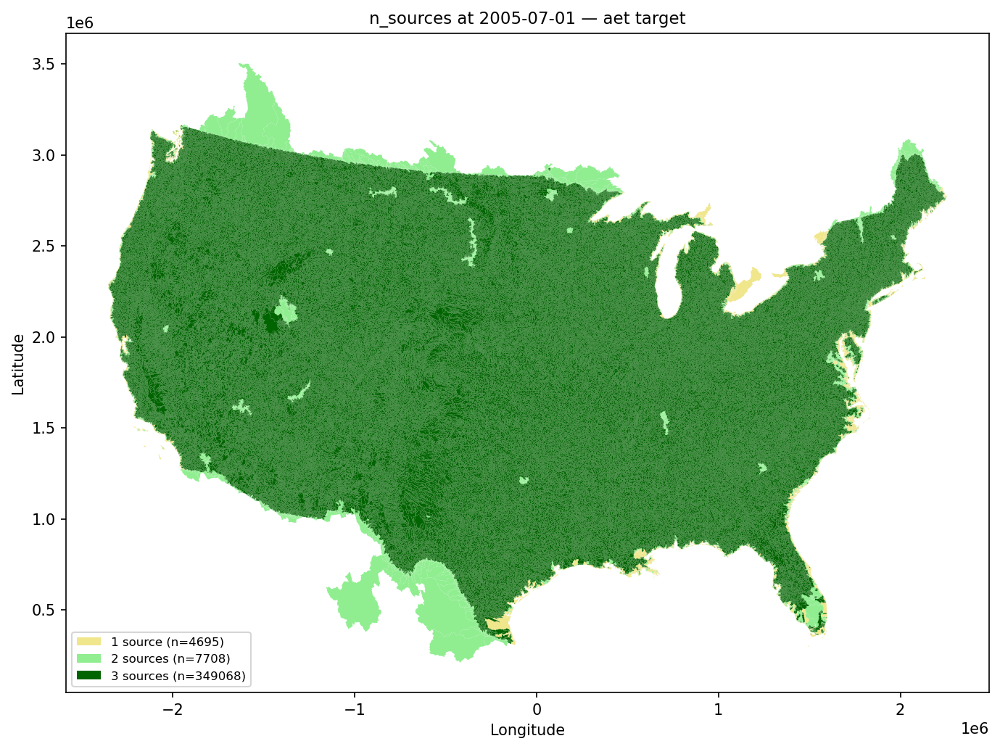
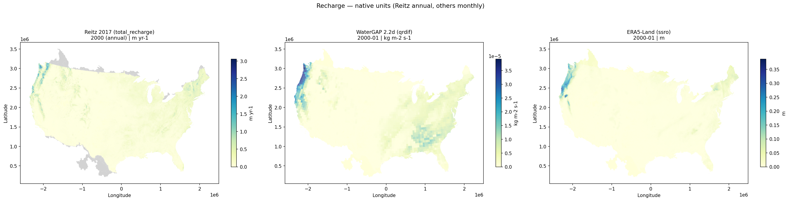
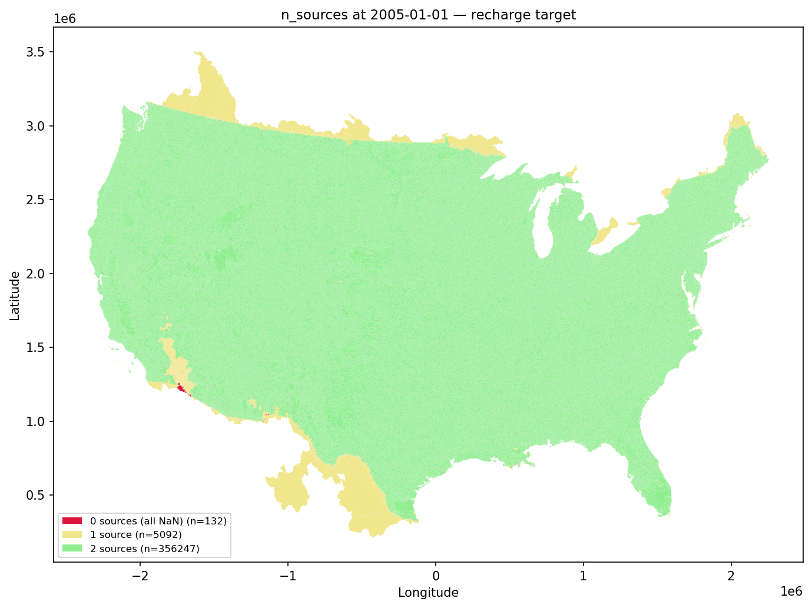
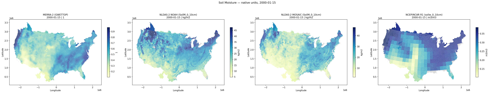
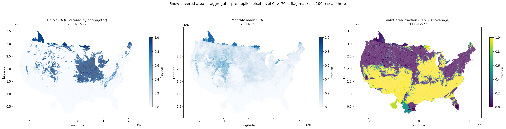
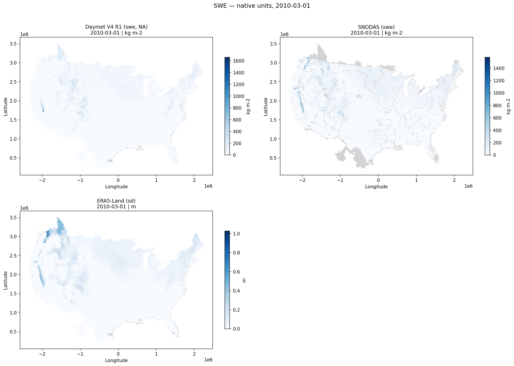

# nhf-spatial-targets

### Aggregated source results & final calibration targets

#### Project: `gfv2-spatial-targets`

Companion to the earlier collaborator briefing — this deck assumes the
gridded-source QC story and zooms straight to the **HRU-aggregated** and
**final-target** outputs that downstream PRMS calibration consumes.

<span class="footnote">
USGS National Hydrologic Model · TM 6-B10 (Hay et al. 2022) · `docs/presentations/2026-collaborator-overview-...` for Stage 1 context
</span>

<!--
Session goal: review the two outputs the pipeline actually emits — the per-source
aggregated NCs and the combined target NCs — for each of the six variable
categories. We'll skip the Stage 1 (raw gridded) material entirely; that lives
in the prior collaborator deck if anyone wants to revisit it.
-->

---

## Today's plan

1. **Repo intro** — purpose, datastore vs project, CLI workflow, multi-source bounds (~5 min)
2. **Aggregated → target pipeline** in one diagram (~3 min)
3. **Per-category walkthroughs** — sources → aggregated bounds → final target (~30 min, 6 × ~5 min)
   - Runoff · AET · Recharge · Soil moisture · Snow-covered area · SWE
4. **Open questions & next steps** (~5 min)
5. **Free discussion** (~2 min buffer + interleaved throughout)

Each category follows the same 3-slide template so the rhythm is predictable
and the natural discussion gap lands between "aggregated" and "target".

<!--
Time budget: ~30 min of speaking with ~15 min for discussion (front-loaded between
categories, back-loaded after Section 4). SWE and SCA have placeholders for the
final-target step because the work isn't end-to-end yet — those become discussion
prompts rather than figure tours.
-->

---

# Part 1 — Repo intro

---

## Project purpose

Build the **six calibration targets** for the National Hydrologic Model by
spatially aggregating gridded source datasets to an HRU fabric via
[`gdptools`](https://github.com/rmcd-mscb/gdptools). TM 6-B10 (Hay et al. 2022)
is the methodological reference; where the report's original sources are
retired we use the modern replacement (`docs/references/known-gaps-resolved.md`).

| Target | PRMS variable | Sources | Method | Step |
|---|---|---|---|---|
| Runoff | `basin_cfs` | ERA5-Land · GLDAS-NOAH · MWBM ClimGrid | NaN-aware multi-source min/max | Monthly |
| AET | `hru_actet` | MOD16A2 v061 · SSEBop · MWBM ClimGrid | Multi-source min/max | Monthly |
| Recharge | `recharge` | Reitz 2017 · WaterGAP 2.2d · ERA5-Land `ssro` | 0–1 normalised min/max (2000–2009) | Annual |
| Soil moisture | `soil_rechr` | MERRA-2 · NCEP/NCAR · NLDAS-MOSAIC · NLDAS-NOAH | 0–1 normalised min/max | Monthly + annual |
| Snow-covered area | `snowcov_area` | MOD10C1 v061 | MODIS CI > 70 % bound | Daily |
| SWE | `pkwater_equiv` | Daymet · SNODAS · ERA5-Land `sd` · Margulis WUS-SR¹ | NaN-aware multi-source min/max | Daily |

<span class="footnote">
¹ Margulis WUS-SR fabric-scoped to Oregon via `catalog/sources.yml → fabric_scope`. Non-OR fabrics fall back to a 3-source bound.
</span>

<!--
Six targets. The runoff/AET/SWE targets are bounded in absolute units (cfs,
inches/day, inches); recharge and soil moisture are 0–1 normalised because we
care about year-to-year change, not absolute magnitude. SCA is its own animal:
single source, CI-driven, builder still pending.
-->

---

## Datastore vs project — one diagram

```text
/caldera/.../nhf-datastore/              # DATASTORE — shared, fabric-independent
  ├── era5_land/   gldas/   merra2/      #   raw downloads + consolidated NCs
  ├── mod16a2/     mod10c1/   ...        #   reusable across any fabric
  ├── snodas/      daymet/                #   expensive to re-fetch
  └── margulis_wus_sr/                   #   (OR scope at catalog-level)

/caldera/.../gfv2-spatial-targets/       # PROJECT — fabric-specific (GFv2.0)
  ├── config.yml                         #   points to datastore + fabric
  ├── fabric.json   manifest.json        #   computed metadata + provenance
  ├── data/aggregated/<source>/          #   per-source HRU NCs, native units, NaN-honest
  ├── targets/                           #   final calibration target NCs (this deck's focus)
  ├── weights/                           #   gdptools weight caches (fabric × source grid)
  └── logs/

/caldera/.../gfv11-spatial-targets/      # ANOTHER PROJECT — same datastore, different fabric
  └── config.yml  → /caldera/.../nhf-datastore   # 100% raw-data reuse
```

**Why this split?** Raw downloads are expensive and fabric-independent; fabric-aligned
outputs are cheap and fabric-tied. One datastore can serve N fabrics — switching
GFv1.1 → GFv2.0 re-uses every fetched file and only rebuilds weights + aggregated NCs.

<!--
The audit trail story matters here: never delete a project directory. manifest.json
records every fetch with timestamp + sha256 + period covered; the target NCs embed
the same provenance in CF global attributes. If a calibration result is ever
questioned, the answer to "what data went into this?" lives in the project, not
in the operator's memory.
-->

---

## CLI workflow

`init` → *edit config* → `materialize-credentials` → `validate` → `fetch` → **`agg`** → **`run`**

| Step | Command | What this deck covers |
|---|---|---|
| 1 | `nhf-targets init --project-dir <dir>` | — |
| 2 | *(manual edit of `config.yml` + `.credentials.yml`)* | — |
| 3 | `nhf-targets materialize-credentials --project-dir <dir>` | — |
| 4 | `nhf-targets validate --project-dir <dir>` | — |
| 5 | `nhf-targets fetch <source> --project-dir <dir>` | — *(covered in prior deck)* |
| 6 | **`nhf-targets agg <source> --project-dir <dir>`** | **→ `data/aggregated/<source>/` (Part 3 figures B)** |
| 7 | **`nhf-targets run --project-dir <dir>`** | **→ `targets/*.nc` (Part 3 figures C)** |

**On HPC:** the same commands ship as SLURM scripts at the repo root
(`agg_all.slurm`, `agg_ssebop.slurm`, `agg_daymet.slurm`, `agg_snodas.slurm`,
`run_all.slurm`) — array dispatch + memory/CPU tuning per source.

<!--
The two stages this deck zooms into — agg and run — are the last two steps. The
fetch/consolidate side was the prior deck's main story; here it's a precondition.
The HPC note matters because on Caldera every figure in this deck came from the
SLURM-driven aggregation/target build, not from a workstation run.
-->

---

## Multi-source bounds — why a lower/upper, not a point estimate

The pipeline emits **bounds**, not a best estimate. The bound width is real
inter-product disagreement.

- Different products use different physics, forcing, and algorithms → different answers.
- The **envelope** (per-HRU min/max) is the calibration uncertainty range.
- Targets are *constraints with width*, not absolute observations.

**Why not just pick the "best" product?** No product is best everywhere; picking
one over-fits the optimiser to that product's systematic bias.

**Why not make bounds as wide as possible?** A bound that's too wide flattens
the penalty surface and calibration won't converge. The goal is an *honest* bound —
wide where products genuinely disagree, tight where they agree.

<div class="callout">
This is the conceptual hinge for every Part-3 category. The aggregated-bounds
slide shows where sources agree and disagree; the target slide shows what
falls out when we take the envelope.
</div>

<!--
Use this slide to set up the discussion frame for the rest of the deck. When a
collaborator asks "why are we keeping source X?", the right question is: does X
widen the bound in a direction that reflects real uncertainty, or in a direction
that reflects a product artifact? That's exactly the question PR #88 resolved
for MOD16A2 v061 — fill-value contamination was widening the AET bound for the
wrong reason.
-->

---

# Part 2 — Aggregated → target, one diagram

---

## How an aggregated NC becomes a target NC

```text
  ┌──────────────────────────────────────────────────────────────────────┐
  │ Stage 1  (prior deck — out of scope today)                           │
  │   source granules → fetch/<src>.py → datastore consolidated NC       │
  └─────────────────────────────────┬────────────────────────────────────┘
                                    │  native grid, native units
                                    ▼
  ┌──────────────────────────────────────────────────────────────────────┐
  │ Stage 2  AGGREGATE     (nhf-targets agg <src>)                       │
  │   pre_aggregate_hook  → flag masks, CI gates, sums-of-accums         │
  │   gdptools weighted mean (stat_method = mean | masked_mean)          │
  │   post_aggregate_hook → rename diagnostics, attach attrs             │
  │   ⇒ <project>/data/aggregated/<src>/  (HRU, native units, NaN-honest)│
  └─────────────────────────────────┬────────────────────────────────────┘
                                    │  per-source HRU bound material
                                    ▼
  ┌──────────────────────────────────────────────────────────────────────┐
  │ Stage 3  TARGET BUILD  (nhf-targets run)                             │
  │   unit conversion (× 1000, ÷ 100, mm/month → cfs, ...)               │
  │   multi-source NaN-aware min/max  →  lower_bound, upper_bound        │
  │   optional NN-fill on the combined bound  →  parallel _nn_filled.nc  │
  │   ⇒ <project>/targets/<tgt>.nc   +   <project>/targets/<tgt>_nn_filled.nc │
  └──────────────────────────────────────────────────────────────────────┘
```

Pixel-defined ops run **pre-aggregation**; HRU-defined ops run **post-aggregation**;
linear ops commute and live in `targets/` by convention. Deep dive:
`docs/architecture/transformation-pipeline.md`.

<!--
The split matters because pixel-level masking and HRU-level combination cannot
swap places. An HRU with half high-CI snow pixels and half low-CI cloud pixels
gives different answers if you gate CI pre- vs post-aggregation. mod10c1 and
mod16a2 are the two sources that exercise this — they use masked_mean because
their pre_aggregate_hook emits NaNs deliberately.
-->

---

# Part 3 — Per-category walkthroughs

For each variable: **A** sources & method · **B** aggregated bounds · **C** final target.

---

## 3.1 Runoff — sources & method

**Sources** (all three contribute to the bound):

- **ERA5-Land** `ro` — 0.1°, monthly aggregated from hourly; surface runoff in m water-eq.
- **GLDAS-2.1 NOAH** `Qs_acc + Qsb_acc` — 0.25°, monthly; surface + sub-surface in kg/m² (≡ mm).
- **MWBM ClimGrid** `runoff` — 2.5 arcmin, monthly; Wieczorek et al. 2024 ClimGrid-forced MWBM, mm/month.

**Method.** All three aggregated to HRU polygons, harmonised to mm/month, then
converted to **cfs** in `targets/run.py` using HRU area and days-in-month.
NaN-aware `nanmin / nanmax` — a bound is defined whenever ≥1 source is finite.

**Period.** Monthly, intersection 2000-01 → 2020-12 (MWBM ClimGrid caps overlap at 2020).

**Builder.** `src/nhf_spatial_targets/targets/run.py` (PR #92/#95).

<!--
The conversion to cfs is the only linear unit step that lives in the target
builder for runoff. It commutes with the area-weighted mean, so it doesn't matter
mathematically whether we convert pre- or post-aggregation — convention is post,
so the aggregated NCs stay in source-native mm/month, which makes a missed
conversion factor easier to spot if it ever creeps in.
-->

---

## 3.1 Runoff — aggregated bounds

 

<span class="caption">Left: per-source HRU map, native units. Right: cross-source magnitude check after normalisation.</span>

- All three sources show the expected east-wet / west-dry CONUS gradient at HRU resolution.
- ERA5-Land and GLDAS agree closely in the humid east; MWBM ClimGrid runs lower in arid HRUs.
- Coverage map (`runoff_coverage.png`) — full CONUS, no honest-NaN HRUs to worry about for runoff.

<!--
Bring up runoff_coverage.png in discussion if anyone asks about completeness;
runoff is the cleanest of the six on that axis. The normalisation panel is
showing relative magnitude, not the final bound — it's a "do these sources
disagree in a way that suggests a unit bug?" check. They don't.
-->

---

## 3.1 Runoff — final target

 

<span class="caption">Left: lower / upper bound maps in cfs. Right: number of sources contributing per HRU (max 3).</span>

- `runoff_target_representative_series.png` shows a representative HRU time series with bound envelope and PRMS-overlayable shape.
- `runoff_target_nn_fill_{map,series}.png` shows where NN-fill closes the residual all-NaN cells in the `_nn_filled` companion file.

<div class="callout">
<strong>Discussion hook.</strong> MWBM ClimGrid coverage ends 2020-12 (verified on PR #127's full run; n_sources=3 covers 96.6 % through 2020). Do we extend the runoff target past 2020 with a 2-source bound, or hold the window at 2020 to keep all three sources in play?
</div>

<!--
The 2020 ceiling is the one decision the room actually needs to make for runoff.
Memory note project_mwbm_2020_ceiling has the underlying numbers if anyone asks
for them. Extending past 2020 with 2 sources is mechanically fine; the question
is whether the bound width is honest with one fewer voter.
-->

---

## 3.2 AET — sources & method

**Sources:**

- **MOD16A2 v061** — 500 m, 8-day MODIS AET, sinusoidal projection. Fill-value mask in `pre_aggregate_hook`; `masked_mean` aggregation.
- **SSEBop** — remote STAC via USGS NHGF, per-year NCs; energy-balance AET.
- **MWBM ClimGrid** `aet` — 2.5 arcmin, monthly; Wieczorek et al. 2024.

**Method.** All three aggregated to HRU polygons, harmonised to **mm/month**,
converted to **inches/day** in `targets/aet.py`. Multi-source min/max bound.

**Period.** Monthly, intersection ≈ 2000–2020 (MWBM ClimGrid 2020 ceiling again).

**Builder.** `src/nhf_spatial_targets/targets/aet.py`.

<div class="callout">
<strong>Why MOD16A2 v061 needs <code>masked_mean</code>.</strong> Sinusoidal→WGS84 reprojection
was averaging fill-value codes (e.g. 32766, 32767) into valid neighbours, which
flattened seasonality and widened the AET bound for an artefactual reason
(PR #88). The fix masks `ET_500m` fills <strong>before</strong> reprojection.
</div>

<!--
The MOD16A2 fill-mask fix is one of the cleaner case studies for why
pre-aggregate hooks exist. Pre-#88 the AET bound was wider than it should have
been, because the upper envelope was being pulled by reprojection-averaged
fill codes that looked like real high values. Worth noting if discussion drifts
into "why do we have a pre_aggregate_hook at all".
-->

---

## 3.2 AET — aggregated bounds

 

<span class="caption">Left: per-source HRU map in mm/month. Right: normalised cross-source comparison.</span>

- MOD16A2 v061 (post-#88) recovers the seasonal swing — east-CONUS HRUs show summer maxima ≈ winter minima × 5–8.
- SSEBop trends slightly higher than MOD16A2 in agricultural HRUs; MWBM ClimGrid sits between them.
- Coverage map (`aet_coverage.png`) — MOD16A2 has some MODIS-sinusoidal gore-fill HRUs, SSEBop is dense, MWBM is full.

<!--
The 5–8× summer/winter ratio for east-CONUS HRUs is the test that the PR #88
fix worked end-to-end. If anyone asks "are we sure the MOD16A2 fix is in
this aggregated output?", the answer is yes — the seasonal swing is the
smoking gun.
-->

---

## 3.2 AET — final target

 

<span class="caption">Left: lower / upper bound maps in inches/day. Right: source count per HRU (max 3).</span>

- `aet_target_representative_series.png` — bound width shrinks markedly in winter (all three sources agree it's near zero) and opens up in summer where MOD16A2 and SSEBop diverge.
- `aet_target_conus_series.png` — CONUS-mean lower/upper consistent with the PR #127 21-year run.

<!--
For discussion: the summer/winter bound asymmetry is the calibration-relevant
feature. The optimiser has plenty of room in summer to fit either a MOD16A2-like
or SSEBop-like response without leaving the envelope; in winter it's locked
to a narrow band. That's the kind of "honest bound" we want.
-->

---

## 3.3 Recharge — sources & method

**Sources** (all annual):

- **Reitz 2017** — 800 m annual recharge, USGS ScienceBase; inches/year.
- **WaterGAP 2.2d** — 0.5° monthly diffuse recharge summed to annual; mm/month.
- **ERA5-Land** `ssro` — 0.1° hourly sub-surface runoff summed to annual; m water-eq (recharge proxy).

**Method.** Each source aggregated to HRU polygons, then **0–1 normalised
independently over 2000–2009** before the multi-source `nanmin / nanmax`.
Optimisation target is year-to-year *relative* change, not absolute magnitude.

**Period.** Annual, normalisation window 2000–2009 (TM 6-B10 body text).

**Builder.** `src/nhf_spatial_targets/targets/rch.py`.

<div class="callout">
<strong>gfv2 note.</strong> WaterGAP 2.2d (0.5°) is excluded from recharge for the
gfv2 fabric — the 0.5° cells average orographic gradients across mountain/valley
pairs in the intermountain west, so HRUs in the same source cell collapse to a
constant. Per-fabric decision; revisit for non-mountainous fabrics.
</div>

<!--
The fabric-coarse-grid exclusion is captured in memory note
project_gfv2_coarse_grid_exclusions. It's a per-fabric judgment call, not a
catalog-level decision — WaterGAP 2.2d still lives in catalog/sources.yml and
is fetched into the shared datastore, it's just dropped at the target-build
stage for gfv2.
-->

---

## 3.3 Recharge — aggregated bounds

 

<span class="caption">Left: per-source HRU map, native units. Right: normalised cross-source comparison over 2000–2009.</span>

- Reitz 2017 carries the spatial detail (800 m → HRU); ERA5-Land `ssro` is smoother.
- WaterGAP 2.2d included in the aggregated NCs (for inspection) but excluded from the gfv2 target bound — see prior slide.
- Coverage map (`recharge_coverage.png`) — Reitz 2017 ends 2013; ERA5-Land extends through present.

<!--
The Reitz 2017 2013 end-date is a sub-question to flag if anyone wonders why
the recharge target doesn't extend further. It's not the only reason — WaterGAP
ends 2016 — but Reitz is the spatial-detail anchor and losing it past 2013
materially changes what the bound captures.
-->

---

## 3.3 Recharge — final target

 

<span class="caption">Left: lower / upper bound maps, normalised 0–1. Right: source count per HRU.</span>

- `recharge_target_representative_series.png` — annual cadence, 0–1 normalised; bound width varies HRU-to-HRU.
- `recharge_target_nn_fill_{map,series}.png` — companion `_nn_filled` file closes residual all-NaN HRUs.

<div class="callout">
<strong>Discussion hook.</strong> Two-source bound (Reitz + ERA5-Land `ssro`) is what
gfv2 actually ships. Is that bound informative enough for calibration in the
arid west, where Reitz 2017's mean recharge is near zero and ERA5-Land `ssro`
is the dominant signal?
</div>

<!--
The two-source bound width in the arid west is the question worth airing in
the room. There's a reasonable argument that adding WaterGAP back in for
non-mountainous arid HRUs would help, but it's a per-cell decision and we don't
have the per-cell logic wired up yet — currently it's an all-or-nothing
fabric-level exclusion.
-->

---

## 3.4 Soil moisture — sources & method

**Sources** (all monthly, upper-zone soil layer):

- **MERRA-2** `GWETTOP` — 0.5° monthly, 0–0.05 m, dimensionless wetness (preferred).
- **NCEP/NCAR** `soilw.0-10cm` — ~1.9° monthly, 0–0.10 m, VWC (m³/m³).
- **NLDAS-2 MOSAIC** `SoilM_0_10cm` — 0.125° monthly, 0–0.10 m, kg/m².
- **NLDAS-2 NOAH** `SoilM_0_10cm` — 0.125° monthly, 0–0.10 m, kg/m².

**Method.** Each source aggregated to HRU polygons, then **0–1 normalised
independently** — *monthly* normalised per calendar month (all Jans together,
all Febs together, …); *annual* normalised over full 1982–2010 (TM 6-B10 App. 1).
Multi-source min/max.

**Builder.** `src/nhf_spatial_targets/targets/som.py` (emits both monthly and annual NCs).

<div class="callout">
<strong>gfv2 note.</strong> NCEP/NCAR (T62 ≈ 210 km) excluded for the same intermountain-west
coarse-grid reason as WaterGAP for recharge. gfv2 ships a 3-source soil-moisture bound
(MERRA-2, NLDAS-MOSAIC, NLDAS-NOAH).
</div>

<!--
Two sources (MERRA-2 + NLDAS-NOAH) report different physical layers (0–5 cm vs
0–10 cm), which is one reason we normalise per source before combining — the
normalised value is "where does this layer sit in its own historical range",
which is comparable across layers. Mention if anyone asks about depth heterogeneity.
-->

---

## 3.4 Soil moisture — aggregated bounds

 

<span class="caption">Left: per-source HRU map, native units (heterogeneous — see units note). Right: normalised cross-source comparison.</span>

- Wet/dry geography agrees across all four sources at HRU resolution.
- NCEP/NCAR (T62) visibly washes out terrain detail in the intermountain west — motivation for the gfv2 exclusion.
- Time series (`soil_moisture_time_series.png`) — annual cycle phase agreement is good; amplitude varies across sources, which the per-calendar-month normalisation absorbs.

<!--
The visible coarse-grid washout in NCEP/NCAR is the visual smoking gun for the
gfv2 exclusion. Worth flipping to that map briefly if discussion is lukewarm —
it's a quick "look, this is what we're excluding and why" moment.
-->

---

## 3.4 Soil moisture — final target

 

<span class="caption">Left: monthly lower / upper bound maps, normalised 0–1. Right: per-calendar-month climatology, CONUS mean.</span>

- `soil_moisture_target_monthly_coverage_timeseries.png` — bound coverage across the 1982–2010 window.
- Annual companions on disk: `..._annual_representative_series.png`, `..._annual_conus_series.png`, `..._annual_nan_map.png`, `..._annual_nn_fill_series.png`.
- NCs on disk: `soil_moisture_targets_monthly.nc`, `..._annual.nc`, plus `_nn_filled` variants.

<div class="callout">
<strong>Discussion hook.</strong> Monthly normalisation (per calendar month — Jans
together, Febs together, …) vs annual normalisation (single 1982–2010 window)
gives meaningfully different bound widths, especially in spring shoulder
seasons. Is the modelling team using monthly, annual, or both?
</div>

<!--
The bounds_map shows the per-HRU envelope at a snapshot month; the climatology
panel shows the seasonal cycle of the CONUS-mean bound after per-calendar-month
normalisation. The annual figures aren't shown inline to keep the slide tight,
but the file list above signals to the room that they exist if anyone wants to
dig into the annual cadence. The choice of monthly-vs-annual is genuinely a
modeller-side decision — we emit both NCs.
-->

---

## 3.5 Snow-covered area — sources & method

**Source** (single):

- **MOD10C1 v061** — 0.05° daily MODIS snow cover, global. Variables `Day_CMG_Snow_Cover` (sca) and `Day_CMG_Clear_Index` (CI).

**Method.** Per-pixel filter: only days/cells with **CI > 0.70** contribute
(TM 6-B10). `pre_aggregate_hook` applies the CI gate and masks flag values >100;
`masked_mean` aggregation. Aggregated NCs carry CI-gated sca as a daily 0–1 fraction.

**Builder.** `src/nhf_spatial_targets/targets/sca.py` — **<span class="status-todo">STUB (18 lines, raises NotImplementedError)</span>**

<div class="callout">
<strong>Open gap.</strong> TM 6-B10 §3.5 calls for upper/lower bounds derived from
the daily SCA value and its associated CI. <code>PRMSobjfun.f</code> is not
publicly available, so the exact bound formula has not been reconstructed.
See <code>docs/references/known-gaps-resolved.md</code> → "Still open".
</div>

<!--
The PRMSobjfun.f gap is genuinely unresolved. We have the aggregated NC ready
to feed a builder — the question is just what formula to feed it through.
The two natural candidates: (a) a binary CI > 70% pass/fail bound, where the
"bound" degenerates to single point estimate; (b) a CI-weighted bound width.
Worth airing for input.
-->

---

## 3.5 Snow-covered area — aggregated bounds

 

<span class="caption">Left: HRU SCA fraction (CI-gated). Right: HRU time series showing seasonal cycle.</span>

- Strong seasonal cycle in snowy HRUs; near-zero year-round in southern CONUS.
- `snow_covered_area_coverage.png` — coverage drops in winter at high latitudes where CI is rarely > 70 % under polar night.
- `snow_covered_area_histogram.png` — bimodal as expected (snow-covered / snow-free).

<!--
The polar-night coverage drop is worth knowing — it's not a pipeline bug, it's
MODIS having no signal in the dark. For CONUS specifically it's mostly a non-issue,
but if we ever extend the fabric to Alaska the CI-gate becomes a meaningful
coverage filter.
-->

---

## 3.5 Snow-covered area — final target *(placeholder — builder pending)*

<div class="callout">
<strong>Final target NC not yet produced.</strong> <code>targets/sca.py</code> is a
stub. Once the bound formula is selected, expected outputs:
<code>sca_targets.nc</code> (per-HRU per-day lower / upper bound, fraction 0–1)
plus optional <code>sca_targets_nn_filled.nc</code>.
</div>

**Decision the room can help with:**

1. **Binary CI > 70 % filter** — single point estimate per HRU per day; "bound" degenerates to (value, value). Implementable in a day.
2. **CI-weighted bound** — bound width scales with confidence; needs the reconstructed `PRMSobjfun.f` formula. Pending source-code recovery from collaborators.
3. **Something else?** — e.g. multi-day rolling CI weighting, or pairing MOD10C1 with a second source (Daymet snow fraction proxy?).

Reference: `catalog/variables.yml → snow_covered_area`, `docs/references/known-gaps-resolved.md`.

<!--
This is the most important Section-3 slide for getting decisions from the room.
We can implement (1) immediately and ship a target NC tomorrow; (2) needs the
PRMSobjfun.f recovery first and then a week of implementation; (3) is a research
question. Steer toward "what does the modelling team need by when?".
-->

---

## 3.6 SWE — sources & method

**Sources** (all daily):

- **Daymet** v4 R1 `swe` — 1 km daily, NA/HI/PR; kg/m² (≡ mm).
- **SNODAS** `swe` — 1 km daily CONUS, 2003+; kg/m² (≡ mm). WGS84-native — heavy weight gen.
- **ERA5-Land** `sd` — 0.1° daily, 1979+; m water-eq → mm.
- **Margulis WUS-SR** `SWE` — 500 m daily, **Oregon-only** (`fabric_scope`); 1985–2021; m water-eq → mm.

**Method.** All four aggregated to HRU polygons, harmonised to mm, then
converted to **inches** in `targets/swe.py`. NaN-aware multi-source `nanmin / nanmax`
with **year-chunked streaming** to bound peak RAM (PR #139). Margulis contributes
only inside its Oregon `fabric_scope` window; non-OR fabrics get a 3-source bound.

**Builder.** `src/nhf_spatial_targets/targets/swe.py` — implemented (454 lines).
End-to-end run for gfv2 still **<span class="status-wip">in progress</span>**.

<!--
The year-chunked streaming was the implementation detail that made SWE tractable
on this hardware — without it the daily-cadence cross-source concat would blow
memory at fabric scale. Mention if anyone asks why SWE took longer than runoff.
-->

---

## 3.6 SWE — aggregated bounds (per-source status)

 

<span class="caption">Left: per-source HRU map, native units (mm). Right: HRU time series across the four sources.</span>

| Source | Period available | Aggregation status on gfv2 |
|---|---|---|
| Daymet v4 | 1980–2024 | <span class="status-done">✅ done</span> |
| SNODAS | 2003–2024 | <span class="status-wip">⏳ recent runs in flight</span> (see `logs/agg_snodas_*.out`) |
| ERA5-Land `sd` | 1979–present | <span class="status-done">✅ done</span> |
| Margulis WUS-SR | 1985–2021 (OR only) | <span class="status-done">✅ done</span> |

<div class="callout">
<strong>Verify on talk day.</strong> SNODAS per-year status changes most week-to-week.
Re-check <code>find &lt;project&gt;/data/aggregated/snodas -name '*.nc' | wc -l</code> and the
most recent <code>logs/agg_snodas_*.out</code> before this slide.
</div>

<!--
WGS84-native cost: memory note project_crs_aggregation_cost has the receipt —
SNODAS and other WGS84-native sources cost ~5–8× more in weight generation
than projected sources (Daymet sinusoidal, etc.) at comparable resolution.
That's why SNODAS is the trailing item on the SWE list.
-->

---

## 3.6 SWE — final target *(placeholder — end-to-end run pending)*

<div class="callout">
<strong>Final target NCs not yet on gfv2.</strong> Builder is implemented; the
end-to-end run waits on SNODAS aggregation completion. Expected outputs:
<code>swe_targets.nc</code> and <code>swe_targets_nn_filled.nc</code>
(per-HRU per-day lower / upper bound in inches).
</div>

- For gfv2 (non-Oregon-only fabric): 4-source bound where Margulis is inside its OR scope, 3-source elsewhere.
- For an Oregon-only fabric the Margulis source dominates because of its 500 m native resolution.
- Builder behaviour cross-checked on the gfv2 fabric subsets during SWE umbrella (#101).

**Discussion hooks:**

1. **Source weighting** — equal weight to all four, or weight by native resolution / period coverage?
2. **NN-fill default** — for SWE the all-NaN gaps cluster in summer where the bound is meaningfully zero anyway; do we ship NN-filled as the consumer default?
3. **Period of record lock** — SNODAS-bounded 2003 floor, or accept a Daymet-only era 1980–2002?

<!--
Source weighting and NN-fill policy are both legitimate "the room can decide" items.
The period-of-record question is a harder one — it's tangled up with what the
calibration team treats as the modelling era. Defer to whatever they've said
elsewhere if known; otherwise air the trade-off.
-->

---

# Part 4 — What this unlocks · open questions

---

## How PRMS consumes a target NC

Each target NC is a **soft constraint** for PRMS calibration:

- Per-HRU per-timestep `(lower_bound, upper_bound)` in the variable's PRMS units.
- Simulated values inside the envelope incur zero cost; outside the envelope incur a penalty.
- `_nn_filled` companion is the consumer-default for builders that produce one — it closes the residual all-NaN HRUs so the optimiser sees no missing data; the honest-NaN `.nc` is the audit-trail record.

**Reusable across fabrics, not across projects** — the target NC is fabric-specific,
but the same builder + same datastore on a different fabric reproduces the equivalent
targets without re-fetching any raw data.

<!--
The "soft constraint" framing matters for the calibration audience: targets aren't
ground truth, they're the bound the optimiser is allowed to live inside.
A bound width of zero would be a point-estimate constraint (hardest); the bounds
we ship are intentionally wider where products disagree.
-->

---

## Open questions to bring to the room

1. **SCA bound formula** — binary CI > 70 % filter, CI-weighted bound, or wait on `PRMSobjfun.f` recovery? (Part 3.5)
2. **SWE end-to-end run** — order of operations for the remaining SNODAS aggregation; do we cut a gfv2 SWE target as soon as it lands, or wait on additional QA? (Part 3.6)
3. **Period-of-record locks** per category — runoff & AET intersect at 2000–2020 because of MWBM ClimGrid; do we extend with 2-source bounds past 2020?
4. **NN-fill default** — which targets ship `_nn_filled` as the consumer default vs the honest-NaN file? Currently we emit both for runoff / AET / recharge / soil moisture; choice belongs to the modelling team.
5. **Fabric-coarse-grid exclusions** for the next fabric — WaterGAP (recharge) and NCEP/NCAR (soil moisture) are gfv2-specific; are we ready to codify a per-fabric exclusion mechanism?

<!--
These five are the discussion seeds. Order them by where the room has the most
energy — usually #1 (SCA) and #2 (SWE) draw the most response because they're
the visible "this is not done yet" items. #3-5 are the implicit decisions
that have been quietly accumulating; airing them is the point of this slide.
-->

---

# Part 5 — References & next steps

---

## References

**Architecture & methodology:**

- `docs/architecture/transformation-pipeline.md` — pre/post-aggregation policy, `mean` vs `masked_mean`, canonical row order.
- `docs/references/tm6b10-summary.md` — TM 6-B10 crib sheet keyed to this repo.
- `docs/references/calibration-target-recipes.md` — per-target unit-conversion + multi-source-combination recipes.
- `docs/references/known-gaps-resolved.md` — dataset substitutions (v006→v061, MERRA-Land→MERRA-2, NHM-MWBM→ERA5-Land+GLDAS+ClimGrid, …).
- `docs/references/target-period-coverage.md` — per-source on-disk ranges.

**Catalogue & code:**

- `catalog/sources.yml`, `catalog/variables.yml` — single source of truth for sources, variables, units, periods.
- `src/nhf_spatial_targets/targets/{run,aet,rch,som,sca,swe}.py` — per-target builders.

**Prior deck (Stage 1 / consolidated context):**

- `docs/presentations/2026-collaborator-overview-gfv2-spatial-targets.slides.md`

**GitHub:** SWE umbrella **#101** · runoff target **#92 / #95** · MOD16A2 fill-mask fix **#88**.

---

## Next steps before the next checkpoint

1. **SCA target builder** — pick a bound formula (Part 3.5), implement against existing aggregated NC, ship `sca_targets.nc`.
2. **SWE end-to-end run on gfv2** — once SNODAS aggregation finishes, run `nhf-targets run-swe`, render `notebooks/targets/inspect_target_swe.ipynb`, swap the SWE placeholder slide for real figures.
3. **Per-fabric exclusion mechanism** — if other fabrics need WaterGAP / NCEP-NCAR re-included, lift the hard-coded `gfv2` exclusion into a config-driven per-fabric override.

<span class="footnote">
Questions / discussion → open floor.
</span>

<!--
Closing slide. Let discussion expand naturally; if it stalls, prompt with
"of the five open questions, which one would you most like resolved before
next month?" — the answer to that frames the next sprint.
-->
