# Oregon — aggregated + target results

#### Project: `or-spatial-targets` · 16,814 HRUs · PNW · EPSG:5070

Sibling to the [`gfv2-spatial-targets` overview](2026-05-aggregated-targets-overview-gfv2-spatial-targets.slides.md) — same pipeline, regional fabric. This deck zooms straight to the **aggregated** and **final-target** outputs for the five implemented Oregon targets.

USGS National Hydrologic Model · TM 6-B10 (Hay et al. 2022) · sibling deck has Part 1 (repo intro) + Part 2 (aggregation pipeline) if needed

<!--
Session goal: walk the five implemented OR targets (runoff/aet/rch/som/swe) plus
the SCA stub, using the per-source aggregated NCs and the combined target NCs.
Margulis WUS-SR makes SWE a 4-source bound on OR — the flagship delta from gfv2.
-->

---

<!-- _class: compact -->

## Oregon at a glance

| | OR (this deck) | gfv2 (sibling deck) |
|---|---|---|
| **HRU count** | 16,814 | 361,471 |
| **Fabric extent** | Pacific Northwest | CONUS |
| **Fabric file** | `model_layers_9_nhru.parquet` | `gfv2_fabric.gpkg` |
| **Equal-area CRS** | EPSG:5070 (CONUS Albers) | EPSG:5070 |
| **Targets built** | 5 (runoff / aet / rch / som / swe) | 5 (same) |
| **SWE bound** | **4 sources** (Margulis WUS-SR active via `fabric_scope: [or]`) | 3 sources (Margulis filtered out) |
| **SCA** | Builder stub — not built | Builder stub — not built |

| Target | Sources (active in OR build) | Period | Step |
|---|---|---|---|
| Runoff | ERA5-Land · GLDAS-NOAH · MWBM ClimGrid | 1979-01 .. 2024-12¹ | Monthly |
| AET | MOD16A2 v061 · SSEBop · MWBM ClimGrid | 2000-01 .. 2024-12² | Monthly |
| Recharge | Reitz 2017 · ERA5-Land³ | 2000 .. 2013 | Annual |
| Soil moisture | MERRA-2 · NLDAS-MOSAIC · NLDAS-NOAH⁴ | 1982-01 .. 2010-12 | Monthly + annual |
| **SWE** | Daymet · SNODAS · ERA5-Land · **Margulis WUS-SR** | 1980-01 .. 2025-12 | Daily |

¹ Runoff bound width varies across the 1979-2024 window — 2 sources 1979-1999 (ERA5+MWBM), 3 sources 2000-2020 (all), 2 sources 2021-2024 (ERA5+GLDAS; MWBM ends 2020). ² AET likewise — 3 sources 2000-2020, 2 sources 2021-2023 (MOD16A2+SSEBop), 1 source 2024 (MOD16A2 only; SSEBop ends 2023, bound collapses to a point estimate that year). ³ WaterGAP 2.2d excluded on OR — see slide 3.3A. ⁴ NCEP/NCAR excluded on OR — see slide 3.4A. Both exclusions inherit the gfv2 coarse-grid rationale (PNW shares the intermountain-west terrain).

<!--
The OR build is the first regional fabric to take the pipeline end-to-end. The
single biggest delta from gfv2 is SWE: Margulis WUS-SR (500 m, 1985-2021,
Western US only via fabric_scope) actually contributes here. Aggregation finished
late April 2026; targets rebuilt 2026-05-23 after the netCDF default-fill mask
fix (#205) cleaned out an aggregator footgun that surfaces on any regional
fabric whose HRUs poke outside a source's data extent.
-->

---

<!-- _class: compact -->

## Sources used vs. sources available

The pipeline emits two layers of inspection figures that live in different namespaces and answer different questions:

| | What's plotted | What it shows |
|---|---|---|
| **`docs/figures/aggregated/or-spatial-targets/*.png`** | Every source on disk under `data/aggregated/<src>/` | Per-source HRU coverage / magnitude / time series — the **menu** |
| **`docs/figures/targets/or-spatial-targets/*.png`** | The configured target bound (`config.yml → targets.<t>.sources`) | The **min/max envelope** that actually feeds PRMS calibration |

The aggregated inspect notebooks (`notebooks/aggregated/inspect_aggregated_*.ipynb`) plot every source that's aggregated on disk regardless of `config.yml`, so aggregated PNGs may show sources excluded from the target. Source-of-truth for "what's in the target": the target NC's `source` global attribute and `n_sources` data variable.

<strong>OR-specific exclusions from the target build</strong> (both coarse-grid; same rationale as gfv2):
<ul>
<li><code>recharge.sources</code> drops <strong>WaterGAP 2.2d</strong> (0.5° ≈ 50 km) — orographic gradients across PNW mountain/valley HRUs collapse to one cell. Inline reminder on slide 3.3A.</li>
<li><code>soil_moisture.sources</code> drops <strong>NCEP/NCAR</strong> (T62 ≈ 210 km) — same reason at coarser resolution. Inline reminder on slide 3.4A.</li>
</ul>

<!--
Establishing slide for the aggregated-vs-target source mismatch viewers will see
throughout: e.g. the aggregated WaterGAP figure appears under 3.3B even though
WaterGAP isn't in the OR recharge target bound. That's by design — aggregated is
the exploration view (every source ever pointed at OR is still on disk and worth
looking at); target is the calibration view. Per-fabric exclusion decisions live
in the project's config.yml, not in the catalog (raw downloads remain reusable).
-->

---

# Part 3 — Calibration target walkthroughs

For each variable: **A** sources & method · **B** aggregated bounds · **C** target output.

---

<!-- _class: fig-over-text -->

## 3.1 Runoff — sources & method

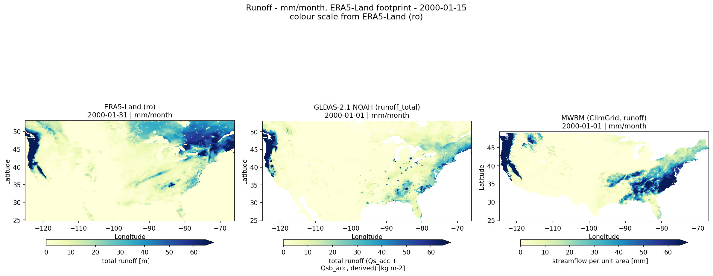

Raw-grid scale before HRU aggregation — all three sources on a common mm/month scale, ERA5-Land footprint.

**Sources** (all contribute to bound):
- **ERA5-Land** `ro` — 1979–present
- **GLDAS-2.1 NOAH** `Qs_acc + Qsb_acc` — 2000–present
- **MWBM ClimGrid** `runoff` — 1900–2020

**Method.** HRU aggregation → mm/month → **cfs** in `targets/run.py`. NaN-aware multi-source min/max. Intersection caps the bound at 2020 (MWBM ceiling).

GLDAS shows **urban impervious-surface runoff** via NOAH-LSM's MODIS-IGBP urban class; ERA5-Land H-TESSEL has no urban tile, so disagreement in urban HRUs is honest model-physics divergence.

<!--
The conversion to cfs is the only linear unit step that lives in the target
builder for runoff. It commutes with the area-weighted mean, so it doesn't matter
mathematically whether we convert pre- or post-aggregation — convention is post,
so the aggregated NCs stay in source-native mm/month, which makes a missed
conversion factor easier to spot if it ever creeps in.

**Why GLDAS picks up urban impervious surfaces (in case the room asks).**
GLDAS-2.1 runs NOAH LSM with MODIS IGBP land cover. IGBP class 13 ("Urban
and Built-up") gets explicit urban parameters in NOAH: near-zero
infiltration capacity, low green-vegetation fraction. The result is that
nearly all precipitation over an urban grid cell becomes surface runoff
(`Qs_acc`), which is physically correct for impervious pavement. At
GLDAS's 0.25° (~25 km) cells, major metro footprints (NYC, Chicago, LA,
Boston, Houston) cover several cells each and show as distinct
high-runoff blobs. ERA5-Land H-TESSEL has no urban tile — it treats urban
cells as generic low-vegetation with normal infiltration parameters — so
the urban signature is invisible to it. MWBM ClimGrid has no land-cover
physics at all.

**Calibration implication.** Urban HRUs end up with a *wider* multi-source
bound for the right reason — real inter-product disagreement about
impervious runoff. PRMS doesn't have populated `imperv_frac` for this
fabric either, so the optimiser can't reproduce the urban signal — it
just has more room in those HRUs. The bound is "honest" but not actively
guiding urban-aware calibration. Worth flagging if a collaborator points
at urban-HRU bound width.
-->

---

<!-- _class: two-col -->

## 3.1 Runoff — aggregated bounds

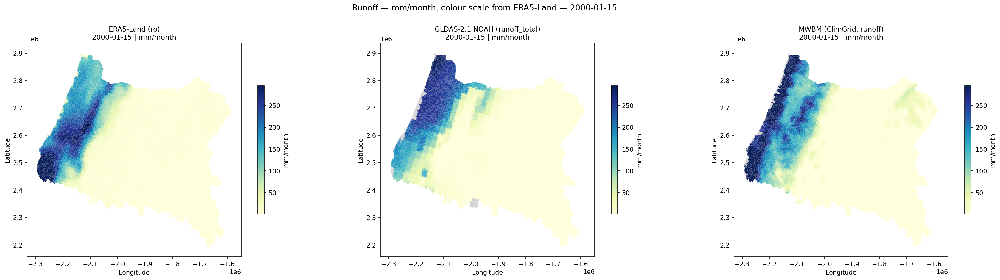
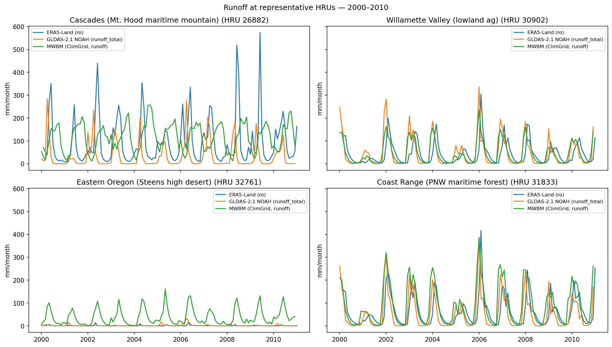

Top: cross-source magnitude check (normalised). Bottom: representative HRU time series, per source.

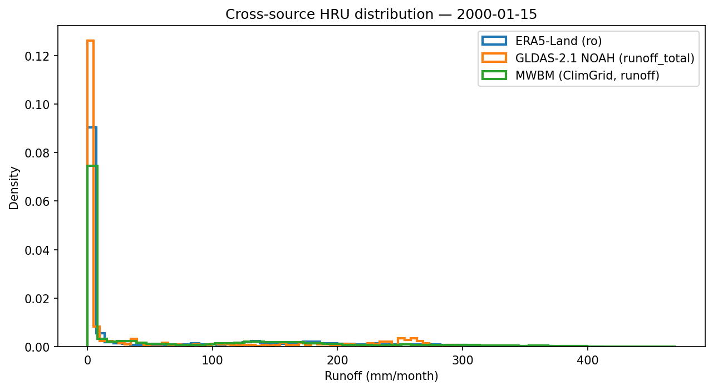

HRU value distribution, per source.

- All three sources show the expected east-wet / west-dry CONUS gradient at HRU resolution.
- ERA5-Land and GLDAS agree closely in the humid east; MWBM ClimGrid runs lower in arid HRUs.

<!--
Bring up runoff_coverage.png in discussion if anyone asks about completeness;
runoff is the cleanest of the six on that axis. The normalisation panel is
showing relative magnitude, not the final bound — it's a "do these sources
disagree in a way that suggests a unit bug?" check. They don't.
-->

---

<!-- _class: two-col -->

## 3.1 Runoff — target output

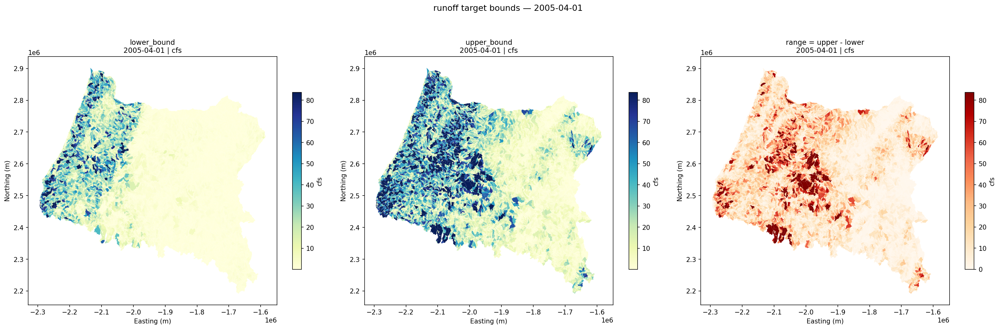
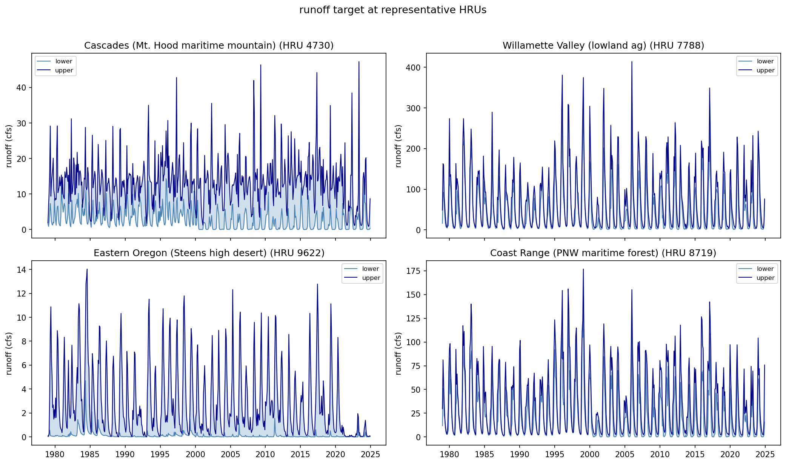

Top: lower / upper bound maps (cfs). Bottom: representative HRU time series with bound envelope.

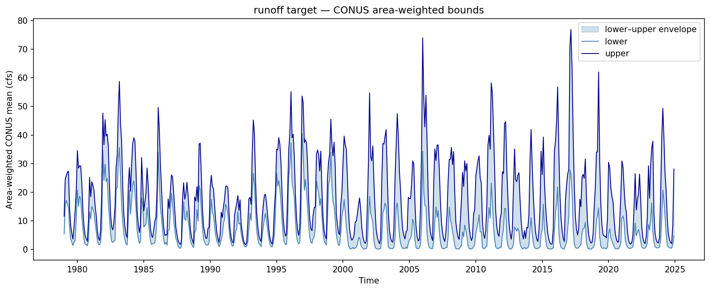

CONUS-mean lower / upper envelope.

<!-- - `runoff_target_nn_fill_{map,series}.png` shows where NN-fill closes the residual all-NaN cells in the `_nn_filled` companion file.

<strong>Discussion hook.</strong> MWBM ClimGrid coverage ends 2020-12 (verified on PR #127's full run; n_sources=3 covers 96.6 % through 2020). Do we extend the runoff target past 2020 with a 2-source bound, or hold the window at 2020 to keep all three sources in play?

 -->

<!--
The 2020 ceiling is the one decision the room actually needs to make for runoff.
Memory note project_mwbm_2020_ceiling has the underlying numbers if anyone asks
for them. Extending past 2020 with 2 sources is mechanically fine; the question
is whether the bound width is honest with one fewer voter.
-->

---

<!-- _class: fig-over-text -->

## 3.2 AET — sources & method

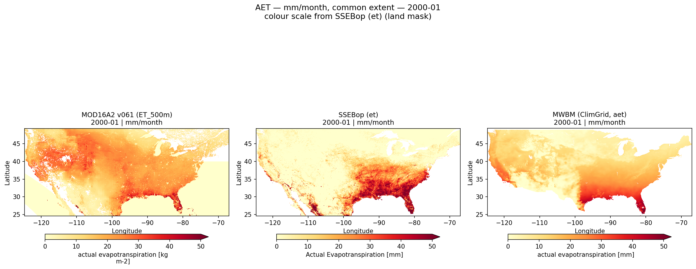

Raw-grid scale before HRU aggregation — mm/month on a common scale.

**Sources:**
- **MOD16A2 v061** `ET_500m` — 2000–present (`masked_mean`, PR #88)
- **SSEBop** `et` — 2000–2023
- **MWBM ClimGrid** `aet` — 1900–2020

**OR period:** 2000-01-01 .. 2024-12-31, with variable source count by band — 3 sources 2000-2020 (all three), 2 sources 2021-2023 (MOD16A2 + SSEBop), 1 source 2024 (MOD16A2 only).

**Method.** HRU aggregation → mm/month → **inches/day** in `targets/aet.py`. Multi-source min/max (NaN-aware — a bound is well-defined whenever ≥1 source is finite at the HRU/time).

<!-- 

<strong>MOD16A2 fill-mask.</strong> Sinusoidal→WGS84 reprojection was averaging fill codes (32766/32767) into valid neighbours, widening the bound artefactually. PR #88 masks `ET_500m` fills <em>before</em> reprojection.

 -->

<!--
The MOD16A2 fill-mask fix is one of the cleaner case studies for why
pre-aggregate hooks exist. Pre-#88 the AET bound was wider than it should have
been, because the upper envelope was being pulled by reprojection-averaged
fill codes that looked like real high values. Worth noting if discussion drifts
into "why do we have a pre_aggregate_hook at all".
-->

---

<!-- _class: two-col -->

## 3.2 AET — aggregated bounds

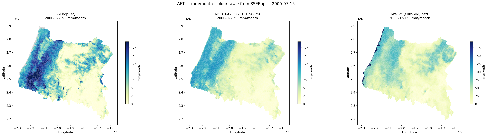
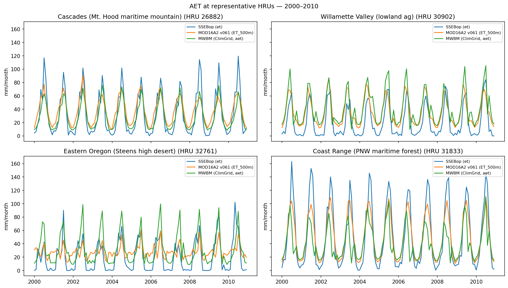

Top: cross-source magnitude check (mm/month basis). Bottom: representative HRU time series, per source.

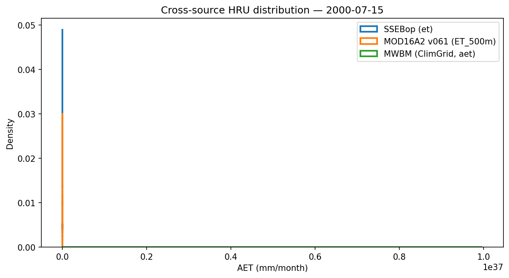

HRU value distribution, per source.

- SSEBop trends slightly higher than MOD16A2 in agricultural HRUs; MWBM ClimGrid sits between them.

<!--
The 5–8× summer/winter ratio for east-CONUS HRUs is the test that the PR #88
fix worked end-to-end. If anyone asks "are we sure the MOD16A2 fix is in
this aggregated output?", the answer is yes — the seasonal swing is the
smoking gun.
-->

---

<!-- _class: two-col -->

## 3.2 AET — target output

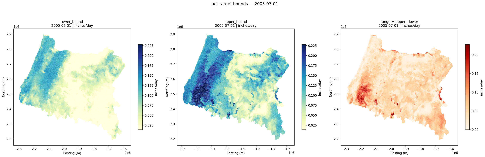
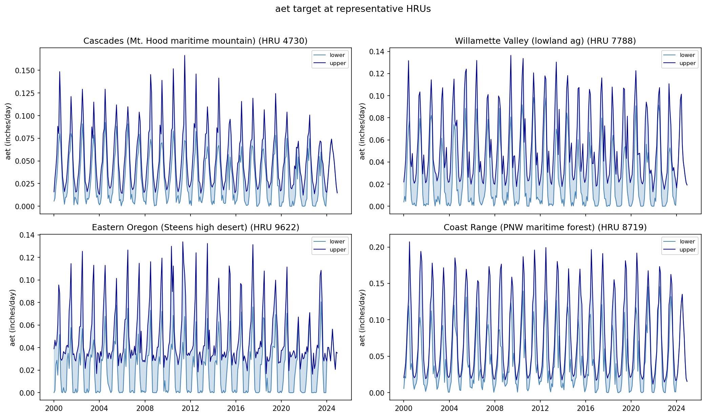

Top: lower / upper bound maps (inches/day). Bottom: representative HRU time series.

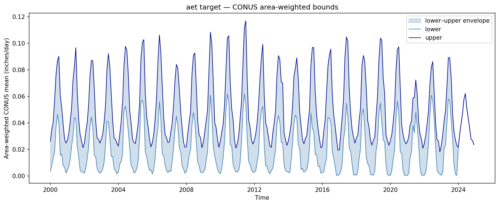

CONUS-mean lower / upper envelope (PR #127 21-year run).

- Bound shrinks in winter — all three sources agree on near-zero AET.
- Bound opens in summer where MOD16A2 and SSEBop diverge; that's the calibration-relevant disagreement.
- CONUS-mean envelope confirms the seasonal asymmetry at aggregate scale.

<!--
For discussion: the summer/winter bound asymmetry is the calibration-relevant
feature. The optimiser has plenty of room in summer to fit either a MOD16A2-like
or SSEBop-like response without leaving the envelope; in winter it's locked
to a narrow band. That's the kind of "honest bound" we want.
-->

---

<!-- _class: fig-over-text -->

## 3.3 Recharge — sources & method

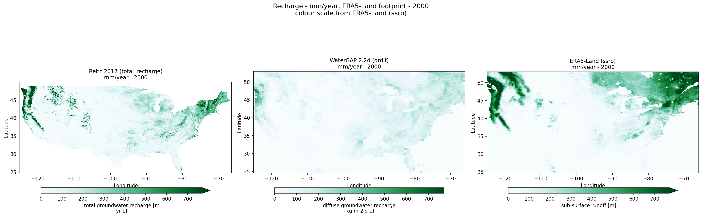

Raw-grid scale before HRU aggregation — annual recharge on a common scale.

**Sources** (annual):
- **Reitz 2017** `total_recharge` — 2000–2013
- **WaterGAP 2.2d** `groundwater_recharge` — 1901–2016
- **ERA5-Land** `ssro` — 1979–present (sub-surface runoff proxy)

**Method.** 0–1 normalised independently, then multi-source min/max in `targets/rch.py`. Target is year-to-year *relative* change, not absolute magnitude.

<strong>OR note.</strong> WaterGAP 2.2d excluded (inherits the gfv2 decision) — 0.5° cells average orographic gradients across PNW mountain/valley pairs, collapsing HRU detail. <code>config.yml → targets.recharge.sources</code> lists Reitz 2017 + ERA5-Land only.

<!--
The fabric-coarse-grid exclusion is captured in memory note
project_gfv2_coarse_grid_exclusions; OR inherits the same decision because the
PNW fabric shares the intermountain-west terrain. It's a per-fabric judgment
call, not a catalog-level decision — WaterGAP 2.2d still lives in
catalog/sources.yml and is fetched into the shared datastore, it's just dropped
at the target-build stage for OR (and gfv2).

**Why ERA5-Land `ssro` works as a recharge proxy (in case the room asks).**
`ssro` is the drainage flux out of the bottom of ERA5-Land's modeled soil
column (H-TESSEL, 4 layers to ~289 cm). It's not direct recharge — there's
no aquifer in the model — but the flux exiting the unsaturated zone is the
right *mechanistic* analog. Why this is acceptable here: the recharge
target normalises each source 0–1 over 2000–2009 and asks the optimiser to
match year-to-year *relative* change, not absolute magnitude. So `ssro`
only needs to be temporally informative (wet years → more drainage, dry
years → less), which it is. Caveats: `ssro` bundles deep drainage with
shallow interflow that returns to streams; no travel-time lag from soil
column to water table (matters in deep-unsaturated-zone arid HRUs); no
aquifer-property mediation. Adding `ssro` as a third source also extends
target coverage past 2016 (Reitz ends 2013, WaterGAP 2.2d ends 2016) — see
`docs/references/known-gaps-resolved.md` line 9 + catalog comment on the
`ssro` variable.
-->

---

<!-- _class: two-col -->

## 3.3 Recharge — aggregated bounds

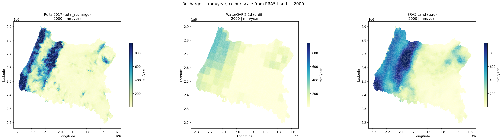
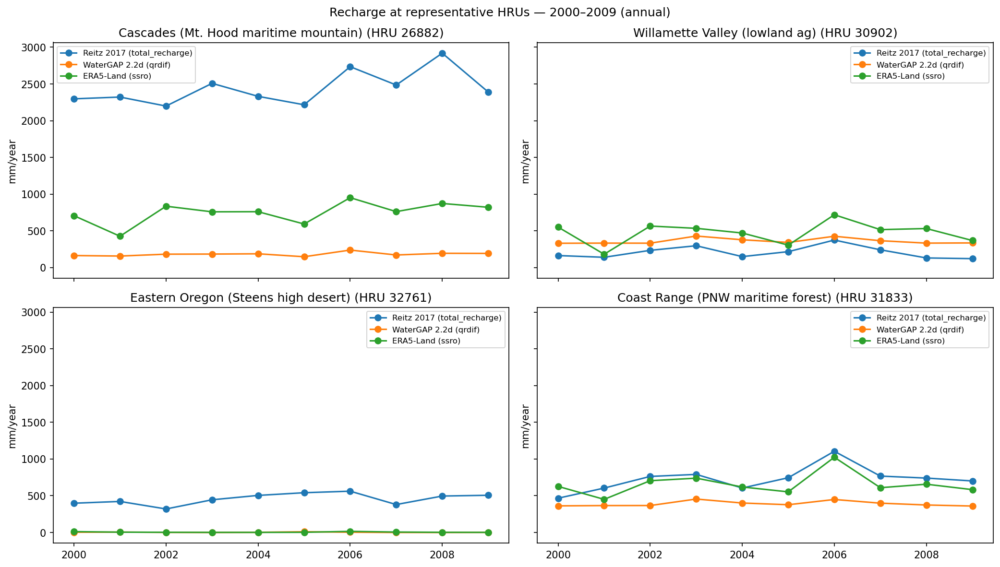

Top: cross-source magnitude check, normalised over 2000–2009. Bottom: representative HRU annual series, per source.

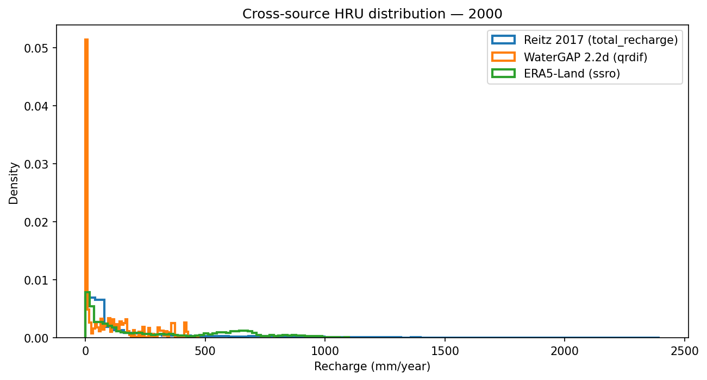

HRU value distribution, per source.

- Reitz 2017 carries the spatial detail (800 m → HRU); ERA5-Land `ssro` is smoother.
- WaterGAP 2.2d included in the aggregated NCs (for inspection) but excluded from the OR target bound — see prior slide.

<!--
The Reitz 2017 2013 end-date is a sub-question to flag if anyone wonders why
the recharge target doesn't extend further. It's not the only reason — WaterGAP
ends 2016 — but Reitz is the spatial-detail anchor and losing it past 2013
materially changes what the bound captures.
-->

---

<!-- _class: two-col -->

## 3.3 Recharge — target output

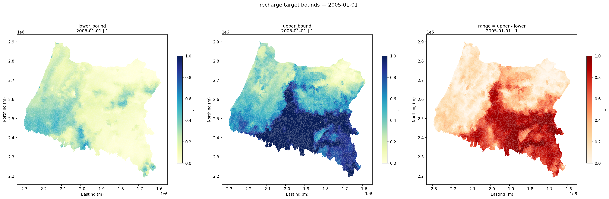
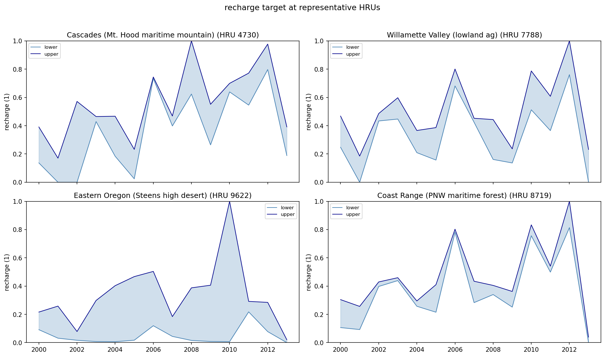

Top: lower / upper bound maps (0–1 normalised). Bottom: representative HRU annual series.

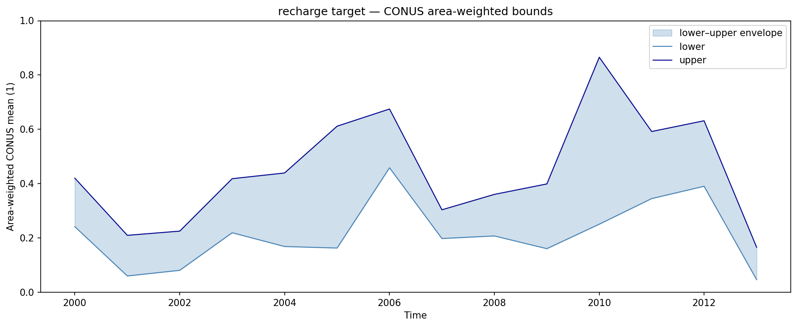

CONUS-mean lower / upper envelope.

<strong>Period: 2000-2013 (capped at Reitz 2017 end).</strong> Reitz 2017 stops at 2013 so extending the period past that would give a single-source bound (ERA5-Land <code>ssro</code> only), which under <code>normalized_minmax</code> collapses to a point-estimate constraint every year. OR ships <strong>2000-2013 throughout</strong> to keep the 2-source bound width intact; <code>normalize_period</code> matched to the period so 0-1 normalisation uses the full window.

<strong>Bound collapse — feature, not bug.</strong> Under <code>normalized_minmax</code>, the lower/upper bound collapse to a point estimate at any HRU/year where every contributing source hits its in-window min or max. On OR this is visible in wet years (e.g. <strong>2006</strong> at Willamette Valley / Eastern Oregon / Coast Range rep HRUs — both Reitz and ERA5 <code>ssro</code> normalised to 1.0). PEST++ sees those as <em>stricter</em> single-observation rows; the calibration team can downweight them if the agreement is judged less informative than the constraint they impose. See <code>prmsobjfun-summary.md</code> for the underlying bound-collapse semantics in the historical Fortran objfun.

<strong>Arid-HRU caveat.</strong> The arid concern is muted on most of OR (majority of PNW HRUs are humid/mountainous), but <strong>eastern Oregon / Owyhee high-desert HRUs</strong> share gfv2's arid-west problem: Reitz is an empirical baseflow-regression product, so where baseflow is near zero its recharge estimate is also near zero, collapsing the bound to roughly <code>(≈0, ssro)</code>. And in deep-unsaturated-zone arid HRUs, real recharge lags soil-column drainage by years to decades, so <code>ssro</code> at year N isn't the right temporal signal either. Is that bound informative enough to guide calibration in eastern-OR arid HRUs?

<!--
Three callouts now: the period decision (2000-2013, capped at Reitz), the
collapse semantics framed as feature-not-bug (PEST++ will weight the
collapsed-bound observations), and the original arid-HRU caveat. The 2006
collapse the user flagged in the OR review is a direct example of the
collapse semantics — both sources hit decadal max simultaneously.
-->

---

<!-- _class: fig-over-text -->

## 3.4 Soil moisture — sources & method

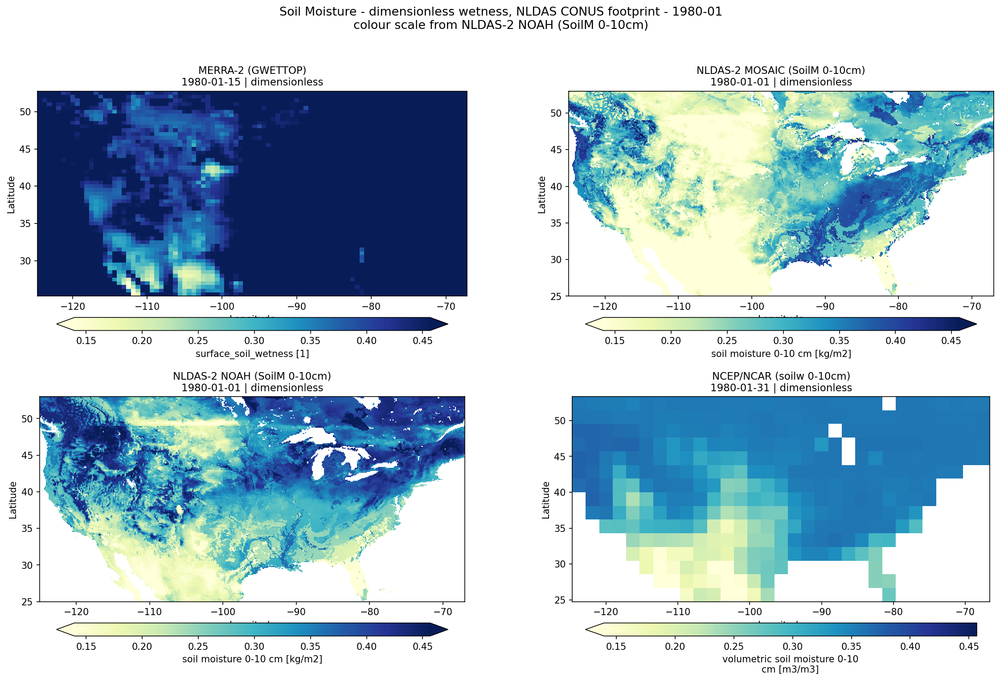

Raw-grid scale before HRU aggregation — heterogeneous native units normalised to a common scale (note the coarse NCEP/NCAR cells vs the 0.125° NLDAS).

**Sources** (monthly, upper-zone soil layer):
- **MERRA-2** `GWETTOP` — 1980–present
- **NCEP/NCAR** `soilw_0_10cm` — 1948–present *(OR-excluded — inherits gfv2)*
- **NLDAS-2 MOSAIC** `SoilM_0_10cm` — 1979–present
- **NLDAS-2 NOAH** `SoilM_0_10cm` — 1979–present

**Method.** 0–1 normalised independently per source — *monthly* per calendar month; *annual*. Multi-source min/max in `targets/som.py` (emits monthly + annual NCs).

<strong>OR note.</strong> NCEP/NCAR (T62 ≈ 210 km) excluded (inherits the gfv2 decision) — same intermountain-west coarse-grid reason as WaterGAP for recharge. OR ships a 3-source bound (MERRA-2 + NLDAS-MOSAIC + NLDAS-NOAH).

<!--
Two sources (MERRA-2 + NLDAS-NOAH) report different physical layers (0–5 cm vs
0–10 cm), which is one reason we normalise per source before combining — the
normalised value is "where does this layer sit in its own historical range",
which is comparable across layers. Mention if anyone asks about depth heterogeneity.
-->

---

<!-- _class: two-col -->

## 3.4 Soil moisture — aggregated bounds

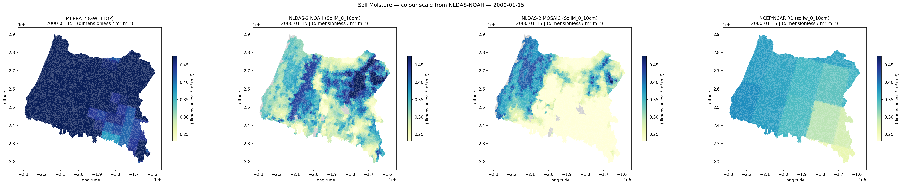
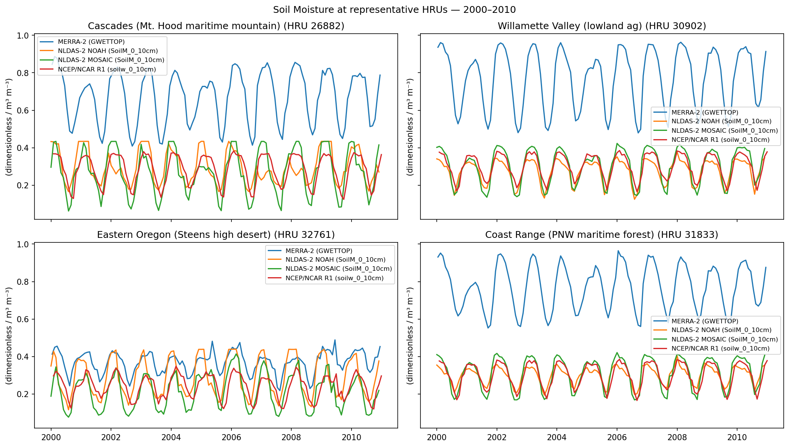

Top: cross-source magnitude check (0–1 normalised — heterogeneous native units harmonised). Bottom: representative HRU time series, per source.

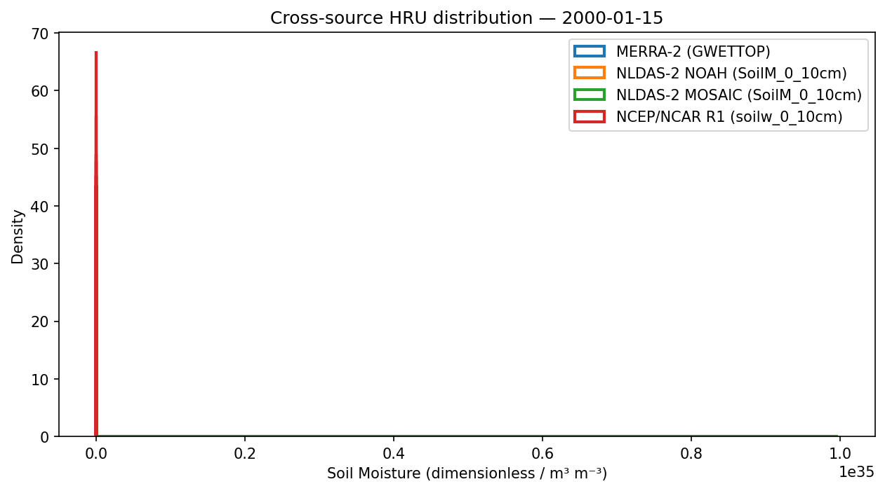

HRU value distribution, per source.

- Wet/dry geography agrees across all four sources at HRU resolution.
- NCEP/NCAR (T62) visibly washes out terrain detail across the PNW — motivation for the OR exclusion (inherits gfv2).
- Annual cycle phase agreement is good across sources; amplitude varies, which the per-calendar-month normalisation absorbs.

<!--
The visible coarse-grid washout in NCEP/NCAR is the visual smoking gun for the
OR exclusion (same gfv2 reasoning). Worth flipping to that map briefly if
discussion is lukewarm — it's a quick "look, this is what we're excluding and
why" moment.
-->

---

<!-- _class: two-col -->

## 3.4 Soil moisture — target output

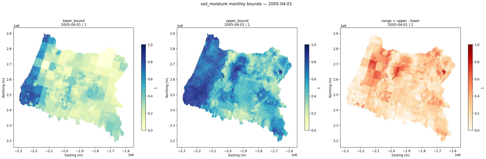
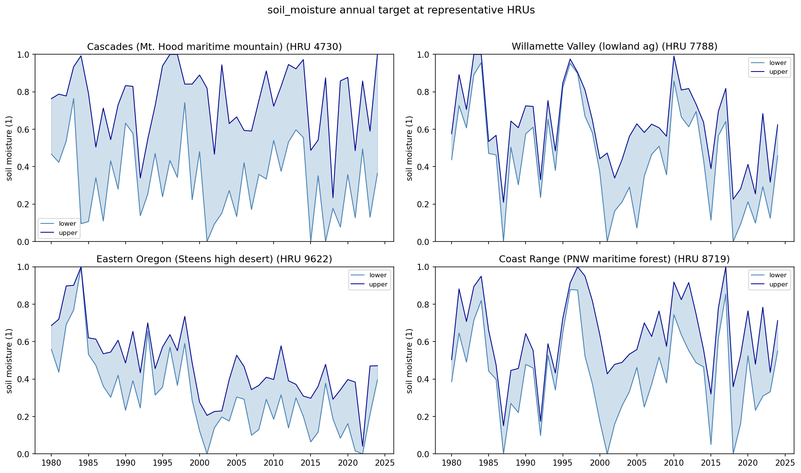

Top: monthly bound maps (0–1 normalised). Bottom: annual representative HRU series.

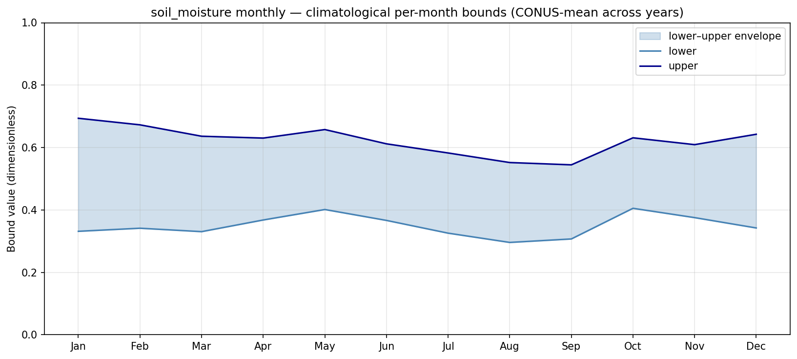

Per-calendar-month CONUS-mean climatology — seasonal-cycle view of the bound.

- NCs on disk: `soil_moisture_targets_monthly.nc`, `..._annual.nc`, plus `_nn_filled` variants.

<strong>Discussion hook.</strong> Monthly normalisation (per calendar month — Jans
together, Febs together, …) vs annual normalisation (single 1982–2010 window)
gives meaningfully different bound widths, especially in spring shoulder
seasons. Is the modelling team using monthly, annual, or both?

<!--
The bounds_map shows the per-HRU envelope at a snapshot month; the climatology
panel shows the seasonal cycle of the CONUS-mean bound after per-calendar-month
normalisation. The annual figures aren't shown inline to keep the slide tight,
but the file list above signals to the room that they exist if anyone wants to
dig into the annual cadence. The choice of monthly-vs-annual is genuinely a
modeller-side decision — we emit both NCs.
-->

---

<!-- _class: fig-over-text -->

## 3.5 Snow-covered area — sources & method

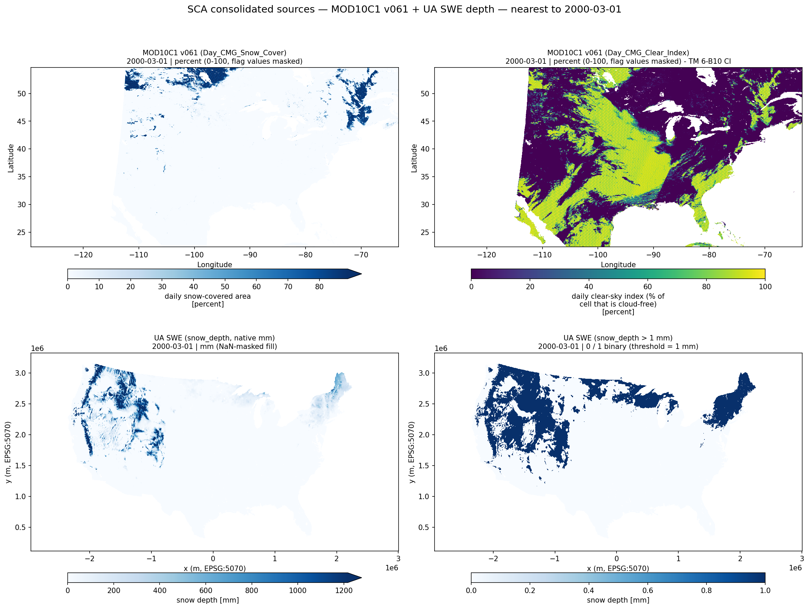

Raw MOD10C1 v061 panels — CI-gated SCA fraction at 0.05° resolution before HRU aggregation.

**Source** (single):
- **MOD10C1 v061** `Day_CMG_Snow_Cover` + `Day_CMG_Clear_Index` — 2000–present

**Method.** Per-pixel **CI > 0.70** filter (TM 6-B10). Aggregated NCs carry CI-gated SCA as a daily 0–1 fraction.

<strong>Gap recently closed.</strong> Target builder (<code>targets/sca.py</code>) is still a STUB — but the bound formula is no longer missing. <code>PRMSobjfun.f90</code> landed in the repo 2026-05-24 (<code>docs/references/PRMSobjfun.f90</code>); <code>calcSCA</code> lines 1043-1050 build the bound from <code>(CI, SCA_obs)</code> when CI > 70%: <code>lower = (CI/100)·SCA_obs</code>, <code>upper = lower + (1 − CI/100)</code>, with July/August forced to (0, 0). Implementation tracked in <strong>#210</strong>.

<!--
The PRMSobjfun.f gap closed 2026-05-24 when a collaborator delivered the
Fortran source. calcSCA is option (b) — CI-weighted bound width with
hardcoded July/August zero. See docs/references/prmsobjfun-summary.md for
the full crib sheet. targets/sca.py is implementable now; tracked in #210.
The July/August zero is a TM-6-B10-era modelling assumption worth flagging
for the calibration team if OR's Cascades high-elevation HRUs hold late-
summer snowpack.
-->

---

<!-- _class: two-col -->

## 3.5 Snow-covered area — aggregated bounds

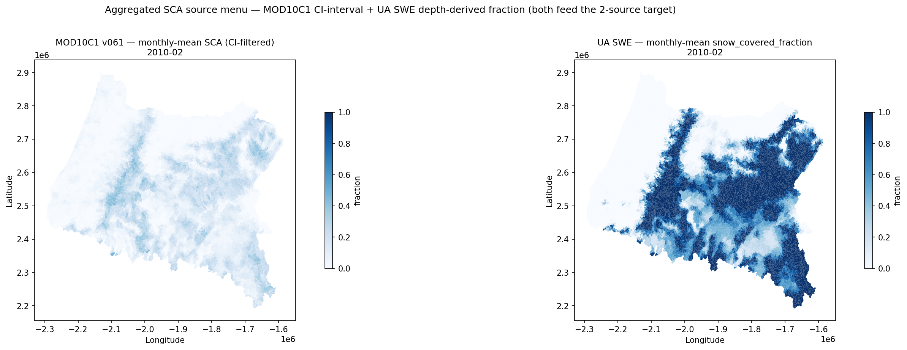
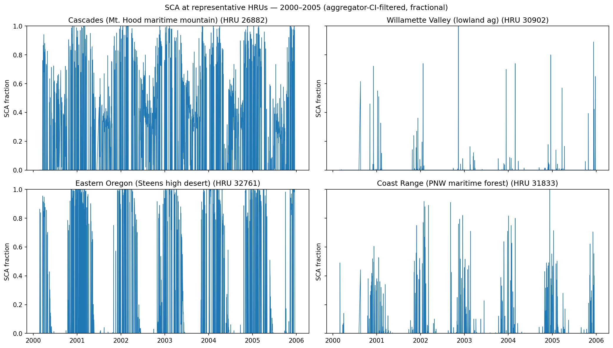

Top: aggregated HRU SCA fraction, MOD10C1 v061 (CI > 70 % gate), 0–1 scale. Bottom: representative HRU time series.

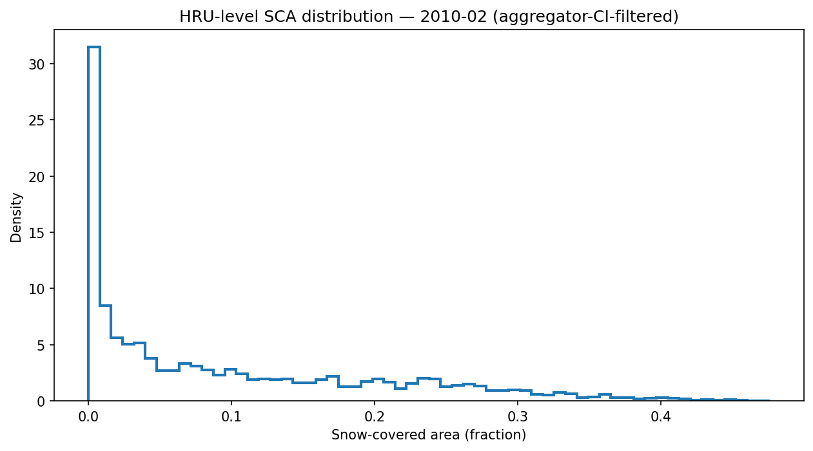

HRU value distribution — bimodal as expected (snow / snow-free).

- Single source (MOD10C1 v061) — figures are within-source diagnostics, not cross-source.
- Strong seasonal cycle in snowy HRUs; near-zero year-round in southern CONUS.

<!--
The polar-night coverage drop is worth knowing — it's not a pipeline bug, it's
MODIS having no signal in the dark. For CONUS specifically it's mostly a non-issue,
but if we ever extend the fabric to Alaska the CI-gate becomes a meaningful
coverage filter.
-->

---

## 3.5 Snow-covered area — target output *(placeholder — builder pending implementation in #210)*

<strong>Final target NC not yet produced — but the formula is in hand.</strong> <code>targets/sca.py</code> is still a stub; <strong>#210</strong> tracks promotion to a real implementation now that <code>PRMSobjfun.f90:calcSCA</code> (<code>docs/references/PRMSobjfun.f90</code>, lines 1043-1050) makes the bound formula explicit. Expected outputs once implemented: <code>sca_targets.nc</code> (per-HRU per-day lower / upper bound, fraction 0-1) plus optional <code>sca_targets_nn_filled.nc</code>.

**The reconstructed bound** (per HRU per day, MOD10C1 `CI > 70`):

- `lower = (CI/100) · SCA_obs` — confidence-weighted "definitely snow" floor.
- `upper = lower + (1 − CI/100)` — adds the maximum amount that *could* be obscured snow.
- **July & August → forced to `(0, 0)`** regardless of `obs`. Hardcoded as no-snow.
- `CI ≤ 70`: no entry (drops out of the OF denominator).

**Open question for the calibration team** (now framed by the formula, not the gap):

The July/August zero-snow assumption was appropriate for the original TM 6-B10 fabrics. For OR's **Cascades high-elevation HRUs that hold late-summer snowpack**, it forces the optimiser to predict zero where real snow exists. Is this a configurable knob we add (per-HRU summer-zero override) or do we just ship the TM-6-B10-faithful default?

Crib sheet: `docs/references/prmsobjfun-summary.md`. Aggregated MOD10C1 NCs already on disk → SCA target rebuild is feasible without re-aggregation.

<!--
The formula is no longer the gap; the gap now is the calibration-team-side
decision about the July/August hardcode. The #210 implementation gives us
SCA target NCs in days, but whether they're shipped with the literal TM-6-B10
hardcode is the room's call. See docs/references/prmsobjfun-summary.md for
the watch-outs section that flags this.
-->

---

<!-- _class: fig-over-text -->

## 3.6 SWE — sources & method

Raw-grid scale before HRU aggregation — all four sources rescaled to inches on a common SNODAS-CONUS footprint (Margulis Western-US only by design).

**Sources** (daily):
- **Daymet v4 R1** `swe` — 1980–2024
- **SNODAS** `swe` — 2003–present
- **ERA5-Land** `sd` — 1979–present
- **Margulis WUS-SR** `SWE` — 1985–2021 *(Oregon-only via `fabric_scope`)*

**Method.** HRU aggregation → harmonised to mm → **inches** in `targets/swe.py`. NaN-aware multi-source min/max. Margulis contributes only inside its OR scope; non-OR fabrics get a 3-source bound.

<!--
The year-chunked streaming was the implementation detail that made SWE tractable
on this hardware — without it the daily-cadence cross-source concat would blow
memory at fabric scale. Mention if anyone asks why SWE took longer than runoff.
-->

---

<!-- _class: two-col -->

## 3.6 SWE — aggregated bounds

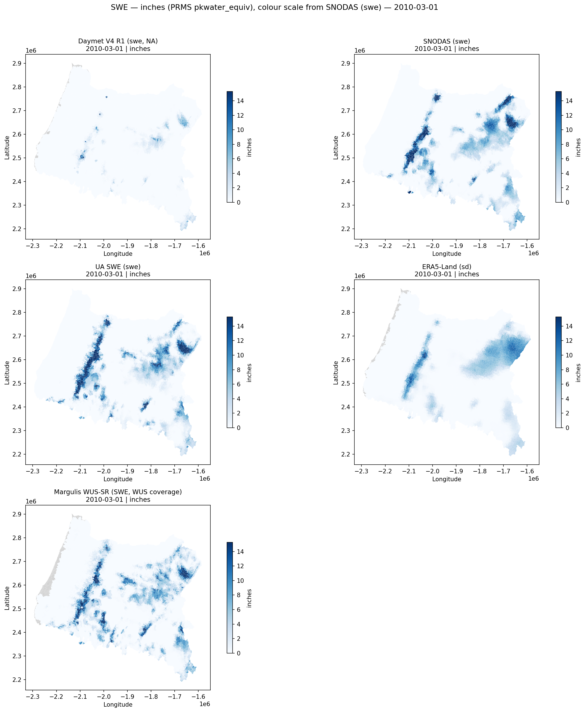
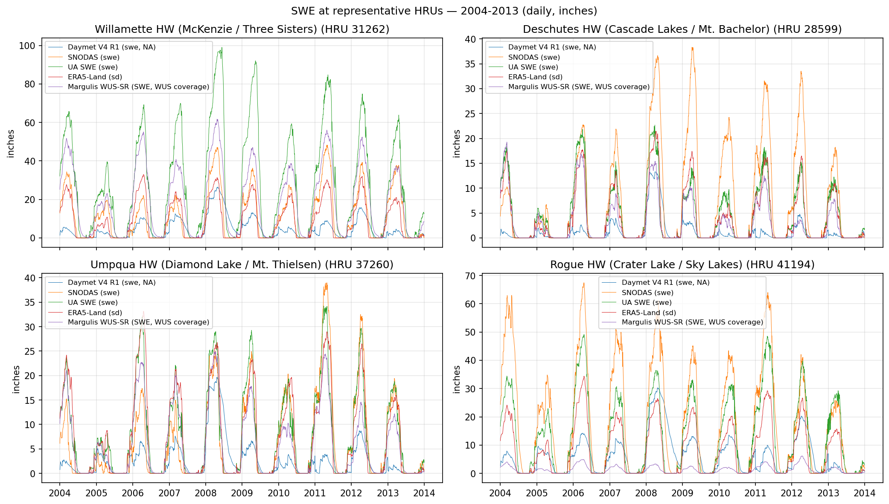

Top: cross-source magnitude check (mm basis). Bottom: representative HRU time series, per source.

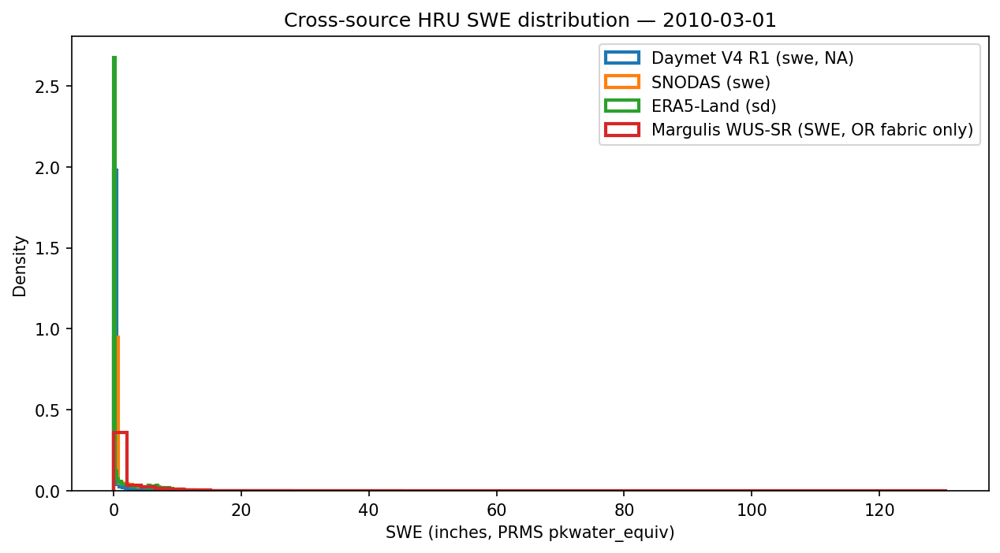

HRU value distribution, per source.

- **Daymet v4** `swe` — 1980–2024
- **SNODAS** `swe` — 2003–2024
- **ERA5-Land** `sd` — 1979–present
- **Margulis WUS-SR** `SWE` — 1985–2021 *(OR scope)*

<!--
WGS84-native cost: memory note project_crs_aggregation_cost has the receipt —
SNODAS and other WGS84-native sources cost ~5–8× more in weight generation
than projected sources (Daymet sinusoidal, etc.) at comparable resolution.
That's why SNODAS is the trailing item on the SWE list.
-->

---

<!-- _class: two-col -->

## 3.6 SWE — target output

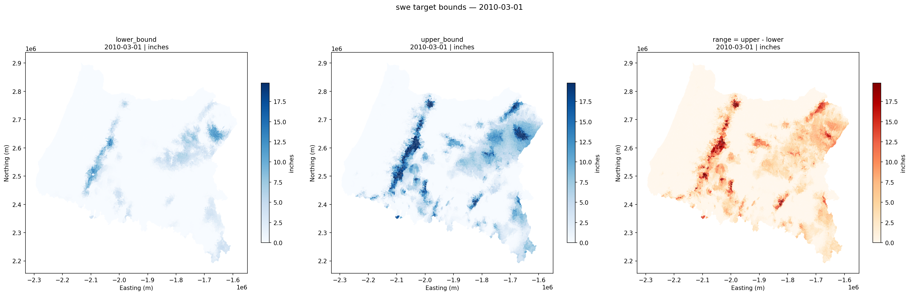
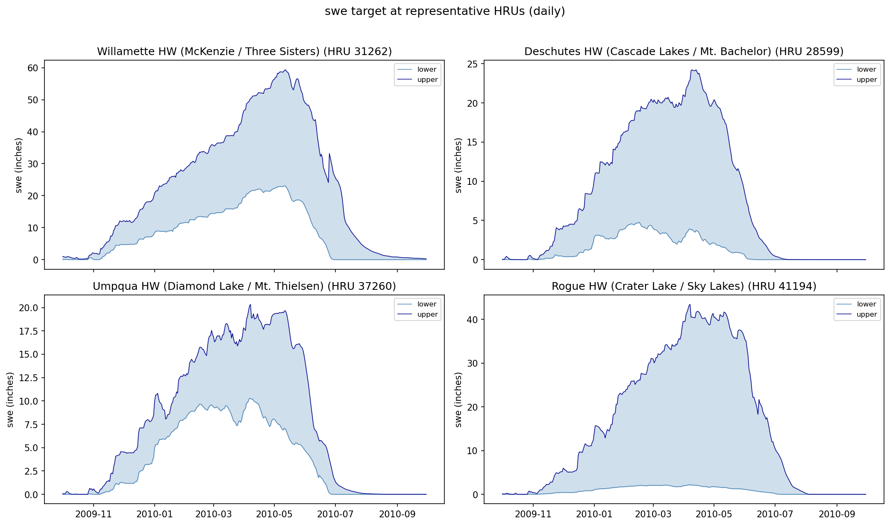

Top: lower / upper bound maps (inches). Bottom: representative HRU time series with bound envelope.

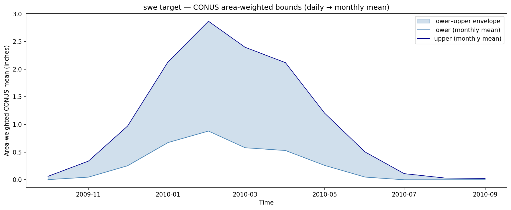

CONUS-mean lower / upper envelope.

- **4-source bound across OR** — Margulis WUS-SR contributes via `catalog/sources.yml → fabric_scope.fabrics: [or]` matching `config.yml → fabric.token: or`. Sibling gfv2 ships 3 sources for the same target (Margulis filtered out at every CONUS HRU).
- Margulis (500 m) is the highest-resolution SWE product in the bound; it tightens the upper-bound envelope dramatically inside its high-elevation footprint where Daymet / SNODAS / ERA5-Land disagree most.

<!--
Source weighting and NN-fill policy are both legitimate "the room can decide" items.
The period-of-record question is a harder one — it's tangled up with what the
calibration team treats as the modelling era. Defer to whatever they've said
elsewhere if known; otherwise air the trade-off.
-->

---

# Part 4 — What this unlocks · open questions

---

## How calibration consumes a target NC

Each target NC is a **soft constraint** for PRMS calibration via PEST++:

- Per-HRU per-timestep `(lower_bound, upper_bound)` in the variable's PRMS units.
- Simulated values inside the envelope incur zero cost; outside the envelope incur a penalty (typically squared distance to the nearest bound edge).
- `_nn_filled` companion is the consumer-default for builders that produce one — it closes the residual all-NaN HRUs so the optimiser sees no missing data; the honest-NaN `.nc` is the audit-trail record.
- **When `upper == lower` the bound collapses to a point estimate** — a stricter constraint, not a wider one. Surfaces naturally in `normalized_minmax` targets (recharge / SOM) at HRU-years where every contributing source hits its in-window min or max, and in any year falling inside a single-source tail (e.g. AET 2024 with only MOD16A2 active).

**Reusable across fabrics, not across projects** — the target NC is fabric-specific, but the same builder + same datastore on a different fabric reproduces the equivalent targets without re-fetching any raw data.

<!--
The "soft constraint" framing matters for the calibration audience: targets aren't
ground truth, they're the bound the optimiser is allowed to live inside. The
bound-collapse callout is new on OR because OR's regional fabric + variable-source-
count extensions surface several places where upper == lower; PEST++ will treat
those as point-estimate observations.
-->

---

<!-- _class: compact -->

## What this pipeline emits vs. what calibration consumes

| | This pipeline (`nhf-spatial-targets`) | Calibration consumer (PEST++) |
|---|---|---|
| **Unit of work** | Per-HRU per-time `(lower_bound, upper_bound)` NetCDFs under `<project>/targets/` | PEST++ observation file(s) — one row per `(HRU, time, target)` with weights |
| **Targets emitted vs. consumed** | 6: runoff, AET, recharge, soil moisture, **SCA**¹, **SWE**² | Choice of subset per calibration round; PRMSobjfun.f90 historically wired the 5 TM 6-B10 targets — SWE was never part of that loop. |
| **Bound mechanic** | NaN-aware multi-source min/max (or 0-1 normalised min/max); fill-value-clean per #205 | `(val - nearest_bound)²` inside PEST++ observation residuals; collapsed bound = point estimate |
| **NN-fill policy** | Both `<tgt>.nc` (honest NaN) + `<tgt>_nn_filled.nc` shipped | Calibration team picks one per target as the consumer default |
| **Format adapter** | Native NetCDF (CF-1.6) | NetCDF → PEST++ instruction/observation files (separate step, not in this repo) |

¹ <strong>SCA</strong> target builder is currently a stub. The CI-weighted bound formula was previously "not publicly available" — a collaborator delivered <code>PRMSobjfun.f90</code> 2026-05-24 (see <code>docs/references/PRMSobjfun.f90</code> + the crib sheet in <code>prmsobjfun-summary.md</code>). The formula is reconstructed; implementation tracked in #210. ² <strong>SWE</strong> is an extension beyond the TM 6-B10 5-target set; <code>PRMSobjfun.f90</code> has no <code>calcSWE</code>. If the calibration team wants SWE in the OF, a PEST++ observation group for SWE bounds needs to be added (separately from this pipeline).

<strong>Historical reference, not active consumer.</strong> The TM 6-B10 Fortran objective function <code>PRMSobjfun.f90</code> is the canonical record of how bounds were originally meant to be consumed (zero cost inside / squared cost outside / point-estimate when collapsed). It is checked into this repo for documentation; <strong>PEST++ is the active calibration driver</strong> and inherits or modifies those semantics as the calibration team configures.

<!--
Establishing slide for the gap between what we produce (NetCDFs over 6 targets
including SWE) and what the calibration loop actually consumes (PEST++ over
some subset). The two interesting structural points: (a) SCA can be built now
that the bound formula is no longer missing — see #210; (b) SWE is a pipeline
extension that doesn't yet feed PEST++ unless someone adds a SWE observation
group on the calibration side. Both are calibration-team-side decisions, not
pipeline decisions.
-->

---

## Open questions to bring to the room

1. **SWE in calibration** — pipeline emits 6 targets; PEST++ historically (via PRMSobjfun.f90) consumed 5. Do we add a SWE observation group to PEST++ so the OR-only 4-source SWE bound actually drives parameter selection, or hold it as inspection-only?
2. **SCA implementation priority** — #210 reconstructs the bound formula from `PRMSobjfun.f90:calcSCA`; the July/August zero-snow hardcode may or may not be appropriate for OR's Cascades high-elevation HRUs. Is this a calibration-team-pending decision (configurable) or a pipeline-side default we ship?
3. **Period-of-record locks** per category — OR has now extended runoff (1979-2024) and AET (2000-2024); recharge is still 2000-2009. Each extension creates variable-source-count bands and (for `normalized_minmax`) potential bound collapse. Calibration team's call on how aggressively to extend.
4. **NN-fill default** — which targets ship `_nn_filled` as the consumer default vs the honest-NaN file? Currently we emit both for runoff / AET / recharge / soil moisture; choice belongs to PEST++ observation-file generation.
5. **Fabric-coarse-grid exclusions** scale beyond OR + gfv2 — both projects drop WaterGAP (recharge) and NCEP/NCAR (soil moisture) for the same intermountain-west terrain reason. Worth codifying as a catalog-level "coarse-grid for fine HRUs" tag so a future regional fabric (CO, UT, ID, …) inherits the right defaults?
6. **Margulis WUS-SR on OR** — the only multi-source SWE bound in the system that actually includes Margulis. Worth a tighter look at how it shapes the bound vs the 3-source gfv2 case (e.g. swap Margulis out and re-render to quantify the bound-width delta).

<!--
These five are the discussion seeds. Order them by where the room has the most
energy — usually #1 (SCA) and #2 (SWE) draw the most response because they're
the visible "this is not done yet" items. #3-5 are the implicit decisions
that have been quietly accumulating; airing them is the point of this slide.
-->

---

# Part 5 — References & next steps

---

## References

**Architecture & methodology:**

- `docs/architecture/transformation-pipeline.md` — pre/post-aggregation policy, `mean` vs `masked_mean`, canonical row order.
- `docs/references/tm6b10-summary.md` — TM 6-B10 crib sheet keyed to this repo.
- `docs/references/calibration-target-recipes.md` — per-target unit-conversion + multi-source-combination recipes.
- `docs/references/known-gaps-resolved.md` — dataset substitutions (v006→v061, MERRA-Land→MERRA-2, NHM-MWBM→ERA5-Land+GLDAS+ClimGrid, …).
- `docs/references/target-period-coverage.md` — per-source on-disk ranges.

**Calibration-side reference** *(historical; PEST++ is the active consumer)*:

- `docs/references/PRMSobjfun.f90` — the TM-6-B10-era Fortran objective function (2026-05-24, from collaborator). Defines the soft-constraint bound mechanic + SCA formula + 5-target scope (no SWE).
- `docs/references/prmsobjfun-summary.md` — crib sheet distilling the bound semantics, the SCA formula, the iSTEP 1-4 calibration progression, and the watch-outs (July/August zero-snow hardcode; PAN's double-weighting note in `calcSCA`).

**Catalogue & code:**

- `catalog/sources.yml`, `catalog/variables.yml` — single source of truth for sources, variables, units, periods.
- `src/nhf_spatial_targets/targets/{run,aet,rch,som,sca,swe}.py` — per-target builders.

**Prior decks:**

- `docs/presentations/2026-05-aggregated-targets-overview-gfv2-spatial-targets.slides.md` — sibling deck; same pipeline + targets, CONUS gfv2 fabric.
- `docs/presentations/2026-collaborator-overview-gfv2-spatial-targets.slides.md` — original collaborator briefing (Stage-1 consolidated context).

**GitHub umbrella:** Oregon end-to-end **#182**. Aggregator fill-leak that this build hit: **#204 / #205** (the 2026-05-23 fix that made OR's regional fabric produce clean targets).
