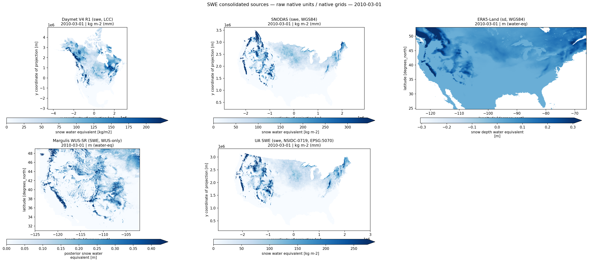
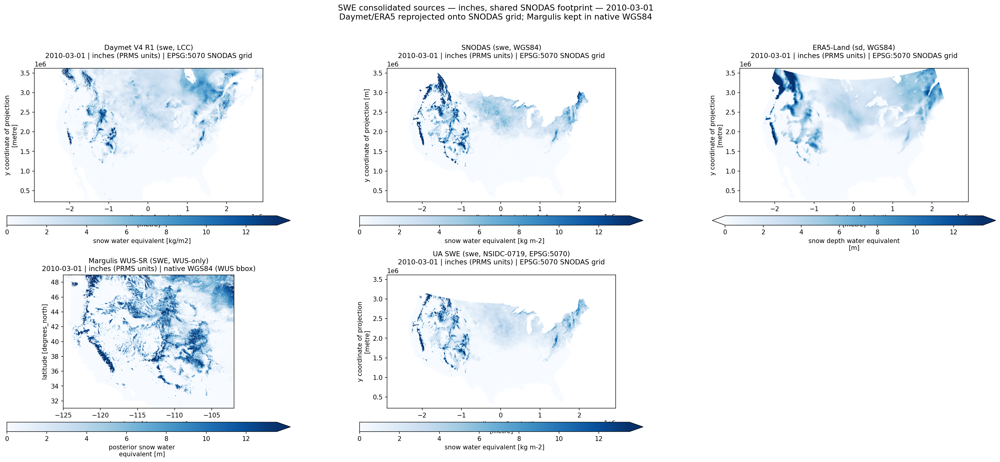

# Adding UA daily 4-km SWE

### NSIDC-0719 v1 — University of Arizona gridded SWE + Snow Depth

#### A new source for **two** calibration targets: SWE and snow-covered area

Decision review before wiring aggregation + target builders. The fetch +
consolidation layer is **done** (42 water years, 1982–2023, on the shared
datastore); these are the consolidated, pre-projected source grids the
aggregator would read next.

Broxton, P., Zeng, X. & Dawson, N. (2019). NSIDC-0719 v1, DOI
<code>10.5067/0GGPB220EX6A</code>. · Figures: <code>docs/figures/consolidated/gfv2-spatial-targets/</code>

<!--
Framing: this is a go/no-go on a NEW source, not a results review. We've spent
the fetch effort (a 2-day SLURM run with one OOM retry); before spending the
aggregate+target effort (PR-B/C/D) I want consensus that the data is worth it.
Everything shown is the consolidated source grid — no HRU aggregation yet.
-->

---

<!-- _class: compact -->

## What is NSIDC-0719, and why two targets?

| | |
|---|---|
| **Product** | UA Daily 4-km Gridded SWE + Snow Depth, CONUS |
| **Method** | Assimilates SNOTEL / COOP in-situ snow obs with PRISM modeled fields (Broxton/Zeng/Dawson, U. Arizona) |
| **Coverage** | Water years **1982–2023** · daily · ~4 km · native NAD83 lat/lon |
| **Variables** | `swe` (kg m⁻² ≡ mm) · `snow_depth` (mm) |
| **In this repo** | Pre-projected to EPSG:5070 at consolidate time (mirrors SNODAS — ~5–8× faster weight-gen) → `<datastore>/ua_swe/daily/ua_swe_daily_WY<YYYY>.nc` |

**Value proposition #1 — a third CONUS SWE source, back to 1982.**
Today's SWE bound leans on SNODAS (2003+) and Daymet; UA SWE adds an
independent assimilation product and **pushes the multi-source record back two
decades** before SNODAS exists.

**Value proposition #2 — a second snow-covered-area source.**
`snow_depth > threshold` is a per-pixel binary snow indicator; area-weighted to
HRU it yields fractional SCA. This **breaks MOD10C1's single-source lock** on
the SCA target and is **not weather-blocked** (MOD10C1 drops cloudy days).

<!--
The two value props are the whole pitch. #1 is "more is better + longer record."
#2 is the clever bit: we get a SECOND target for free out of the snow-depth
companion variable, and it fills exactly the gap MOD10C1 has (clouds).
-->

---

<!-- _class: fig-over-text -->

## SWE — native grids, peak winter (1 Mar 2010)

Five SWE sources at their native resolution / CRS. UA SWE (NSIDC-0719) is the new panel; the other four are the current SWE target inputs.

**What to look for**
- Same broad pattern across all five: Sierra / Cascades / Rockies / Northern Plains / Northeast.
- UA SWE (4 km) sits between SNODAS/Daymet (1 km, sharp ridges) and ERA5-Land (11 km, smooth).
- Margulis is Western-US-only by design.

**Why it matters here**
- A new source only helps if it shows the *same physical signal* with *independent* error — visually confirmed.
- 4 km is coarser than our two 1 km sources but far finer than ERA5-Land.

<!--
This is the "does it look like snow" sanity slide. If UA SWE showed no Sierra
signal or a wildly different pattern, we'd stop here. It doesn't — it agrees on
the pattern and adds an independent lineage.
-->

---

<!-- _class: fig-full -->

## SWE — magnitude check, inches on a shared footprint

All sources → inches (PRMS units), reprojected onto the common SNODAS EPSG:5070 footprint (Margulis kept native WGS84). Colour scale anchored on SNODAS 2nd/98th percentile. The printed table under the notebook cell reports per-source mean + 95th-percentile inches.

<!--
Magnitude is the make-or-break check (memory: catalog metadata has been wrong
4x; a >30% CONUS-mean miss = a missed conversion factor). UA SWE should land in
the same inches range as SNODAS/Daymet, not 25.4x off. If the printed means are
order-of-magnitude consistent, units are right. Talk to the table, not just the map.
-->

---

<!-- _class: fig-over-text -->

## Snow-covered area — a depth-derived second source (1 Mar 2000)

Left two: MOD10C1 v061 snow cover + clear-sky index (current single SCA source). Right two: UA SWE snow depth and its <code>depth &gt; 1 mm</code> binary — the pixel-level signal the aggregator would area-weight into a per-HRU fractional SCA.

**The mechanic**
- Pixel `depth > threshold` → 0/1 indicator.
- Area-weighted to HRU = fraction of HRU that is snow-covered.
- **Must** be done pre-aggregation (commutes with area-weighted mean only at pixel scale).

**Why add it to SCA**
- MOD10C1 is cloud-gated (CI ≤ 70 % drops the day); UA SWE is not.
- Pushes SCA record back to 1982 (MOD10C1 is 2000+).
- Multi-source min/max widens the bound where the two disagree.

<!--
The binary preview is provisional (threshold = 1 mm). The point of the slide is
to show the signal is plausible: mid-winter high-elevation pixels go to 1, summer
goes to 0. Whether 1 mm is the right threshold is an open question (next slide).
-->

---

<!-- _class: compact -->

## What it costs, and the open questions

**Costs / caveats**
- **Resolution.** 4 km vs our 1 km SNODAS/Daymet — coarser, but adds independent info and 20 yr of history.
- **Depth threshold is a free parameter.** Default 1 mm (generous, counts thin snow). Configurable per project; revisit after calibration.
- **Pre-2000 SCA is a point estimate, not a bound.** Before MOD10C1 (2000), the SCA "bound" collapses to UA SWE's single value `[v, v]`. Honest, but not an interval — will be documented in the target NC.
- **Reprojection at the CONUS boundary.** 4 km NN resample NAD83→EPSG:5070 loses ~1 pixel along high-curvature coast (same trade SNODAS accepts).

**Open questions for the room**
1. Is a **4 km** third SWE source worth adding alongside two 1 km sources? (We think yes — independent lineage + 1982 record.)
2. Is the **depth-derived SCA** approach sound, and is **1 mm** a sensible starting threshold?
3. Do we want the pre-2000 degenerate SCA interval, or clamp SCA to the MOD10C1 era (2000+)?

<!--
Be honest about the costs up front — it builds trust in the yes. The three
questions are the actual decisions I need from this meeting. #1 and #2 gate
PR-C and PR-D respectively; #3 is a config default we can change later.
-->

---

<!-- _class: compact -->

## The ask — proceed to aggregation + targets?

**Done** ● — catalog entry, fetch + consolidation (42 WY, 1982–2023), CF-1.6 compliant source grids, these inspection notebooks.

**Proposed next**, gated on today's decision:

| PR | Scope | Unlocks |
|---|---|---|
| **PR-B** | `aggregate/ua_swe.py` — HRU area-weighting + depth→binary→fraction pre-hook | per-HRU `swe`, `snow_depth`, `snow_covered_fraction` |
| **PR-C** | `targets/swe.py` — add UA SWE as 3rd SWE source | SWE bound back to 1982 |
| **PR-D** | `targets/sca.py` — refactor single → multi-source min/max | SCA bound + depth-derived 2nd source |

<b>Decision:</b> continue to PR-B → PR-C → PR-D, or hold? If continuing, confirm the 1 mm depth threshold default and the pre-2000 SCA policy.

Per-source detail + magnitude tables: <code>notebooks/inspect_ua_swe.ipynb</code>. Cross-source views:
<code>notebooks/consolidated/inspect_consolidated_swe.ipynb</code> ·
<code>inspect_consolidated_snow_covered_area.ipynb</code>.

<!--
Close on the concrete ask. The three PRs are stacked and independently
mergeable; PR-C and PR-D both depend on PR-B. If the room says hold, we've spent
only the fetch effort and the catalog entry — cheap to shelve.
-->

---

# Backup / reference

<!-- _class: compact -->

## Provenance & reproduction

- **Source:** NSIDC-0719 v1 · DOI `10.5067/0GGPB220EX6A` · <https://nsidc.org/data/nsidc-0719/versions/1>
- **Catalog:** `catalog/sources.yml → ua_swe` (units, variables, access block). Source units read from the catalog, never hardcoded.
- **Fetch:** `pixi run nhf-targets fetch ua-swe --project-dir <dir>` (Earthdata-authenticated HTTPS, per-WY NetCDF; SLURM script ships in the project).
- **Consolidation:** `fetch/ua_swe.py::consolidate_water_year_ua_swe` — decode time (`days since 1900-01-01`), rename SWE→`swe` / DEPTH→`snow_depth`, mask fill `< 0`, per-day reproject to EPSG:5070 4 km (NN), CF-1.6 metadata via `apply_cf_metadata`.
- **Figures:** `pixi run -e dev render-figures-consolidated` (or the SLURM render job) with `SAVE_FIGURES=1`.

**Margulis catalog fix (in PR-A).** The `margulis_wus_sr` entry was previously
mislabeled "(NSIDC-0719)" — that ID is *this* UA product. Corrected to
"(WUS_UCLA_SR)"; Margulis remains the Oregon-scoped 480 m WUS reanalysis.

<!--
Backup slide for the "where did this come from / how do I rerun it" questions.
The Margulis fix is worth a sentence because anyone who looked at the old catalog
saw the mislabel.
-->
