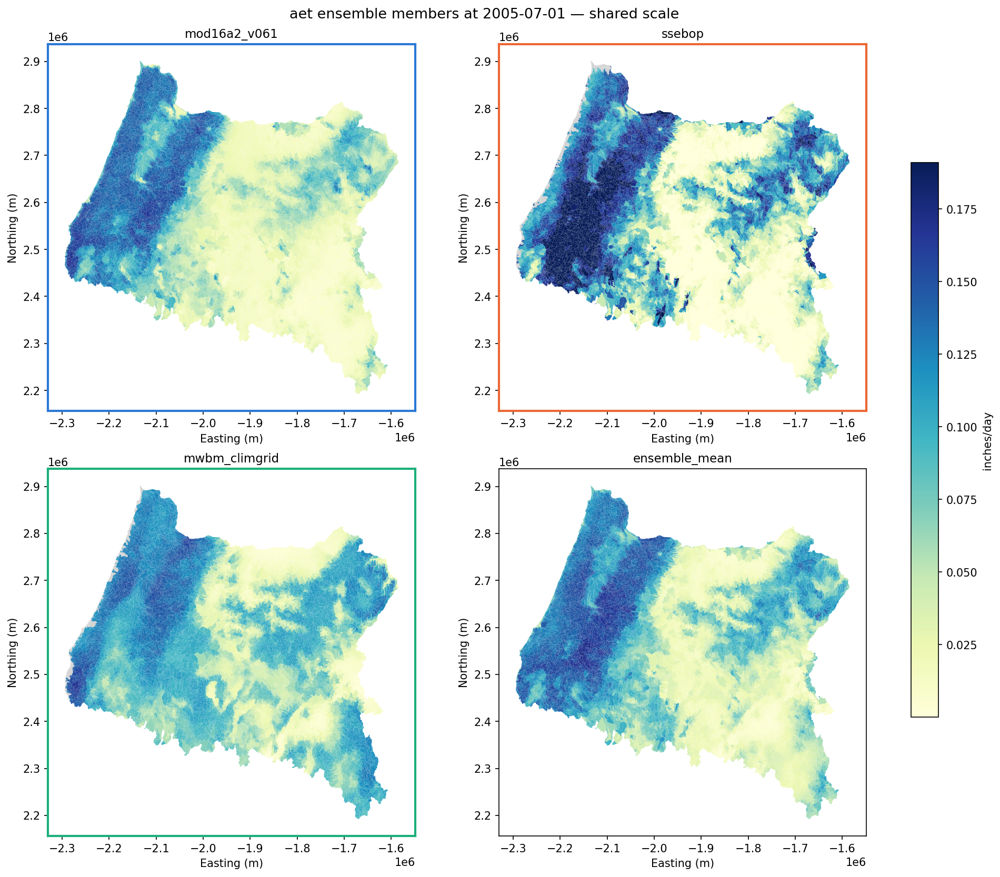
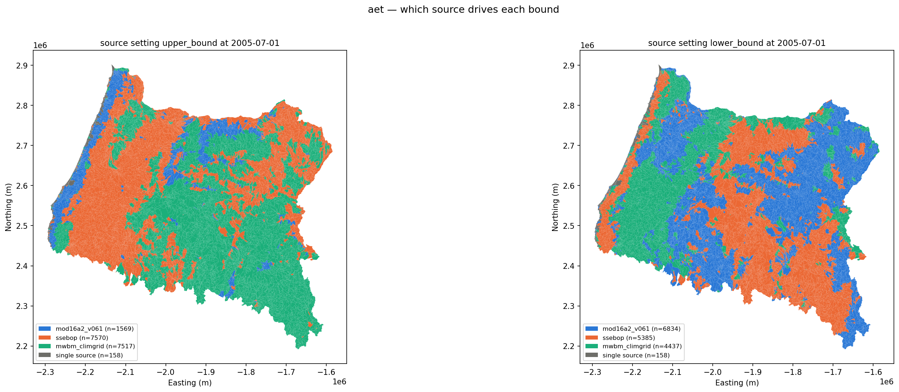
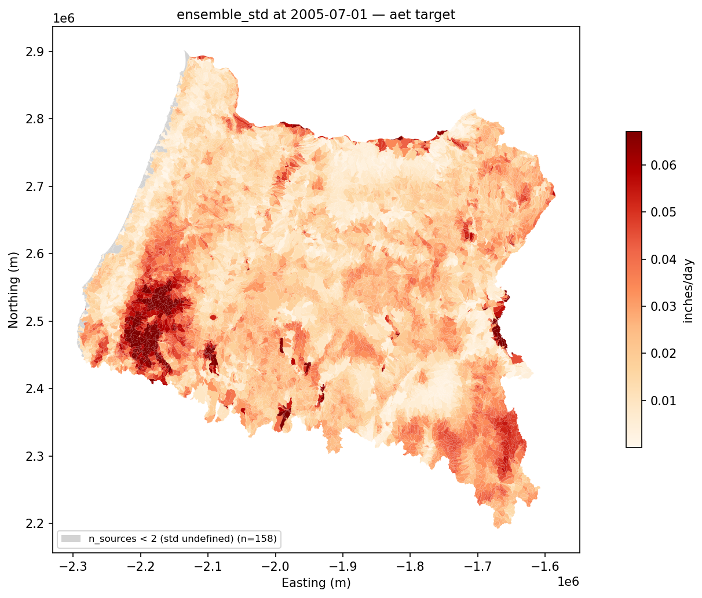
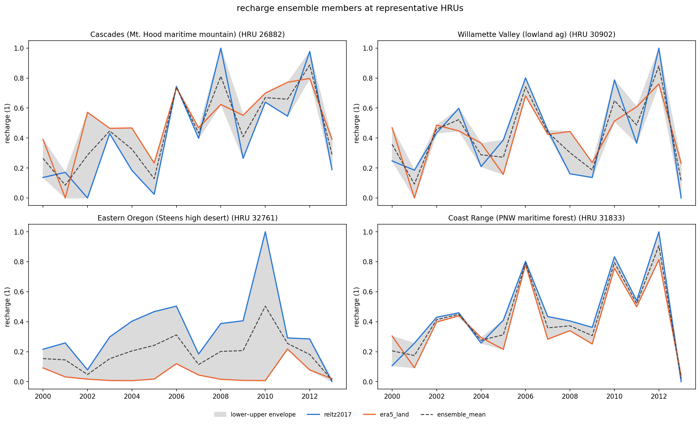
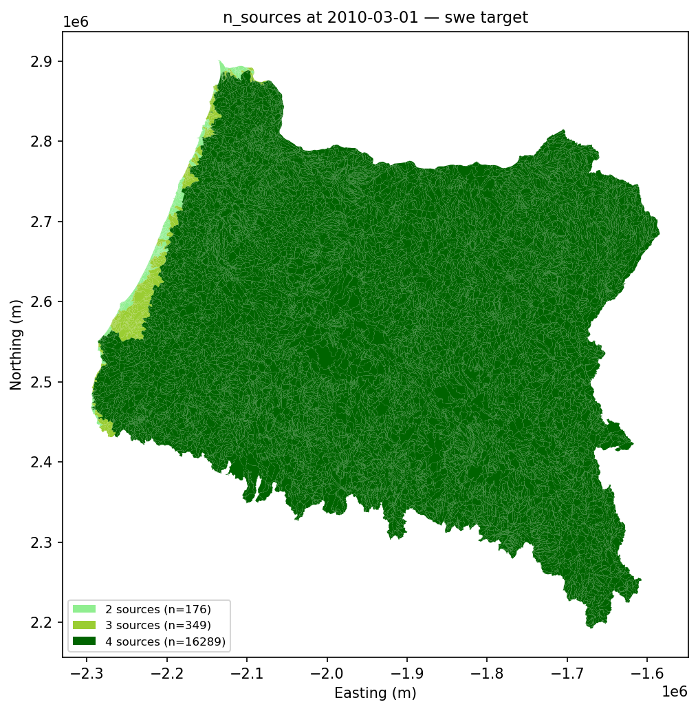

# Oregon — ensemble calibration targets

#### Project: `or-spatial-targets` · 16,814 HRUs · PNW · rebuilt 2026-09-09

The target NetCDFs now carry the **per-source ensemble** alongside the bounds, and recharge / soil moisture normalize **each source over its own period of record**. This deck covers what changed, what the new files contain, and how to read them.

<span class="footnote">
USGS National Hydrologic Model · TM 6-B10 (Hay et al. 2022) · issue #338 · supersedes the May aggregated + target overview for this fabric
</span>

<!--
Origin: colleagues' 06_Create_calibration_target_ensembles.ipynb. The pipeline
previously wrote three variables per target (lower_bound / upper_bound /
n_sources); the notebook wrote eight. This work brings the pipeline to that
schema and adds per-source-POR normalization, then rebuilds Oregon on it.
Everything on these slides is read from the rebuilt NCs, not from config.
-->

---

<!-- _class: compact -->

## What changed

| | Before | After |
|---|---|---|
| **Variables per target NC** | 3 — `lower_bound`, `upper_bound`, `n_sources` | **8** — the three above **+ one variable per source** + `ensemble_mean` + `ensemble_std` |
| **Provenance attrs** | `source` (prose) | `+ member_keys` (machine-readable, emitted set) · `+ members_emitted` |
| **Conventions** | CF-1.6 | **CF-1.8** on target NCs (consolidated + aggregated stay CF-1.6) |
| **Recharge / soil-moisture normalization** | one shared window for every source | **`per_source_por`** — each source over its own complete-calendar-year record |
| **SWE sources (OR)** | 5 (incl. Daymet) | **4** — Daymet dropped |
| **SCA (OR)** | built, in the target set | still built¹, excluded from the ensemble narrative |

<div class="callout">

**`emit_members` is an output switch, not a science switch.** Members were always computed — they are the input the bounds are derived from. The flag only decides whether they are also written. `lower_bound` / `upper_bound` are byte-identical either way.

</div>

<span class="footnote">
¹ <code>enabled: false</code> is honored when <code>nhf-targets run</code> selects all targets, but <strong>not</strong> when a target is named directly — and the SLURM array names them (<code>run-sca</code>). So <code>sca_targets.nc</code> was rebuilt on 2026-09-09 despite being disabled in <code>config.yml</code>. It carries no members (<code>members_emitted=false</code>), correctly: SCA's bounds are a MOD10C1 confidence interval, not a member min/max, so emitted members would not reconstruct them.
</span>

---

<!-- _class: compact -->

## Oregon at a glance — rebuilt 2026-09-09

| Target | Members (from the NC's `member_keys`) | Period | Steps | `n_sources` max |
|---|---|---|---|---|
| Runoff | era5_land · gldas_noah_v21_monthly · mwbm_climgrid | 1979-01 .. 2024-12 | 552 | 3 |
| AET | mod16a2_v061 · ssebop · mwbm_climgrid | 2000-01 .. 2024-12 | 300 | 3 |
| Recharge | reitz2017 · era5_land | 2000 .. 2013 | 14 | 2 |
| Soil moisture | merra2 · nldas_mosaic · nldas_noah | 1980-01 .. 2024-12 | 540 + 45 | 3 |
| **SWE** | **snodas · era5_land · margulis_wus_sr · ua_swe** | 1980-01 .. 2024-12 | 16,437 | **4** |
| SCA | *(none — CI-interval bound)* | 1982-01 .. 2024-12 | 15,706 | 2 |

| File | Was | Now |
|---|---|---|
| `runoff_targets.nc` | 66 MB | 212 MB |
| `aet_targets.nc` | 33 MB | 111 MB |
| `soil_moisture_targets_monthly.nc` | 41 MB | 155 MB |
| `recharge_targets.nc` | 2.0 MB | 5.1 MB |
| **`swe_targets.nc`** | 736 MB | **3.1 GB** |

<span class="footnote">
Every member list above is read back from the written file's <code>member_keys</code> attr and cross-checked against the variables actually on disk — not from <code>config.yml</code>. Growth is the members plus the two ensemble statistics. The <code>_nn_filled</code> companions did <strong>not</strong> grow (33 / 66 / 41 / 2.1 MB): by design they carry only the filled bounds, since filling an individual member would fabricate a source observation where that source never had one.
</span>

---

<!-- _class: compact -->

## Per-source period-of-record normalization

Recharge and soil moisture are normalized to 0–1. Previously every source shared one window — which clamped a long record to the shortest one. Under **`normalize_period: per_source_por`** each source uses its own complete-calendar-year record:

| Target | Source | Window actually used |
|---|---|---|
| **Recharge** | `reitz2017` | 2000-01-01 / 2013-12-31 |
| | `era5_land` | **1979-01-01 / 2025-12-31** |
| **Soil moisture** | `merra2` | **1980**-01-01 / 2025-12-31 |
| | `nldas_mosaic` | 1979-01-01 / 2025-12-31 |
| | `nldas_noah` | 1979-01-01 / 2025-12-31 |

Under the old shared window both recharge sources were clamped to 2000–2013; ERA5-Land now normalizes against its full 47-year record. MERRA-2's one-year-later start is detected automatically.

<div class="callout">

**"Period of record" means complete calendar years.** A partial leading or trailing year is coverage, not record — an unfinished year's annual *sum* would otherwise become that HRU's minimum and compress every other year toward 1.0.

</div>

<span class="footnote">
Each window is recorded on the output NC as <code>normalize_window_&lt;source_key&gt;</code>, so the file states the record it actually used. Two traps had to be avoided: reindexing pads uncovered months with NaN at <em>real</em> timestamps (so a naive completeness count reads padding as data), and resampling to annual collapses a ragged partial year into one indistinguishable step. Both windows above are derived from the raw, pre-reindex, pre-resample series. No interior-gap warning fired on this build, so no Oregon source has a mid-record hole.
</span>

---

<!-- _class: compact -->

## What the ensemble buys you

Each target NC now carries every contributing source as its own variable, plus two derived diagnostics:

| Variable | Meaning |
|---|---|
| `<source_key>` | that source's harmonized contribution, in the target's units |
| `ensemble_mean` | NaN-aware mean across finite members |
| `ensemble_std` | population std across finite members — **NaN wherever `n_sources < 2`** |
| `lower_bound` / `upper_bound` | unchanged: NaN-aware min / max across members |
| `n_sources` | unchanged: count of finite members per (HRU, time) |

Previously, a wide bound told you the sources disagreed but not **which** source drove the edge. The members answer that directly, per HRU per timestep.

<div class="callout">

`ensemble_std` is masked below two sources deliberately. With one finite source the population std is exactly 0 — a calibration weight built from it would read "only one source covered this cell" as "perfect inter-source agreement."

</div>

<span class="footnote">
Median <code>ensemble_std</code> where defined: runoff 0.43 cfs (99.1% of cells) · AET 0.0119 in/day (95.1%) · recharge 0.085 (99.6%) · soil moisture 0.109 (98.0%) · SWE 0.00068 in (95.0%). SWE's median is near zero because most (HRU, day) cells are snow-free and every source agrees on zero — read it seasonally, not as a single number.
</span>

---

<!-- _class: fig-over-text -->

## Seeing the members

<div class="fig-row">


<span class="caption">AET members and <code>ensemble_mean</code>, July 2005 — one shared color scale</span>

</div>
<div class="text-cols">
<div>

**The shared scale is the figure.** Autoscaling each panel to its own range
would render three sources that disagree by a factor of three as three
near-identical maps. The scale is pooled across every panel instead, so a
systematically wet or dry source is visible at a glance.

</div>
<div>

Coverage gaps stay grey rather than reading as zero. `mod16a2_v061` has no
data on the coastal fringe — the same 158 HRUs that sit at `n_sources == 1`
there, where the bound is degenerate.

Panel frames carry each member's color, reused in the two figures that follow
so the set reads as one system.

</div>
</div>

---

<!-- _class: two-col -->

## Which source drives each bound

<div class="grid">
<div class="figs solo">


<span class="caption">AET, July 2005 — <code>upper_bound</code> (left), <code>lower_bound</code> (right)</span>

</div>
<div class="notes">

`upper_bound` is the NaN-aware max across members, so exactly one member
*sets* it at each HRU. This names it.

- `mod16a2_v061` sets the upper bound at **1,569** HRUs but the lower at
  **6,834** — systematically the driest July AET source.
- `ssebop` (7,570) and `mwbm_climgrid` (7,517) split the upper bound almost
  evenly, trading along the Cascade crest.
- Recharge is starker: `reitz2017` sets the upper bound at **14,908 of
  16,814** HRUs and `era5_land` the lower at the same count.

<div class="callout">

Grey is not a member. **no spread** = the sources agree; **single source** =
only one is finite, so there is nothing to win.

</div>

</div>
</div>

---

<!-- _class: compact -->

## A driver map is a trap without a tie test

`argmax` always returns a column — even when every member holds the same
value. Members reach the figure as float32 that has been through a unit
conversion, so physically identical values are rarely bit-identical.

Oregon SWE, 16,814 multi-source cells, **2010-08-15** (snow-free):

| | cells |
|---|---|
| spread bit-identical zero | 239 |
| `0 < spread < 1e-9` inches | **14,239** |
| field maximum that day | 108 inches |

An exact `spread == 0` test hands **85% of a snow-free state** to a driver
chosen by a nanometre of SWE. The tie test is therefore
`spread <= atol + rtol · max|value|`, scaled by the field rather than the
cell — near-zero cells have no magnitude of their own to be relative to, and
that is exactly where the noise lives.

| `upper_bound` classified "no spread" | exact | scale-aware |
|---|---|---|
| 2010-08-15 — snow-free | 1.4% | **89.0%** |
| 2010-03-01 — near-peak snow | 1.3% | 17.2% |

<span class="footnote">
The asymmetry is the check. A blunt tolerance would have flattened both rows; this one suppresses the summer noise and leaves the winter signal intact. AET and recharge classifications are byte-identical either way — their values never approach zero, so only the snow targets were ever exposed. Default <code>rtol</code> is float32 resolution (1e-6); <code>rtol=0.0</code> restores the strict comparison.
</span>

---

<!-- _class: two-col -->

## Where, and when, they disagree

<div class="grid">
<div class="figs">


<span class="caption">AET <code>ensemble_std</code>, July 2005</span>


<span class="caption">Recharge members at four representative HRUs</span>

</div>
<div class="notes">

AET disagreement concentrates in the Coast Range and the west slope of the
Cascades — forested, orographic, and where ET products diverge most. The
legend names the grey: 158 HRUs at `n_sources < 2`, where a population
standard deviation would be exactly `0` and read as perfect agreement.

In time, the same question resolves per HRU. At Steens the two recharge
sources hold a sustained offset across the whole record; in the Coast Range
they track each other closely.

<div class="callout">

A bound that hugs one colored line through a season is a bound set by that
source. That is the read the bounds alone could never give you.

</div>

</div>
</div>

---

<!-- _class: compact -->

## Coverage — where the bound is actually informative

`n_sources` distribution across all (HRU, timestep) cells:

| Target | 0 | 1 | 2 | 3 | 4 |
|---|---|---|---|---|---|
| Runoff | — | 0.9% | 54.3% | 44.8% | — |
| AET | — | 4.9% | 12.5% | **82.6%** | — |
| Recharge | 0.0% | 0.4% | **99.6%** | — | — |
| Soil moisture | — | 2.0% | — | **98.0%** | — |
| **SWE** | 0.1% | 5.0% | 12.3% | **46.2%** | **36.5%** |

- **Runoff** sits at 2 sources more often than 3 — MWBM ClimGrid ends 2020, and GLDAS starts 2000, so the full three overlap only 2000–2020.
- **AET** is the best-covered monthly target at 82.6% three-source.
- **SWE** reaches 4 sources on 36.5% of cells; Margulis contributes by geometry (honest NaN outside its Western-US grid) and SNODAS starts 2004.
- A cell at `n_sources == 1` has a **degenerate bound** — lower equals upper. Treat it as a point estimate, not a range.

<span class="footnote">
Percentages are of all (HRU, timestep) cells including snow-free and out-of-coverage ones, computed directly from each rebuilt NC's <code>n_sources</code> variable. Recharge's 0.0% at zero sources is a genuine non-zero count that rounds to zero at one decimal.
</span>

---

<!-- _class: compact -->

## SWE — Daymet dropped, four sources

**`snodas · era5_land · margulis_wus_sr · ua_swe`** — Daymet removed per the colleagues' ensemble notebook; UA SWE retained at their request.

| Source | Contributes | Note |
|---|---|---|
| `snodas` | 2004– | 21 per-year NCs; the archive has real day-gaps in 2004–07 |
| `era5_land` | 1979– | 47 per-year NCs; `sd` is snow depth **water equivalent**, so ×1000 → mm is exact, not a density assumption |
| `margulis_wus_sr` | 1985–2020 | 36 per-year NCs; 500 m, Western-US only — contributes by geometry, honest NaN elsewhere |
| `ua_swe` | 1982–2022 | 41 per-year NCs; CONUS-wide, reaches before SNODAS |

Bound range across the rebuilt file: **0 – 288.9 inches**.

<div class="callout">

A year in which a source has no data still emits that source as an **all-NaN member**, so every per-year file carries the same variable set — the stitch across 45 years requires an exact match. Getting this subtly wrong is what broke the first rebuild attempt (#345).

</div>

<span class="footnote">
The written <code>lower_bound</code> minimum is <code>-2.9e-23</code> inches — floating-point noise from the unit conversion, numerically zero, not negative snow. Worth knowing before someone reports it as a bug. Member counts above are the per-year NC counts the build logged, which match each source's expected coverage exactly.
</span>

---

<!-- _class: two-col -->

## Recharge — per-source POR, visible

<div class="grid">
<div class="figs">


<span class="caption">Bound width per HRU, 2000–2013</span>


<span class="caption">Representative HRUs — normalized 0–1</span>

</div>
<div class="notes">

Both sources are normalized to 0–1, but now over **different windows**:

- `reitz2017` → 2000-01-01 / 2013-12-31
- `era5_land` → **1979-01-01 / 2025-12-31**

Previously both were clamped to 2000–2013, so ERA5-Land's 0 and 1 were set by
the wettest and driest year *in the Reitz window* rather than in its own
47-year record.

<div class="callout">

These figures changed against their June versions. Runoff and AET re-rendered
byte-identical — neither their sources nor their method moved.

</div>

</div>
</div>

---

<!-- _class: two-col -->

## Soil moisture — per-calendar-month, per-source window

<div class="grid">
<div class="figs">


<span class="caption">Monthly climatology of the bound</span>


<span class="caption">Bound width per HRU</span>

</div>
<div class="notes">

Normalization is **per calendar month** — a January value is scaled against
other Januaries, so the seasonal cycle does not swamp the interannual signal.

Under `per_source_por` each source brings its own window:

- `merra2` → **1980**-01-01 / 2025-12-31
- `nldas_mosaic` → 1979-01-01 / 2025-12-31
- `nldas_noah` → 1979-01-01 / 2025-12-31

MERRA-2's one-year-later start is detected from its own record rather than
being imposed on the other two.

</div>
</div>

---

<!-- _class: two-col -->

## SWE — four sources, not five

<div class="grid">
<div class="figs">


<span class="caption">`n_sources` per HRU — max 4</span>


<span class="caption">Bound width per HRU, inches</span>

</div>
<div class="notes">

Daymet dropped per the colleagues' notebook; `ua_swe` retained at their
request. `snodas · era5_land · margulis_wus_sr · ua_swe`.

The `n_sources` map is the direct evidence — its maximum is now **4**. Coverage
across all (HRU, day) cells: 4 sources at **36.5%**, 3 at **46.2%**, 2 at
12.3%, 1 at 5.0%.

Margulis contributes by **geometry** — area-weighted inside its Western-US
grid, honest NaN outside — which is why the 4-source region is spatially
bounded rather than uniform.

<div class="callout">

A cell at `n_sources == 1` is a **degenerate bound**: lower equals upper. Read
it as a point estimate.

</div>

</div>
</div>

---

<!-- _class: compact -->

## Reading the new files

```python
import xarray as xr
ds = xr.open_dataset("targets/swe_targets.nc")

ds.attrs["member_keys"]       # 'snodas,era5_land,margulis_wus_sr,ua_swe'
ds.attrs["members_emitted"]   # 'true'
ds["snodas"]                  # that source's contribution, in inches
ds["ensemble_std"]            # NaN where n_sources < 2
```

- **`member_keys` is the emitted set.** `source_keys` is a *different* attr with different semantics — the sources the config requested — and the release publish gate compares it to `config.yml` with strict equality. Do not conflate them.
- **`members_emitted` is always present**, so a reader can distinguish "this target never emitted members" from "members were emitted and something dropped them."
- The `_nn_filled` companion carries **only** the filled bounds and stamps `members_emitted=false`.

<div class="callout">

Turning `emit_members: false` on a target changes no bound value — only file size. On the national fabric a daily SWE target goes from ~12 GB to ~36–48 GB with members, which is why the switch exists.

</div>

---

<!-- _class: compact -->

## Caveats and what is not done

- **Figures here are current** — re-rendered 2026-09-10 against the rebuilt targets, adding the four ensemble figures. Every *map* also changed cosmetically: the axes were labelled "Longitude"/"Latitude" while the Oregon fabric is EPSG:5070 Albers, so every OR figure had been reporting metres as degrees. They now read `Easting (m)` / `Northing (m)`. The May OR deck carried superseded plots and is removed on this branch.
- **The member and spread figures now exist** (issue #351): member small multiples, an `ensemble_std` map, driver maps, and per-member series, in all five member-carrying notebooks. Building them surfaced a real bug — the first tie test compared spread against exactly `0`, which left 85% of a snow-free August attributed to a noise-chosen driver; see the tie-test slide above. `snow_covered_area` gets a note instead of figures: its bounds are a MOD10C1 confidence interval, not a member min/max.
- **`sca_targets.nc` was rebuilt despite `enabled: false`** and is in the manifest as a published target (accepted for now).
- **Aggregated-figure notebooks glob disk, not config.** They will still render a Daymet panel for SWE even though Daymet is no longer a member of the target. Read the source of truth from the target NC.

<span class="footnote">
Open follow-ups: #339 release payload stages build intermediates · #340 per-year target layout · #341 notebook feedback for the source notebook · #342 CF <code>time: point</code> alongside <code>time_bnds</code> · #343 versioning project intent artifacts · #347 test fixtures diverge from what the aggregator writes.
</span>

---

## References

- **Issue #338** — ensemble members + per-source POR normalization · **#345** — the all-NaN member coord regression
- **Source notebook** — colleagues' `06_Create_calibration_target_ensembles.ipynb`
- **TM 6-B10** (Hay et al. 2022) — `docs/references/tm6b10.pdf`; this pipeline differs deliberately on time windows and dataset versions
- **Design + plan** — `docs/superpowers/specs/2026-09-08-ensemble-target-schema-design.md`, `docs/superpowers/plans/2026-09-08-ensemble-target-schema.md`
- **Architecture** — `docs/architecture/transformation-pipeline.md` (per-source POR, member emission), `docs/architecture/nc-encoding-policy.md`

<span class="footnote">
Every number in this deck was read back from the rebuilt target NetCDFs on 2026-09-09, not from configuration.
</span>
