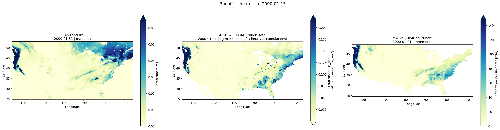
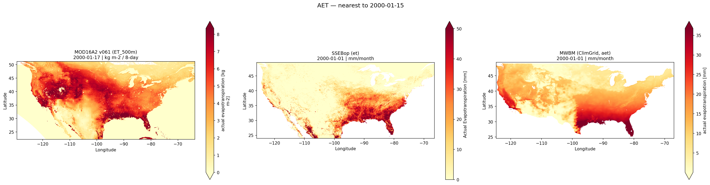
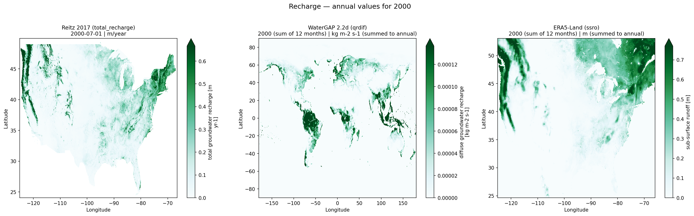
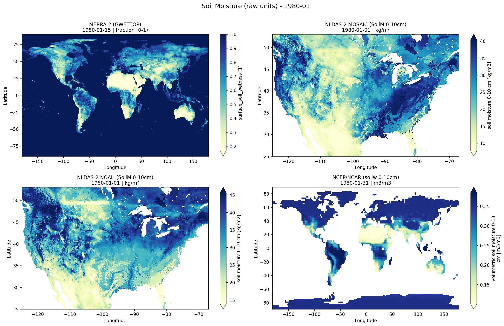
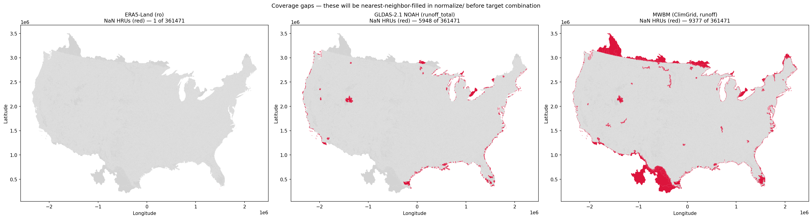
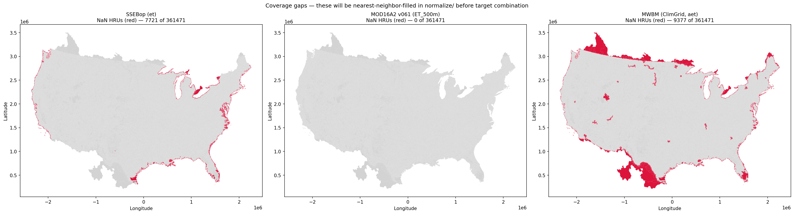
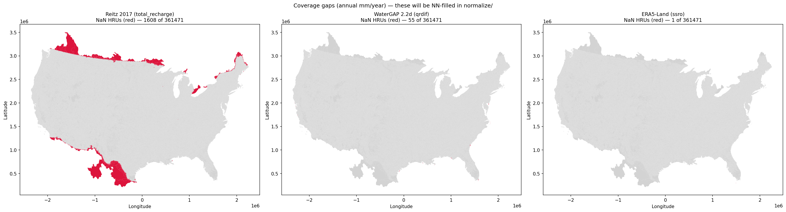
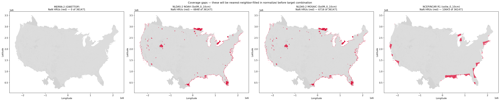
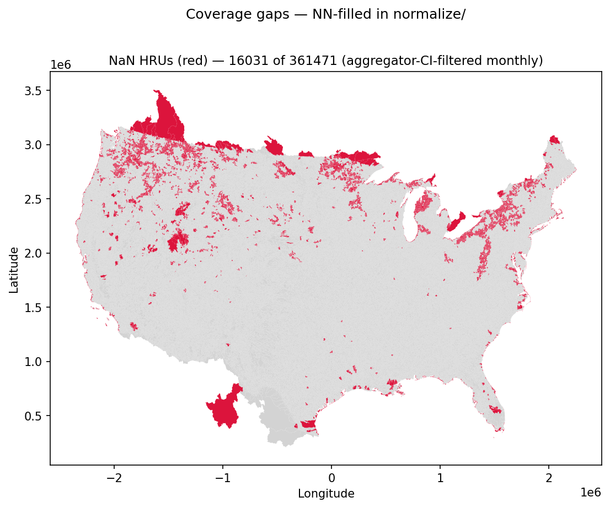

# nhf-spatial-targets

### Pipeline overview & pre-target inspection findings

#### Project: `gfv2-spatial-targets`

Collaborator briefing — calibration-target consensus

Goal of this session: align on **(a) period of record per target group**,
**(b) datasets used in each target group**, and **(c) strategy for filling missing data**.

<span class="footnote">
USGS National Hydrologic Model · TM 6-B10 (Hay et al. 2022)
</span>

<!--
Welcome. This session has three concrete outputs: a decision on period of record
for each target, agreement on which datasets are included, and a strategy for
HRUs that have no valid data for one or more sources in the aggregated output.
-->

---

## Today's plan

1. **Pipeline tour** — repo layout, datastore convention, project setup, workflow
2. **Two-stage QA/QC** — gridded source QC (Stage 1) → HRU aggregate QC (Stage 2)
3. **Decisions** — period of record, datasets, and missing-data strategy per target
4. **Open discussion**

Detail-level docs are linked at the end; this deck stays at the
why / what-changed / where-to-look layer.

<!--
The deck is heavier on QC figures than earlier drafts — every figure from the
inspect_aggregated notebooks is included because each one diagnoses a different
failure mode. We'll move quickly through figures that look clean and slow down
on anything that needs a decision.
-->

---

## Project purpose

Build the **five TM 6-B10 calibration targets** for the National Hydrologic
Model by spatially aggregating gridded source datasets to an HRU fabric via
[`gdptools`](https://github.com/rmcd-mscb/gdptools).

| Target | PRMS variable | Method |
|---|---|---|
| Runoff | `basin_cfs` | Multi-source min/max over absolute cfs |
| AET | `hru_actet` | Multi-source min/max over absolute mm/month |
| Recharge | `recharge` | 0–1 normalised min/max |
| Soil moisture | `soil_rechr` | 0–1 normalised min/max |
| Snow-covered area | `snowcov_area` | MOD10C1 CI bounds |

Source-of-truth: `README.md`, `catalog/variables.yml`.

<!--
Each target is a per-HRU per-timestep *bound* (lower, upper), not a point
estimate. The bound is what the PRMS optimiser penalises against — simulated
values outside the bound incur a cost; within the bound they are unconstrained.
The method column describes how the bound is derived from the source products.
-->

---

## Multi-source bounds strategy

The pipeline produces **lower and upper bounds** per HRU per timestep, not a single
best estimate. The bound width comes from genuine disagreement among independent products:

- **Different products** use different physics, forcing, and algorithms → different answers.
- The **envelope** (per-HRU min/max) is the calibration uncertainty range.
- Targets are *not absolute observations* — they are *constraints with width*.

**Why not just pick the "best" product?**
No product is best everywhere. A bound that captures real inter-product disagreement
gives the optimiser room to match the model to the catchment, rather than over-fitting
to one product's systematic bias.

**Why not make bounds as wide as possible?**
A bound that's too wide under-constrains the optimisation — the penalty surface
becomes flat and calibration converges slowly. The goal is an *honest* bound:
wide where products genuinely disagree, tight where they agree.

<!--
This framing matters for the dataset decisions later. When someone asks "should we
include MOD16A2?", the right question is: "does it widen the bound in a direction
that reflects real uncertainty, or does it widen it because of a product artifact?"
That's exactly the question we resolved for MOD16A2 v061.
-->

---

## Repo module map

```text
catalog/                          # YAML registry — source-of-truth
  sources.yml                     # per-source: access, variables, period, notes
  variables.yml                   # per-target: sources, range_method, period

src/nhf_spatial_targets/
  fetch/      ← per-source download adapters
  aggregate/  ← gdptools-driven HRU aggregation, per source
  normalize/  ← 0–1 norm + nearest-neighbour HRU fill
  targets/    ← per-variable target builders (some still stubs)
  catalog.py  ← single Python interface to the YAML catalog
  cli.py      ← `nhf-targets` entry point

notebooks/
  aggregated/            # Stage 2 — HRU aggregate QC
  consolidated/          # Stage 1 — gridded source QC, pre-aggregation
```

<!--
The YAML catalog is the single source of truth for which datasets are used,
their access paths, variables, and periods. Python code never hardcodes URLs,
variable names, or unit strings — those live in sources.yml and are read at
runtime via catalog.py.
-->

---

## CLI entry points

```bash
# Project lifecycle
pixi run nhf-targets init             --project-dir /data/my-run
pixi run nhf-targets validate         --project-dir /data/my-run
pixi run nhf-targets fetch <source>   --project-dir /data/my-run
pixi run nhf-targets agg   <source>   --project-dir /data/my-run
pixi run nhf-targets run              --project-dir /data/my-run

# Catalog inspection (no project needed)
pixi run catalog-sources
pixi run catalog-variables
```

All commands take `--project-dir`; the project dir + the catalog are the
two state inputs. Everything else is derived.

**On HPC (Caldera / Denali):** these same commands are wrapped in Slurm batch
scripts at the repo root (`fetch_all.slurm`, `agg_all.slurm`, `agg_ssebop.slurm`,
`fetch_era5_land.slurm`, `inspect_aggregated.slurm`, `inspect_consolidated.slurm`)
for resource allocation, parallel source dispatch, and job chaining. The entry
points are identical — Slurm only adds queue management on top.

<!--
pixi is the environment manager (replaces conda/pip). Every command resolves
its own dependencies from pixi.toml — no manual activation step. On a fresh
checkout: `pixi install` then any pixi run command. On Caldera/Denali, the
Slurm scripts handle the module loads and pixi environment before invoking
nhf-targets.
-->

---

## Datastore vs project

The pipeline separates two roles:

| **Datastore** | **Project** |
|---|---|
| Raw downloaded source data | Fabric-specific outputs |
| Fabric-independent, expensive to re-fetch | Fabric-tied, reproducible from datastore |
| Re-usable across many fabrics | One per (fabric, run-time) pair |
| `<datastore>/<source_key>/...` | `<project>/data/aggregated/<source>/...` |

**One datastore can serve many projects.** Switching from GFv1.1 → GFv2.0
re-uses the same fetched source data; only weight caches and aggregated
outputs differ.

<!--
In practice the datastore lives on Caldera scratch (or a large attached volume)
and is shared across all active projects. The project directory holds only the
lightweight aggregated and target outputs — typically a few GB vs hundreds of GB
for the raw datastore. This separation also means a corrupted project can be
fully rebuilt from the datastore without re-downloading anything.
-->

---

## Datastore layout

```text
/caldera/.../nhf-datastore/
  era5_land/                    monthly/era5_land_monthly_{year}.nc
  gldas_noah_v21_monthly/       gldas_consolidated.nc
  merra2/                       merra2_{year}.nc
  mod10c1_v061/                 mod10c1_v061_{year}_consolidated.nc
  mod16a2_v061/                 mod16a2_v061_{year}_consolidated.nc
  mwbm_climgrid/                ClimGrid_WBM.nc
  ncep_ncar/                    ncep_ncar_{year}.nc
  nldas_mosaic/                 nldas_mosaic_{year}.nc
  nldas_noah/                   nldas_noah_{year}.nc
  reitz2017/                    reitz2017_{year}.nc
  watergap22d/                  watergap22d_qrdif_cf.nc
```

Source-of-truth: `README.md` § Per-Source Fetch Pipeline.

<!--
Each source key in the datastore matches the key in catalog/sources.yml —
the pipeline resolves paths programmatically so there is no hardcoding.
watergap22d and mwbm_climgrid are single-file sources (full period in one NC);
all others are per-year. ERA5-Land has a monthly/ subdirectory because it
goes through a daily intermediate consolidation step.
-->

---

## Project layout

```text
/caldera/.../gfv2-spatial-targets/
  config.yml                  ← fabric path, datastore path, target enables
  .credentials.yml            ← gitignored; CDS + Earthdata creds
  fabric.json                 ← computed fabric metadata (from validate)
  manifest.json               ← provenance: fetches, checksums, periods
  data/aggregated/<source>/   ← per-year aggregated NCs (HRU-resolution)
  targets/                    ← final calibration target datasets
  weights/                    ← gdptools weight caches (fabric × source grid)
  logs/                       ← per-run logs
```

Never delete a project directory — it's the audit trail.

<!--
The manifest.json is the key provenance record. It records what was fetched,
from where, when, with what SHA-256, and what period was covered. The target
outputs embed the same provenance in their CF global attributes. If someone
asks "exactly what data went into this target?", the manifest is the answer.
-->

---

## Workflow

```text
init        → empty project skeleton + config.yml template
   ↓
validate    → preflight checks (fabric, datastore, creds, catalog)
              → writes fabric.json + initial manifest.json
   ↓
fetch <src> → download to <datastore>/<src>/   (incremental, manifest-tracked)
   ↓
agg   <src> → gdptools area-weighted aggregation to HRU fabric
              writes <project>/data/aggregated/<src>/<src>_<year>_agg.nc
   ↓
run         → build calibration targets from aggregated NCs
              writes <project>/targets/...
```

`fetch` and `agg` are idempotent and per-source. Only `run` is end-to-end.

<div class="callout">

**What idempotent means in practice:**
`fetch <src>` only downloads files absent from the datastore — safe to re-run after a network failure mid-year.
`agg <src>` skips per-year NCs that already exist — safe to resume at the exact year that failed.
`run` always re-executes fully from the aggregated NCs — there is no partial-run state to clean up.

</div>

<!--
The idempotency design means you never need to manually track "how far did the
last run get?" — just re-issue the same command and it picks up where it left off.
On HPC this is especially important because Slurm jobs hit wall-time limits; the
fetch and agg scripts are designed to be submitted multiple times until all years
are complete.
-->

---

## config.yml — the project's contract

```yaml
fabric:
  path: /caldera/.../gfv2_param_v2/gfv2/fabric/gfv2_nhru_merged.gpkg
  id_col: nat_hru_id
  crs: EPSG:4326          # plotting CRS; aggregator re-projects to EPSG:5070

datastore: /caldera/.../nhf-datastore

targets:
  aet:
    enabled: true
    sources: [ssebop, mwbm_climgrid, mod16a2_v061]   # all three (PR #88 fixed MOD16A2)
    period: "2000/2010"
  recharge:
    enabled: true
    period: "2000/2009"   # normalisation window
  ...
```

Project config can *override* catalog defaults — used when the consensus on
sources or period changes for a specific run without touching the catalog.

<!--
The sources list shows all three AET sources now that PR #88 fixed the
MOD16A2 fill-value contamination. Config overrides can still exclude a source
per-run without touching the catalog.
-->

---

## manifest.json — provenance record

Records, atomically, *what was fetched / aggregated, when, and from where*:

```json
{
  "fabric_meta": { "path": "...", "id_col": "...", "sha256": "..." },
  "sources": {
    "era5_land": {
      "fetched_periods": ["2000/2010"],
      "files": [
        { "path": "monthly/era5_land_monthly_2000.nc",
          "sha256": "...", "fetched_at": "2026-04-29T..." }
      ]
    }
  }
}
```

Re-running `fetch` skips periods already recorded — guards against
duplicate downloads when re-running targets.

<!--
The SHA-256 checksums in the manifest are what make the provenance verifiable.
If a source file is re-fetched (e.g. after a corrected upstream release),
the new checksum differs from the recorded one, flagging the need to re-aggregate
that source. This is the mechanism that would catch a silent upstream correction
like the Reitz 2017 units fix.
-->

---

# Two-stage QA/QC

We inspect every target at **two scales** before it informs a calibration bound:

1. **Gridded source QC** — `notebooks/consolidated/inspect_consolidated_*.ipynb`
   Do the source products agree on the spatial pattern *before we aggregate*?
2. **HRU aggregate QC** — `notebooks/aggregated/inspect_aggregated_*.ipynb`
   Did aggregation preserve that pattern at the fabric scale?

Each notebook writes its panels to `docs/figures/{consolidated,aggregated}/<project>/`
via a `save_figure(fig, name)` hook, so the same figures appear in this deck.

This guards against silent bugs at *either* scale: a gridded-source artefact
that aggregation masks, or an aggregation artefact the source didn't have.

<!--
The two-stage structure is important. We have caught issues at both stages:
at Stage 1 we caught the GLDAS _acc unit trap (values 248× too small at the
gridded level) and the MOD16A2 flat seasonality. At Stage 2 we caught the
valid_area_fraction diagnostic behaviour in MOD10C1. If we had only done one
stage we would have missed at least one of these.
-->

---

# Stage 1 — Gridded source QC

The figures that follow are pre-aggregation: each product on its **native grid**,
clipped to a common extent.

Two panels per target:

1. **Raw panels** — each source individually, native units, independent colour scales.
   Shows the spatial pattern and magnitude of each product before any comparison.
2. **Normalised comparison** — all sources on a shared 0–1 colour scale.
   Shows whether the spatial patterns rhyme across products.

Goal is *visual triangulation* — if independent products agree on the
spatial pattern, the inter-product spread we see at HRU level (Stage 2) is
real signal, not pipeline noise.

<!--
"Normalised" here means linearly rescaled to [0,1] for the comparison figure only —
this is a visualisation step, not the 0-1 normalisation applied in the recharge
and soil-moisture targets. It's just a common colour scale.
-->

---

## Runoff — gridded sources (raw)



<span class="caption">ERA5-Land `ro` and GLDAS-2.1 NOAH `Qs_acc + Qsb_acc` in native units (m/month and mm/month respectively) on each product's own colour scale. Inspect for plausible magnitudes and absence of artefacts before comparing products.</span>

<!--
ERA5-Land ro: monthly accumulation in m/month from the H-TESSEL land surface
scheme within the ECMWF IFS. Global ~0.1°, forced by ERA5 atmospheric analysis.
This is the "total" runoff — surface + subsurface drainage combined.

GLDAS-2.1 NOAH Qs_acc + Qsb_acc: NOAH LSM from NASA GSFC, forced by MERRA-2
atmospheric analysis plus GPCP/CMAP precipitation corrections. Qs_acc is storm
surface runoff; Qsb_acc is baseflow/groundwater outflow. Both are stored as means
of 3-hourly accumulations for the month — NOT monthly sums — requiring the
× 8 × days_in_month conversion before comparison.

Key differences between products:
- Forcing: ERA5-Land uses ECMWF analysis; GLDAS uses MERRA-2 + blended precip.
  Different forcing → different precip totals → different runoff totals.
- Soil scheme: H-TESSEL (bucket + ECMWF parameterization) vs NOAH (4-layer with
  separate storm flow and baseflow routing). NOAH tends to generate more surface
  runoff in convective events; H-TESSEL distributes more to subsurface.
- Resolution: ERA5-Land ~0.1°; GLDAS-2.1 0.25°. Orographic detail differences
  visible in the Rockies and Sierra.
-->

---

## Runoff — gridded sources (normalised)


<span class="caption">Both sources on a shared 0–1 colour scale (ERA5-Land footprint). Wet–dry gradient and orographic patterns align well; magnitude offsets reflect different land surface models and forcing — the spread the multi-source bound is designed to capture.</span>

<!--
When the normalised patterns agree this well, the inter-product spread at Stage 2
is from real physical differences (different LSM parameterizations, different
precip forcing) rather than pipeline errors. This is the "good" kind of spread.
-->

---

## AET — gridded sources (raw)



<span class="caption">SSEBop, MWBM ClimGrid, and MOD16A2 v061 in native units (mm/month) on independent colour scales. MOD16A2 fill-value contamination was fixed in PR #88 (masking before reprojection); all three sources are now in the AET target.</span>

<!--
SSEBop (Operational Simplified Surface Energy Balance): USGS operational product.
Derives actual ET from MODIS land surface temperature (as a proxy for surface
energy balance), corrected by a reference ET field. Satellite-observational in
nature — it is not a model simulation but an inversion of observed surface
temperature. CONUS 1km monthly, 2000–2023.

MWBM ClimGrid (Monthly Water Balance Model): USGS process model forced by the
ClimGrid gridded climate dataset (Wieczorek et al. 2024). Closes the water balance:
ET = P - Q - ΔS. This means MWBM AET is bounded by precipitation — it cannot
exceed what fell as rain or snow. 2.5 arcmin CONUS, 1895–2020.

Key differences:
- SSEBop is observationally constrained via satellite LST; MWBM is model-constrained
  via water balance closure. They measure the same flux but through fundamentally
  different lenses.
- SSEBop captures irrigated agriculture explicitly (the satellite sees a cool,
  wet surface regardless of water source); MWBM only sees natural precipitation
  forcing unless irrigation is added to the climate input.
- In irrigated regions (Central Valley, High Plains), SSEBop AET may exceed MWBM
  AET by a large margin. This is real — irrigated AET can far exceed precip.
-->

---

## AET — gridded sources (normalised)


<span class="caption">All three AET sources on a shared 0–1 scale (ERA5-Land footprint). SSEBop, MWBM, and MOD16A2 v061 (post-PR #88 fix) should all show a strong seasonal cycle and wet-east / dry-west spatial pattern.</span>

<!--
After the PR #88 fix, MOD16A2 should show seasonality comparable to SSEBop
and MWBM (6–11× Jul/Jan ratio for humid CONUS HRUs). If MOD16A2 still appears
flat in a re-run inspection, the consolidated NCs predate the fix and must be
re-fetched and re-aggregated before this comparison is valid.
-->

---

## Recharge — gridded sources (raw)



<span class="caption">Reitz 2017 `total_recharge` (m/yr), WaterGAP 2.2d `qrdif` (mm/yr), and ERA5-Land `ssro` (mm/yr) in native units on independent colour scales. Absolute magnitudes diverge by design — these three products measure conceptually different quantities.</span>

<!--
Reitz 2017: Empirical regression of baseflow separation from observed streamflow
records (USGS gauge network). Annual raster at 800m, CONUS only, 2000–2013.
This is the most observationally grounded of the three — it is derived from
actual streamflow measurements, not model output. Units: m/year (confirmed;
earlier catalog had inches/year which was wrong — CONUS mean ~122 mm/yr
validates m/year).

WaterGAP 2.2d: Global hydrological model (Döll et al.) process-modelling
diffuse groundwater recharge specifically — the component of precipitation
that percolates below the root zone and reaches the water table. Monthly
0.5° global, 1901–2016. This is a model estimate, not observed.

ERA5-Land ssro: Sub-surface runoff from the H-TESSEL soil column. This is
drainage out of the bottom soil layer, which is used here as a proxy for
recharge but is NOT formally equivalent to groundwater recharge. ERA5-Land's
simple soil scheme does not explicitly represent deep percolation.

Key differences:
- Three different concepts: observed baseflow separation (Reitz) vs modelled
  diffuse recharge (WaterGAP) vs modelled soil drainage (ERA5-Land ssro).
- Absolute magnitudes will diverge, especially in arid regions where each
  product has different assumptions about what happens to precipitation that
  doesn't become surface runoff.
- The 0–1 per-source normalization in the target is what makes these combinable
  despite the magnitude differences.
-->

---

## Recharge — gridded sources (normalised)


<span class="caption">All three sources on a shared 0–1 scale (ERA5-Land footprint). Spatial patterns rhyme — wet Pacific Northwest and Southeast, dry interior West — confirming the normalization strategy is sound even though absolute magnitudes differ substantially.</span>

<!--
The normalised comparison is the validation that the normalization strategy
makes sense. Even though the three products measure different things in different
units at different scales, they agree on "where in CONUS is recharge high vs low."
That relative spatial signal is what the normalization preserves and the
calibration target uses.
-->

---

## Soil moisture — gridded sources (raw)



<span class="caption">MERRA-2 `GWETTOP`, NLDAS-2 NOAH, NLDAS-2 MOSAIC, and NCEP/NCAR R1 in native units on independent colour scales. Note the different physical quantities: plant-available wetness fraction (MERRA-2) vs volumetric water content (NCEP, despite kg/m² label) vs mass per area (NLDAS).</span>

<!--
MERRA-2 GWETTOP: Plant-available wetness = (W - Wwilt)/(Wsat - Wwilt) for the
0–5 cm surface layer. From the GEOS-5 Catchment LSM. Dimensionless [0,1] by
definition. "0" means wilting point, "1" means saturation. Responds quickly to
precip events because it's only 5cm deep. Global 0.5°×0.625°, 1980–present.

NLDAS-2 NOAH SoilM_0_10cm: NOAH LSM soil moisture in kg/m² for 0–10 cm.
Same NOAH model as GLDAS but at 0.125° CONUS resolution with better forcing
(NLDAS-2 Phase 2 forcing, bias-corrected). Convert to VWC: ÷ 100.

NLDAS-2 MOSAIC SoilM_0_10cm: MOSAIC LSM (Koster & Suarez). Uses a mosaic
tiling approach for heterogeneous land cover within a grid cell. Different
soil parameterization — often wetter than NOAH in spring (slower drainage),
drier in summer (faster evaporation). Same NLDAS-2 forcing as NOAH. 0.125°.

NCEP/NCAR R1 soilw_0_10cm: T62 Gaussian grid (~1.875°). Oldest reanalysis
(back to 1948). CRITICAL: labeled kg/m² in the NetCDF but values are
volumetric water content (m³/m³) — confirmed by long_name, valid_range [0,1],
and actual_range [0.10, 0.43]. Do NOT divide by 100.

Key differences:
- Four different soil model parameterizations, two land model families (NOAH/MOSAIC
  vs Catchment LSM vs spectral model).
- Different depths: MERRA-2 0–5 cm; others 0–10 cm. MERRA-2 responds faster
  to precip/drying.
- Different variable definitions: plant-available vs VWC vs kg/m².
- The 0–1 per-source normalization per calendar month is what makes these
  combinable despite all these differences.
-->

---

## Soil moisture — gridded sources (normalised)


<span class="caption">All four products on the NLDAS CONUS footprint, shared 0–1 scale. The gridded comparison visualises the layer-depth and variable-definition differences directly — MERRA-2 appears relatively uniform because its 0–5 cm plant-available fraction saturates and dries faster than the deeper-layer products.</span>

<!--
The NLDAS footprint (CONUS at 0.125°) is used as the natural reference for
soil moisture inspection because both NLDAS products are CONUS-only.
MERRA-2 and NCEP/NCAR are global and are clipped to the same footprint here.
-->

---

## Snow-covered area — gridded source (raw)


<span class="caption">MOD10C1 v061 `Day_CMG_Snow_Cover` on March 1, 2000 (peak-CONUS snow date). Left: raw values including flag codes (237=inland water, 239=ocean, 250=cloud-obscured water). Right: after CI > 70% pre-aggregation mask. The mask is applied before fabric aggregation — post-aggregation gating would give a different (wrong) answer.</span>

<!--
MOD10C1 v061: MODIS Terra daily snow cover at 0.05° Climate Model Grid (CMG).
Algorithm: Normalized Difference Snow Index (NDSI > 0.4) plus thermal constraints
(MODIS band 6 reflectance, thermal band > 283K). The CMG product is pre-mosaicked
across all MODIS Terra swaths for the day.

Day_CMG_Clear_Index (CI): fraction of the 0.05° cell that was cloud-free that day.
This is what TM 6-B10 calls "confidence interval" — 100% = completely clear sky,
0% = fully cloud-obscured. It was called Day_CMG_Confidence_Index in v006;
renamed in v061.

Snow_Spatial_QA: a categorical 0–4 quality flag (0=best, 1=good, 2=ok, 3=poor,
4=other). Despite its units attribute saying "percent" in the v061 HDF metadata,
it is NOT a percent. Do not use it as the CI filter — using
`ci = Snow_Spatial_QA / 100; ci > 0.70` would pass only special flag values and
reject every legitimate quality rating.

CI > 70% gate: applied per-pixel BEFORE area-weighting. Post-gating would produce
a different answer — an HRU with 50% high-CI snowy pixels and 50% low-CI cloudy
pixels should include only the high-CI half in the area-weighted mean; post-gating
would average all pixels first, then gate on the HRU-mean CI.
-->

---

# Stage 2 — HRU aggregate QC

What follows is the per-target HRU-level QC: what we have aggregated to the
fabric, what looks right, and what needs a decision.

**Five diagnostic figures per target:**

| Figure | What it shows | What to look for |
|---|---|---|
| Native units map | Aggregated values in source units | Spatial plausibility; correct magnitude order |
| Normalised comparison | All sources on shared scale | Pattern agreement or disagreement |
| Coverage | Fraction of HRUs with valid data | Gaps — do they correspond to source extent? |
| Histogram | Per-HRU value distribution | Multi-source spread; outliers; flag-code leakage |
| Time series | Selected HRUs over time | Seasonal cycle; inter-annual variability |

Source notebooks: `notebooks/aggregated/inspect_aggregated_*.ipynb`.

<!--
The coverage figure is particularly important for the "missing data" decision.
It shows which HRUs are NaN after aggregation, and why — typically because the
HRU polygon doesn't overlap the source grid, or because the source has no data
for that year. The coverage figure by source is the input to the missing-data
discussion at the end of the deck.
-->

---

## Runoff (RUN)

- **Sources:** ERA5-Land `ro` + GLDAS-2.1 NOAH `Qs_acc + Qsb_acc`
- **Method:** multi-source min/max over absolute cfs
- **Cadence:** monthly; calibration window 2000–present (user-configurable)

The unit-conversion fix from PR #68:
GLDAS `_acc` fields are *means of 3-hourly accumulations*, not sums — multiplied
by `8 × days_in_month` to recover mm/month (was 224–248× too small without it).

<!--
The runoff target is the most straightforward in terms of method: two sources,
absolute values, per-HRU min/max. The main complexity was the GLDAS unit trap,
which is now fixed. The native-units map should show physically plausible
runoff depths — Pacific Northwest and Southeast wet, Southwest dry.
-->

---

## Runoff — native units


<span class="caption">ERA5-Land `ro` and GLDAS `runoff_total` aggregated to HRUs, native units (mm/month). Both sources after unit conversion — ERA5 × 1000 (m→mm), GLDAS × 8 × days_in_month (mean 3-hourly accum → mm/month).</span>

<!--
Look for: (1) physically plausible spatial pattern — Pacific Northwest and
Appalachians high, Great Plains and Southwest low. (2) Magnitude order — for
a January month, CONUS mean should be in the range of tens of mm/month; for
a summer month, lower. (3) No HRUs stuck near zero (would indicate a missed
unit conversion).
-->

---

## Runoff — cross-source comparison


<span class="caption">ERA5-Land and GLDAS on a shared mm/month colour scale at the HRU fabric. Pattern agreement is good in the wet–dry gradient; magnitude offsets reflect different LSMs (H-TESSEL vs NOAH) and forcing — the spread the min/max bound captures.</span>

<!--
Magnitude offsets between ERA5-Land and GLDAS are expected and real — different
precip forcing (ERA5 analysis vs MERRA-2 + GPCP), different runoff schemes.
The bound width will be widest in the mountainous West where orographic
precipitation disagrees most between models.
-->

---

## Runoff — coverage



<span class="caption">Fraction of HRUs with valid aggregated data per source and year. Both ERA5-Land and GLDAS cover CONUS+ fully; coverage gaps would indicate a fetch or aggregation failure, not a source-extent limitation.</span>

<!--
Both runoff sources cover the full CONUS+ fabric. The coverage figure for
runoff should show near-100% for all years. Any missing HRUs would be a
pipeline issue (corrupt file, missing year in datastore) rather than a
source-extent gap.
-->

---

## Runoff — distribution


<span class="caption">Per-HRU value distribution across CONUS for a representative month. Both sources should show similar modes with some spread — the spread is the signal. Heavy tails warrant inspection for unit-conversion artefacts.</span>

<!--
The histogram is a quick sanity check for:
- Mode location: should be in the plausible mm/month range for the season.
- Tail behaviour: values >500 mm/month for summer are suspect; values exactly
  at zero for a wet month are suspect.
- Relative shape: ERA5-Land and GLDAS histograms should overlap substantially
  (same catchments, similar physics) with some offset.
-->

---

## Runoff — time series


<span class="caption">Monthly runoff at four representative HRUs spanning the CONUS climate gradient. Confirms seasonal cycle is preserved after aggregation and that inter-annual variability is coherent between the two sources.</span>

<!--
The time series is the primary check on seasonal cycle integrity. For a Pacific
Northwest HRU, the runoff peak should be in winter/spring (snowmelt + precip).
For a Southeast HRU, peak in spring. For a Southwest HRU, nearly flat with a
small monsoon spike. For an Appalachian HRU, moderate seasonal cycle.
If the seasonal cycles are inverted or flat, there's a temporal coordinate bug.
-->

---

## AET

- **Sources:** SSEBop `et` + MWBM ClimGrid `aet` + MOD16A2 v061 `ET_500m`
- **Method:** multi-source min/max over **absolute mm/month**
  (no 0–1 normalisation — magnitudes propagate directly to the bound)
- **Cadence:** monthly; calibration window 2000–2010 (user-configurable)
- **MOD16A2 v061:** flat-seasonality root cause fixed in PR #88; all three sources active

<!--
AET is the only target that uses absolute values without normalization.
This means magnitude errors propagate directly into the calibration bound.
The 8-day → monthly conversion for MOD16A2 (overlap-weighted sum) and the
SSEBop variable name (et, not actual_et) were both caught during inspection.
-->

---

## AET — native units


<span class="caption">SSEBop, MWBM, and MOD16A2 v061 aggregated to HRUs in native mm/month. All three sources should show a strong summer peak in the East. MOD16A2 should now show clear seasonality after the PR #88 fill-value fix — if it still appears flat, the NCs predate the fix and need re-aggregation.</span>

<!--
For a July map: CONUS-mean should be ~50–100 mm/month for all three sources.
For a January map: CONUS-mean should be ~5–20 mm/month for all three.
If MOD16A2 January values are similar to July values, the consolidated NCs
were produced before PR #88 and must be re-fetched and re-aggregated.
SSEBop tends higher in irrigated areas (sees actual ET from irrigation);
MWBM is bounded by precip (doesn't see irrigation water).
-->

---

## AET — cross-source comparison


<span class="caption">All three AET sources on a shared colour scale at the HRU fabric. Pattern agreement across SSEBop, MWBM, and MOD16A2 v061 (post-fix) confirms the spatial structure is consistent before computing the min/max bound.</span>

<!--
With all three sources showing comparable seasonality after the PR #88 fix,
the bound captures real inter-product disagreement: SSEBop (satellite energy
balance) vs MWBM (water balance model) vs MOD16A2 (Penman-Monteith + MODIS
biophysical inputs). The bound will be widest where these three approaches
diverge most — typically in irrigated regions and semi-arid transitions.
-->

---

## AET — coverage



<span class="caption">Fraction of HRUs with valid AET data per source and year. SSEBop covers 2000–2023; MWBM covers 1895–2020; MOD16A2 v061 covers 2000–present. All three overlap for 2000–2020. For 2021–2023 MOD16A2 and SSEBop are available but MWBM is not.</span>

<!--
The three-source overlap period is 2000–2020. For 2021–2023, MOD16A2 and
SSEBop are available but MWBM ends at 2020. This is directly relevant to
the period-of-record decision: does the AET target cap at 2020 (all three
sources) or extend to 2023 with a two-source bound for 2021–2023?
Note that MOD16A2 NCs produced before PR #88 are invalid and must be
re-aggregated — coverage for those years will show NaN until re-run.
-->

---

## AET — distribution


<span class="caption">Per-HRU AET distribution for a representative month across all three sources. SSEBop, MWBM, and MOD16A2 v061 should show overlapping modes in the same magnitude range. A MOD16A2 mode far from the other two would indicate pre-fix NCs still in use.</span>

<!--
With the PR #88 fix applied, MOD16A2 should sit within the SSEBop–MWBM range
for most months. In summer, MOD16A2 (Penman-Monteith) may run lower than
SSEBop (satellite energy balance) in water-stressed regions; in winter it may
run higher due to different cold-season assumptions. This spread is real and
is what the min/max bound captures.
-->

---

## AET — time series


<span class="caption">Monthly AET at four representative HRUs across all three sources. All three should show coherent seasonal cycles with 6–11× Jul/Jan ratios for humid CONUS HRUs. If MOD16A2 still shows ~1× Jul/Jan ratio, the NCs predate PR #88 and need re-aggregation.</span>

<!--
This is the most important AET diagnostic. For a humid East HRU, the seasonal
cycle should swing 6–11× between winter minimum and summer maximum for both
sources. For an arid West HRU, the cycle will be smaller (driven by the sparse
summer monsoon and winter precip pattern) but should still show clear seasonality.
Flat time series from either source would be a flag.
-->

---

## AET — MOD16A2 v061: root cause found and fixed (PR #88)

The flat-seasonality finding (Jul/Jan = 1.12× vs 6–11× for SSEBop/MWBM) was
traced to **fill-value contamination during sinusoidal → WGS84 reprojection**:
`rioxarray`'s `masked=True` only masks the declared `_FillValue`, leaving
special codes (water=32761, barren=32762, snow/ice=32763, cloudy=32764,
no-data=32766) to be averaged into valid neighbours by `Resampling.average`.
This suppressed real ET signal and homogenised the seasonal cycle.

**Fix (PR #88):** mask all ET_500m special codes *before* reprojection.
MOD16A2 v061 now shows correct seasonality and is **back in the AET target**.

| Source | Jan 2000 (pre-fix) | Jul 2000 (pre-fix) | Jul/Jan |
|---|---|---|---|
| SSEBop | 9.0 mm/month | 101.1 mm/month | **11.2×** |
| MWBM | 12.5 | 77.8 | **6.2×** |
| MOD16A2 v061 | 33.3 | 37.4 | **1.12×** ← contaminated |

Full record in `docs/references/lessons-learned.md` § MOD16A2 v061 flat-on-CONUS+.

<!--
The fix is in fetch/modis.py — the mask is applied immediately after opening
the raw HDF file, before rioxarray.reproject_match is called. This means any
re-fetch will produce correct NCs automatically. The 3270 threshold mask in the
aggregate pre-hook is still applied (catches any residual codes that survive
the fetch-time mask), so the pipeline is doubly protected.
-->

---

## Recharge (RCH)

- **Sources:** Reitz 2017 (`total_recharge`) + WaterGAP 2.2d (`qrdif`) + ERA5-Land (`ssro`)
- **Method:** per-source 0–1 normalised over 2000–2009, then per-HRU min/max
- **Cadence:** annual (normalisation window default 2000–2009)

The three sources measure *conceptually different fluxes* — empirical total
recharge, process-modelled diffuse recharge, sub-surface runoff proxy. Absolute
magnitudes diverge by design; the 0–1 normalisation makes them combinable.
The optimisation targets relative year-to-year change.

<!--
The normalization window (2000–2009) and the target period are currently the same.
This is a design choice — the normalization is "what was the relative variability
over this reference period?" If the target period is extended (e.g., 2000–2013 to
match Reitz 2017's full extent), the normalization window should be reconsidered.
-->

---

## Recharge — native units


<span class="caption">All three recharge sources aggregated to HRUs in native units (mm/yr). WaterGAP ~41% below native-grid mean is expected — global 0.5° grid with dry interior US over-represented in CONUS+ clip. Normalization removes this offset before combination.</span>

<!--
The absolute magnitude differences are clearly visible here — this is expected
and the map is intended to show it. Reitz 2017 is the most observationally
grounded (derived from gauge-based streamflow separation); WaterGAP is a global
model; ERA5-Land ssro is a drainage proxy. Olympic Peninsula should be near the
top of all three; Phoenix and the Basin & Range should be near the bottom.
-->

---

## Recharge — cross-source comparison


<span class="caption">All three sources on a shared 0–1 scale. Pattern agreement confirms spatial signals rhyme despite absolute magnitude differences — the normalization strategy is sound.</span>

<!--
This is the key validation for the normalization strategy. If the three products
agreed on spatial pattern but disagreed on magnitude, normalization is the right
approach. If they disagreed on both, normalization would remove signal rather than
noise and the target would be uninformative.
-->

---

## Recharge — coverage



<span class="caption">HRU coverage per source and year. Reitz 2017 covers 2000–2013 only; WaterGAP 2.2d and ERA5-Land `ssro` have longer records. Coverage gaps in Reitz are expected at the end of its period. Gaps within 2000–2013 would indicate a fetch or aggregation failure.</span>

<!--
This figure is directly relevant to the period-of-record decision. Reitz 2017
ends in 2013. If the target period is set to 2000–2013, all three sources are
available for every year. If extended past 2013, only WaterGAP and ERA5-Land ssro
are available. The question is: is a two-source bound for 2014–2016 acceptable,
or should the period be capped at 2013?
-->

---

## Recharge — distribution


<span class="caption">Per-HRU recharge distribution after normalisation. All three sources should show similar 0–1 distributions after normalisation; skew differences indicate spatial concentration of high-recharge HRUs differs across products.</span>

<!--
After normalization, the distributions should all be bounded [0,1] by definition.
Skewness differences between products are real — Reitz empirical estimates may
concentrate high values differently than the WaterGAP process model. This is
acceptable spread; we are not trying to make the products agree.
-->

---

## Recharge — time series


<span class="caption">Annual recharge at four climate-regime HRUs. Inter-annual variability is the signal the calibration target captures. Olympic Peninsula vs Phoenix spans ~5–10× absolute scale; relative phasing across products drives bound width.</span>

<!--
For the Olympic Peninsula: recharge should track wet-year / dry-year cycles
visible in all three products. For Phoenix: near-zero with occasional monsoon
spikes. If ERA5-Land ssro shows large positive spikes during intense precipitation
events that Reitz and WaterGAP do not, that is real — ssro is a fast-responding
drainage signal, not a slow deep-percolation estimate.
-->

---

## Soil moisture (SOM)

- **Sources:** MERRA-2 (`GWETTOP`) + NLDAS-2 NOAH + NLDAS-2 MOSAIC + NCEP/NCAR R1
- **Method:** per-source 0–1 normalised, then per-HRU min/max
- **Cadence:** monthly + annual; period 1982–2010 (user-configurable)

**Layer-depth caveat:** MERRA-2 0–5 cm; others 0–10 cm.
**Variable-meaning caveat:** MERRA-2 `GWETTOP` is plant-available wetness
(`(W − Wwilt) / (Wsat − Wwilt)`), not VWC. NCEP/NCAR `soilw_0_10cm` is VWC
despite `units: kg/m²` label.

The 0–1 normalisation handles all of this — do not compare absolute values.

<!--
The SOM target produces two outputs: monthly and annual. The monthly output
normalizes per calendar month (all Januaries together, etc.) to capture
within-month variability while removing between-month seasonality. The annual
output normalizes over the full 1982–2010 period. Both are required.
-->

---

## Soil moisture — native units


<span class="caption">All four sources in native units — dimensionless [0,1] for MERRA-2, m³/m³ for NCEP/NCAR, kg/m² for NLDAS. Confirms that values are in plausible ranges for each product's definition before normalisation.</span>

<!--
The native-units map makes the unit differences visible: MERRA-2 values in [0,1]
should cluster around 0.3–0.7 for moist regions; NCEP/NCAR VWC values in [0.1,0.4]
for typical mineral soils; NLDAS kg/m² in [2,40] for a 10cm layer (density
1000 kg/m³ → 0.1m layer → max ~100 kg/m², typical ~10–40).
-->

---

## Soil moisture — cross-source comparison


<span class="caption">All four sources on a shared 0–1 scale (NLDAS CONUS footprint). Confirms spatial pattern agreement across very different physical definitions of soil moisture — the East-wet / West-dry gradient should be consistent.</span>

<!--
After normalization, the four products should show broadly similar spatial patterns.
MERRA-2's 0–5 cm layer responds faster to precipitation and drying; it may show
higher spatial variance (more extreme wet/dry values within a season) compared to
the 0–10 cm products. This is real and acceptable.
-->

---

## Soil moisture — coverage



<span class="caption">HRU coverage per source and year. NLDAS products are CONUS-only; MERRA-2 and NCEP/NCAR are global. Coverage gaps in NLDAS for HRUs near the continental boundary (Canada, Mexico) are expected — those HRUs will rely on MERRA-2 and NCEP.</span>

<!--
The CONUS-only extent of the NLDAS products creates a genuine coverage gap at
the edges of the GFv2 fabric — HRUs that straddle the US-Canada or US-Mexico
border may fall partially outside NLDAS coverage. These HRUs will have data from
MERRA-2 and NCEP/NCAR but not from NLDAS NOAH or MOSAIC. The nearest-neighbor
fill in normalize/ handles this, but the coverage figure shows how many HRUs are
in that situation.
-->

---

## Soil moisture — distribution


<span class="caption">Per-HRU distribution in native units. A bimodal distribution from one product but unimodal from another typically signals a regional regime split (wet-coast vs continental interior) that one model captures and another smooths over — informative spread, not a bug.</span>

<!--
The four products are expected to show different histogram shapes because they
have different physical definitions and layer depths. The normalization will map
all of these to [0,1], so the histogram in native units is primarily a sanity
check on plausible values, not on agreement.
-->

---

## Soil moisture — time series


<span class="caption">Monthly soil moisture at four representative HRUs. Confirms per-calendar-month seasonal cycle is coherent across all four sources. The seasonal amplitude should be largest for shallow products (MERRA-2 0–5 cm) and smallest for deep products at stable-moisture sites.</span>

<!--
The monthly target normalizes per calendar month, so the time series is also
used to validate that the seasonal cycle makes physical sense. A Pacific Northwest
HRU should show high winter moisture and drawn-down summer moisture for all four
products. If one product is out of phase, that would be a problem.
-->

---

## Snow-covered area (SCA)

- **Source:** MOD10C1 v061 (`Day_CMG_Snow_Cover` + `Day_CMG_Clear_Index`)
- **Method:** CI-thresholded SCA bounds (CI > 70% pre-aggregation)
- **Cadence:** daily; period 2000–2010

CI > 0.70 is applied **pre-aggregation** — non-linear, cannot post-gate.
Without it, flag codes (237=inland water, 239=ocean, 250=cloud-obscured water)
contaminate the aggregated HRU values.

Open caveat: exact bounds formula pending — see SCA caveat slide.

<!--
SCA is the only single-source target. There is no cross-source comparison.
The QC figures are therefore focused on: does the aggregated SCA look
physically plausible, does the seasonal cycle make sense, and how much of the
fabric has valid (high-CI) data each day?
-->

---

## SCA — native units


<span class="caption">MOD10C1 `Day_CMG_Snow_Cover` aggregated to HRUs in native units (percent, 0–100) after CI > 70% pre-aggregation mask. A March map should show clear alpine and northern-tier snow; a July map should show near-zero for most CONUS HRUs.</span>

<!--
The native-units map is in percent (0–100) because the target builder applies
the ÷100 conversion, not the aggregation driver. The map should show physically
plausible values: Rockies and Sierra Nevada near 80–100% in March, Great Plains
patchy, Southeast near 0. Invalid HRUs (NaN) correspond to areas with no CI-passing
pixels on that day — typically at the southern extent of the snowpack.
-->

---

## SCA — comparison (seasonal context)


<span class="caption">MOD10C1 SCA at two contrasting dates (peak snow and shoulder season). The comparison shows how coverage changes with CI threshold — higher CI requirement leaves more NaN HRUs at the snow edge (cloudier conditions more likely at boundaries).</span>

<!--
For SCA, the "comparison" figure shows the same source at two dates rather than
two sources, since there is only one source. The dates are chosen to show peak
coverage (typically late February or March for CONUS) and shoulder-season coverage
(November or April) to validate that the CI gate behaves sensibly at both ends
of the snow season.
-->

---

## SCA — coverage



<span class="caption">Fraction of HRUs with valid (CI > 70%) SCA data per day of year, averaged over the 2000–2010 period. Cloud cover drives NaN rates — mid-winter storm tracks reduce coverage in some regions. This figure informs the missing-data discussion for SCA.</span>

<!--
This figure is especially important for SCA because the cloud-contamination
NaN rate is non-trivial and varies seasonally. In winter, the same storm systems
that produce snow also produce clouds that obscure the MODIS observation.
A high NaN rate on a given day does not mean no snow — it means MODIS couldn't
see it. The nearest-neighbor fill applied in normalize/ is one mitigation;
the group should discuss whether additional temporal gap-filling is warranted.
-->

---

## SCA — distribution


<span class="caption">Per-HRU SCA distribution for a peak-snow day. A bimodal distribution (near 0 and near 100) is expected for a clear March day — HRUs are either snow-covered or snow-free. A continuous distribution indicates a transition-season date where partial cover is common.</span>

<!--
The bimodal 0/1 shape is a good sanity check that the CI mask is working
correctly. If the distribution shows a large mode near 237/239/250 (the flag
code values), the mask is not being applied before aggregation. After masking,
values should be strictly in [0,100].
-->

---

## SCA — time series


<span class="caption">Daily SCA at four climate-regime HRUs over the full 2000–2010 period. Confirms the seasonal accumulation and ablation cycle is present and that year-to-year variability is preserved (not smoothed out by the CI gate).</span>

<!--
The time series is the primary check on the daily temporal structure. A Colorado
Rockies HRU should show a clean accumulation (October–December) and ablation
(March–May) cycle each year. A Pacific Northwest high-elevation HRU will have
a more sustained winter snowpack. A Southern High Plains HRU should be near
zero most years with occasional brief snow events.
If the time series is noisy or choppy (large day-to-day swings), this may
indicate that CI-passing pixels are spatially discontinuous within the HRU
and the valid_area_fraction is varying wildly day to day.
-->

---

## SCA — open caveat

The TM 6-B10 report describes the calibration-target error bound as
"the daily SCA value and the associated confidence interval", but the
**exact bounds formula remains unconfirmed** — `PRMSobjfun.f` is not public.

Currently: mask SCA where CI ≤ 0.70 and aggregate; the bounding formula will
need a documented assumption before the SCA target builder is finalised.

This is an existing known gap, not a new finding from this work.
Source-of-truth: `CLAUDE.md` § Known Gaps → "SCA CI-bounds formula".

<!--
One path forward: inspect the original NHM calibration runs for the GFv1.1
fabric where SCA targets were used. If we can recover the target files, we
may be able to reverse-engineer what the bounds formula was by comparing
the MOD10C1 input to the target bounds output. This would not give us the
original code but would give us an empirical characterisation of the formula.
-->

---

# Decisions to discuss

Three questions for the group:

**(a)** Period of record per target group
**(b)** Datasets per target group
**(c)** Strategy for missing data / partial-coverage HRUs

Both (a) and (b) are tracked in `catalog/variables.yml` per target.
Project `config.yml` can override per-run, so the catalog default is the
*default* not the *only* choice.

<!--
We have enough aggregated data to answer (a) empirically — the coverage figures
showed which sources cover which years. Decision (b) was already made for AET
Decisions (a) and (c) still need consensus.
-->

---

## (a) Period of record — Runoff

| Dataset | Available period | Notes |
|---|---|---|
| ERA5-Land `ro` | 1979–present | ~0.1°; CONUS+ |
| GLDAS-2.1 NOAH | 2000–present | 0.25°; global |
| MWBM ClimGrid | 1895–2020 | 2.5 arcmin CONUS; aggregated, not yet in builder |

- Full overlap (ERA5-Land + GLDAS): **2000–present**
- ERA5-Land alone available back to 1979 — one-sided bound pre-2000

<!--
If the calibration period needs to extend before 2000, ERA5-Land is the only
option for runoff. Whether a one-sided (single-source) bound is acceptable
for 1979–1999 is a decision for the group. MWBM extends back to 1895 and
could provide a second source for the pre-2000 period once wired into the builder.
-->

---

## (a) Period of record — AET

| Dataset | Available period | Notes |
|---|---|---|
| SSEBop | 2000–2023 | 1 km CONUS; STAC catalog ends 2023 |
| MWBM ClimGrid | 1895–2020 | 2.5 arcmin CONUS |
| MOD16A2 v061 | 2000–present | 500 m global; in target (PR #88 fixed fill-value contamination) |

- Full overlap (SSEBop + MWBM): **2000–2020**
- SSEBop only for 2021–2023; MWBM only for pre-2000

<!--
The SSEBop STAC catalog currently ends at 2023. MWBM ends at 2020.
For 2021–2023 only SSEBop is available. For the pre-2000 period only MWBM
is available (back to 1895). The decision is: cap at 2020 (both sources),
extend to 2023 (SSEBop-only for 2021–2023), or use a time-varying source list.
MOD16A2 v061 was aggregated and is available on disk but was dropped from the
target due to flat CONUS seasonality — preserved if the decision is revisited.
-->

---

## (a) Period of record — Recharge

| Dataset | Available period | Notes |
|---|---|---|
| Reitz 2017 | 2000–2013 | Annual; empirical; CONUS only |
| WaterGAP 2.2d | 1901–2016 | Monthly → annual; global 0.5° |
| ERA5-Land `ssro` | 1979–present | Monthly → annual sum; CONUS+ |

- Full overlap (all three): **2000–2013** (14 years)
- Reitz 2017 is the binding constraint; WaterGAP + ERA5-Land extend to 2016 / present

<!--
The normalization window (2000–2009) falls entirely within the full-overlap
period. If the target period is extended past 2013, only WaterGAP (to 2016)
and ERA5-Land ssro remain — a two-source normalized bound. Past 2016 only
ERA5-Land ssro is available.
-->

---

## (a) Period of record — Soil moisture

| Dataset | Available period | Notes |
|---|---|---|
| MERRA-2 `GWETTOP` | 1980–present | 0.5°×0.625°; global |
| NLDAS-2 NOAH | 1979–present | 0.125°; CONUS only |
| NLDAS-2 MOSAIC | 1979–present | 0.125°; CONUS only |
| NCEP/NCAR R1 | 1948–present | ~1.875°; global |

- Full overlap (all four): **1980–present** (MERRA-2 is the binding constraint)
- TM 6-B10 default window 1982–2010 is well within all source extents
- NCEP/NCAR alone extends to 1948 — could anchor a longer single-source check

<!--
Soil moisture has the most flexibility in period selection because all four
sources have long records. The TM 6-B10 window of 1982–2010 was chosen to
match MERRA-Land availability; with MERRA-2 replacing it (back to 1980),
a 1980–2010 or 1980–present window is feasible. The monthly normalization
(per calendar month) means a longer normalization period generally produces
more stable per-month statistics.
-->

---

## (a) Period of record — Snow-covered area

| Dataset | Available period | Notes |
|---|---|---|
| MOD10C1 v061 | 2000–present | 0.05° daily; single source |

- Period fully determined by MODIS Terra launch: **2000–present**
- No multi-source overlap constraint; period is user-configurable within 2000–present

<!--
SCA is the simplest period decision — the only constraint is the MODIS Terra
launch in late 1999 (first full year of data is 2000). The TM 6-B10 window
of 2000–2010 is a reasonable default; extending to 2000–present adds more
recent years of snow cover data with no additional source constraints.
-->

---

## (a) Period of record — current defaults and questions

| Target | Catalog default | Full overlap period | Key constraint |
|---|---|---|---|
| Runoff | `2000/2010` | 2000–present (both) | GLDAS starts 2000 |
| AET | `2000/2010` | 2000–2020 (both) | MWBM ends 2020; SSEBop ends 2023 |
| Recharge | `2000/2009` (norm window) | 2000–2013 (all 3) | Reitz ends 2013 |
| Soil moisture | `1982/2010` | 1980–present (all 4) | MERRA-2 starts 1980 |
| Snow-covered area | `2000/2010` | 2000–present | MOD10C1 starts 2000 |

**Discussion prompts:**

- Should targets use the full-overlap period, or the TM 6-B10 reference window?
- When the target period extends beyond one source's coverage, is a time-varying
  number of sources acceptable, or should the period be capped at the shortest?
- Does extending AET to 2000–2023 (SSEBop-only for 2021–2023) introduce
  a detectable bias in the calibration results?

<!--
The "time-varying source list" question is the key architectural decision.
Currently the pipeline assumes a fixed source list for the entire target period.
Supporting a time-varying list would require changes to targets/<tgt>.py to
compute bounds only where both (or all) sources are available, and document
which years used which source combination.
-->

---

## (b) Datasets per target — current status

| Target | Aggregated | In target | Note |
|---|---|---|---|
| **RUN** | ERA5-Land, GLDAS, MWBM ClimGrid | All three | ✓ |
| **AET** | SSEBop, MWBM ClimGrid, MOD16A2 v061 | All three | MOD16A2 fixed in PR #88; re-aggregate NCs |
| **RCH** | Reitz 2017, WaterGAP 2.2d, ERA5-Land `ssro` | All three | ✓ |
| **SOM** | MERRA-2, NLDAS-NOAH, NLDAS-MOSAIC, NCEP/NCAR | All four | ✓ |

**Out of scope today:** sources not currently aggregated. We can revisit if
the group has a specific addition in mind.

<!--
MWBM for runoff: the aggregated NC exists on disk and is valid. The decision
to include or exclude it from the targets/run.py min/max is deferred — it could
widen or narrow the bound depending on how MWBM compares to ERA5/GLDAS for a
given HRU. Worth a discussion if time permits.

MOD16A2 for AET: aggregated NC exists and is valid. Excluded from the target
because of flat CONUS seasonality (Jul/Jan = 1.12× vs 6–11× for SSEBop/MWBM).
The aggregated data is preserved in case the decision is revisited for v062.
-->

---

## (b) Datasets per target — Snow-covered area

| Target | Aggregated | In target | Note |
|---|---|---|---|
| **SCA** | MOD10C1 v061 | MOD10C1 v061 | Single source; bounds formula TBD |

**SCA notes:**

- Only calibration target with a single source — no multi-source min/max bound
- CI > 70% pre-aggregation gate is the primary quality control
- Upper/lower bound formula references `PRMSobjfun.f` (not public) — open gap

<!--
SCA is on its own slide because it is architecturally different from the other
four targets: single source, daily cadence, and the bounds formula is not yet
confirmed. The aggregated data is clean and ready; the gap is purely in the
target builder's bound calculation logic.
-->

---

## (c) Missing data — strategy for partial-coverage HRUs

**What causes NaN HRUs after aggregation:**

- HRU polygon entirely outside source grid extent (e.g., NLDAS CONUS-only products for border HRUs)
- Source has no valid data for a year (fetch failure, cloud contamination for SCA)
- All pixels in the HRU failed the quality gate (e.g., CI ≤ 70% for all pixels on a cloudy day)

**Current approach (normalize/ module — implemented):**
Nearest-neighbor fill in HRU space — each NaN HRU gets the value of its spatially nearest non-NaN HRU (for that source, that timestep).

**Questions for the group:**

- Is nearest-neighbor fill the right approach? (Alternatives: inverse-distance weighting, climatological fill, leave as NaN and let PRMS handle it)
- For SCA cloud-contamination NaN: temporal interpolation across adjacent days (pre- and post-cloud) may be more physically appropriate than spatial fill
- For NLDAS border HRUs: spatial fill from MERRA-2 (global source) rather than nearest NLDAS HRU may be more physically appropriate

<!--
The nearest-neighbor fill is a reasonable first choice but it has known limitations. For soil moisture border HRUs, the nearest NLDAS HRU may be hundreds of km away if the HRU is in a remote area near the border. MERRA-2 and NCEP/NCAR provide global coverage, so those HRUs already have values from two of the four sources — the fill is really just recovering the two NLDAS values.

For SCA, the situation is more nuanced. A cloudy day with no CI-passing pixels is different from a snow-free day. Temporal interpolation (average the previous and next clear-sky observations) is more defensible physically. This would require changes to the SCA target builder.
-->

---

## Where things live (pointers for follow-up)

- **Catalog (source-of-truth):** `catalog/sources.yml`, `catalog/variables.yml`
- **Processing quick-reference:** `docs/references/processing-steps-reference.md`
  *(bulleted steps by target/dataset: fetch → aggregate → target → decisions)*
- **Pipeline architecture:** `docs/references/pipeline-architecture-reference.md`
  *(source inventory, transformation framework, design decisions, transformation matrix)*
- **Per-target recipes:** `docs/references/calibration-target-recipes.md`
  *(unit conversions, time-alignment gotchas, code patterns)*
- **Lessons learned:** `docs/references/lessons-learned.md`
  *(MOD16A2 finding, validation-cell limits, mask conventions, etc.)*
- **Inspection notebooks:**
  - Stage 1 (gridded): `notebooks/consolidated/inspect_consolidated_*.ipynb`
  - Stage 2 (HRU): `notebooks/aggregated/inspect_aggregated_*.ipynb`
- **TM 6-B10 crib sheet:** `docs/references/tm6b10-summary.md`

Everything cited here has a path in the repo. After the meeting, decisions go into `catalog/variables.yml` (period / sources) and a follow-up commit to `lessons-learned.md` recording the consensus.

<!--
The three new reference documents (processing-steps-reference.md,
pipeline-architecture-reference.md, and the updated calibration-target-recipes.md)
were added as part of the same prep work that produced this deck. They are
intended as the "ask me anything about processing" reference for collaborators
who want more detail than the deck provides.
-->

---

# Discussion

(intentionally blank)

<!--
Suggested discussion order:
1. (c) Missing data strategy — quick gut check on nearest-neighbor fill vs alternatives
2. (a) Period of record — run through each target; confirm or adjust defaults
3. (b) Datasets — confirm no additional changes needed
4. Next steps: who makes which decisions, when does the next run happen?
-->
